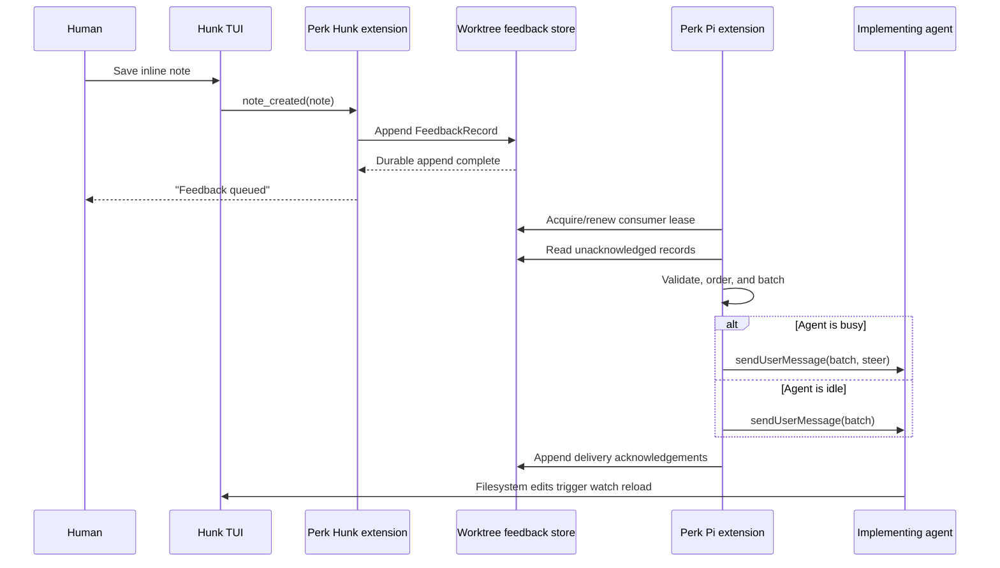

# Hunk watch feedback for a live implement session

**Status:** Proposed design  
**Date:** August 12, 2026  
**Scope:** Local `perk plan watch` and the local interactive implementation session for the same
plan worktree

## Executive decision

`perk plan watch` should turn a saved human note in Hunk into feedback for the one live Perk
implementation session associated with that worktree.

The bridge is deliberately artifact-mediated:

1. `perk plan watch` explicitly loads a small, Perk-bundled Hunk extension from an absolute trusted
   path.
2. When the human **saves** a Hunk note, the extension appends one immutable, versioned record to a
   worktree-local outbox under `.perk/workflow/`.
3. A receiver inside the Perk Pi extension owns the outbox only in an implementation session. It
   batches new records and injects them as one real user message. If the agent is busy, the message
   uses Pi's `steer` delivery; if idle, it starts a normal turn immediately.
4. After Pi accepts the message, the receiver appends delivery acknowledgements. A record is never
   acknowledged before injection.

This produces **at-least-once delivery with stable feedback identities**: the expected crash
residual is a duplicate, never silent loss. It also preserves Perk's two-plane contract. The Python
CLI still positions and launches processes; only the in-session TypeScript extension steers a live
turn.

The feature does not create a second review workflow. It does not add replies, resolution state,
priorities, or task management to Hunk. The agent's code changes are the response, and Hunk's
existing watch reload makes that response visible.

## Problem

`perk plan watch PLAN` currently resolves the implementation worktree and diff base, changes into
that worktree, and replaces itself with:

```text
hunk diff <base-sha> --watch
```

That is a useful live observation surface, but the two interactive processes remain independent:

- The **Hunk session** knows which file and hunk the human is examining and can collect inline human
  notes.
- The **Pi implementation session** owns the agent conversation and can accept steering or follow-up
  user messages.
- The **Perk CLI process no longer exists** after its successful `exec` into Hunk.

The missing capability is a trustworthy relay from a deliberate human action in Hunk to the
correct live implementation session. The relay must not depend on terminal keystroke injection,
transcript mutation, timing luck, or a permanently supervised parent process.

## Current interfaces and constraints

### Hunk

Hunk exposes two relevant surfaces:

- `hunk session comment list --type user --json` can query human notes through Hunk's loopback
  session daemon.
- A Hunk extension can subscribe to `note_created`, which fires after the human saves a note.
  `note_edited` fires while the draft is being composed and is not a send boundary. Agent-created
  session comments do not emit either human-note event.

Hunk notes themselves are session state. A watch reload can remap or drop them, and closing Hunk
removes the only queryable copy. Querying the daemon later is therefore not a sufficient durable
delivery guarantee.

Hunk extensions run with the user's permissions. The extension API is experimental and exposes an
`apiVersion` so consumers can refuse incompatible hosts. An explicit `--extension <path>` is loaded
without repository trust mediation, so the selected path must be a reviewed Perk artifact rather
than a file from the code-under-watch worktree.

### Pi

The Perk extension is already resident in the implementation session and already knows:

- the session's settled `run_id` and Pi session identity;
- the launched stage;
- the active plan reference;
- whether the session is currently idle;
- how to inject a real user message with `sendUserMessage`.

Pi's delivery modes already express the desired behavior:

- **Idle:** send a normal user message, which starts a turn.
- **Busy:** send with `deliverAs: "steer"`. Pi queues it after the current assistant turn finishes
  its tool calls and before the next model call. This is responsive without aborting an in-flight
  filesystem edit, subprocess, or test.

Pi RPC is not an attach protocol for an already-running TUI session. It is available only when Pi
was launched in RPC mode and its controller retained the process's stdin/stdout. Converting the
implementation door into an RPC-hosted runtime would be a substantially different product shape.

### Perk

Perk's architectural constraints are decisive:

- The Python CLI is the **session exterior**. It may prepare state and launch Hunk, but it must not
  become a controller for a live Pi turn.
- The TypeScript extension is the **session interior**. It owns message delivery into Pi.
- Cross-process coordination belongs in a durable artifact, not terminal state or a hidden
  in-memory dependency.
- `.perk/workflow/` is the local, gitignored cache tier and is already the home of disposable
  inter-process state.
- The implementation-session pointer is first-write-wins within a run, but it is not a live,
  plan-worktree-wide lock. The feedback bridge therefore needs its own small single-consumer lease
  rather than inferring liveness from historical session pointers.

## Terminology

The design uses these terms precisely:

- **Watch feedback:** a human-authored Hunk note saved in the Hunk session launched by
  `perk plan watch`.
- **Feedback record:** the immutable versioned representation of one saved note.
- **Outbox:** the append-only worktree-local stream of feedback records.
- **Consumer lease:** the short-lived ownership claim allowing exactly one eligible implementation
  session to drain the outbox.
- **Delivery acknowledgement:** durable evidence that Pi accepted a feedback record as part of an
  injected user message.
- **Queued:** the feedback record was appended successfully to the outbox.
- **Delivered:** Pi accepted the injected user message and the acknowledgement was appended.
- **Addressed:** a human judgment that the implementation now handles the feedback. This is
  intentionally not machine state in this design.

Deleting a Hunk note after saving it does not retract feedback. Saving is the send boundary.

## Goals

1. Let a human send spatially anchored feedback without leaving the watched diff.
2. Deliver while the agent is working, at Pi's next safe steering boundary.
3. Preserve feedback across either process closing or restarting while the worktree remains.
4. Prefer duplication over loss across an unavoidable crash window.
5. Prevent delivery to planning, review, child-agent, unrelated-worktree, or ambiguous concurrent
   sessions.
6. Keep the user-facing interaction small: write a note, save it, observe the implementation
   change.
7. Use public Hunk and Pi extension interfaces rather than private daemon or transcript formats.
8. Keep Hunk usable when the feedback bridge is unavailable, with a loud and accurate degradation.

## Non-goals

- Remote or headless implementation sessions. The local Hunk window and remote runner do not share
  a filesystem or interactive session.
- General messaging between arbitrary Hunk and Pi sessions.
- A bidirectional chat surface inside Hunk.
- Feedback priorities, blocking/non-blocking labels, assignment, threading, or resolution state.
- Interrupting or killing an in-flight tool invocation.
- Converting `perk implement` into a Pi RPC supervisor.
- Publishing feedback to GitHub or Linear before a PR exists.
- Treating agent-authored Hunk annotations as new human instructions.
- Exactly-once delivery. Pi injection and a separate filesystem acknowledgement cannot be one
  transaction.

## Design principles

### Saving is explicit enough

Draft typing is not feedback. The human deliberately creates a note and saves it; that action is
the send boundary. The Perk Hunk extension announces this behavior on startup so the interaction is
visible rather than surprising.

No additional "send" command, keybinding, modal, or confirmation is introduced. Those would
duplicate the meaning of saving and make the interface shallower rather than safer.

### Durability before liveness

The Hunk extension first appends the feedback record and only then reports it as queued. It never
attempts direct best-effort delivery to Pi. If no implementation session is currently consuming,
the record waits for one.

### At-least-once, not pretend exactly-once

The receiver acknowledges only after `sendUserMessage` returns without error. A process can die
after Pi accepted the message but before the acknowledgement append. On restart, that record may be
sent again. Stable IDs make the repeat recognizable; acknowledging first would create a silent-loss
window and is forbidden.

### Misdelivery is worse than delayed delivery

Only one implementation session may hold the consumer lease for a worktree. Other eligible
sessions remain passive. Planning sessions, adopted child sessions, and sessions for another
worktree never inspect or claim the stream.

### Anchors are evidence, not authority

Line numbers describe where the note was written. The working tree may change before delivery, so
the agent must inspect the current file and diff. The message includes the original path, side,
line, and hunk, but never instructs the agent to edit a line blindly.

### One-way is enough

The feedback loop closes through the artifact the user is already watching:

```text
human note -> agent message -> code change -> Hunk watch reload
```

An acknowledgement means "Pi accepted this message," not "the agent agreed" or "the issue is
fixed." Modeling the latter would require a separate human review lifecycle and is outside this
feature.

## Proposed architecture



The files are the cross-process seam. Two adapters meet there:

- The **Hunk publisher adapter** translates `note_created` into one validated append.
- The **Pi inbox adapter** turns the durable stream into validated batches and acknowledges a
  batch only after its injected delivery callback returns successfully.

Callers do not own parsing, deduplication, lease mechanics, filesystem watching, append safety,
backoff, or corruption handling. Those behaviors remain behind the two small interfaces at the
seam.

## User experience

### Normal flow

1. The implementation session is running in the plan worktree.
2. The human runs `perk plan watch <plan>`.
3. Hunk opens as it does today and shows a one-time notice such as:

   ```text
   perk feedback active — saving a human note sends it to the implementation session
   ```

4. The human navigates to a changed line, creates a note, and saves it.
5. Hunk reports only what it knows:

   ```text
   Feedback queued for the implementation session
   ```

6. The Perk Pi extension injects the note at the next safe boundary. The feedback appears in the
   Pi transcript as a user message, not an invisible system mutation.
7. The agent inspects the current code and responds. Edits appear through Hunk's normal watch
   reload.

### No current implementation consumer

Hunk still appends the record and reports it as queued. The next eligible implementation session
for that worktree drains it. The extension must not claim it was delivered merely because a
historical implementation-session pointer exists.

### Bridge unavailable

An incompatible Hunk extension API, unwritable feedback store, or invalid launch metadata disables
feedback but does not crash the review. Hunk remains usable as a watched diff and displays one loud
warning that saved notes will not reach the agent.

## Launch contract

`perk plan watch` keeps its current worktree and diff-base resolution. Immediately before `chdir`
and `exec`, it additionally:

1. Resolves the Perk-bundled Hunk extension to an absolute path from the installed artifact.
2. Mints a unique `watch_instance_id`; this is not a workflow `run_id` and must not reuse that
   vocabulary.
3. Passes trusted launch metadata through process environment variables owned by Perk:
   `PERK_HUNK_WATCH_ID`, `PERK_HUNK_PLAN_ID`, and the resolved
   `PERK_HUNK_WORKTREE_ROOT`.
4. Inserts `--extension <absolute-path>` into the Hunk argv before user-provided Hunk arguments.
5. Uses `execve` with a copied environment plus those three values. It does not mutate the
   launcher's process-global environment before the replace operation.

The extension path is resolved before entering the code-under-watch worktree, matching the existing
absolute-Hunk-binary defense. The launcher never selects an extension path from `.hunk/`, repository
configuration, `PATH`, or a user-controlled Hunk argument. The publisher verifies that Hunk's
resolved event `cwd` is the declared worktree root before deriving the feedback-store path.

The first release adds no feedback configuration key and no additional mode flag. The bridge is
active only for Hunk launched through `perk plan watch`; raw `hunk diff --watch` is unchanged. A
human who never saves a note produces no feedback side effect.

`--dry-run` prints the complete composed Hunk command, including the explicit extension path, but
does not mint a watch instance, create feedback storage, or launch either process.

The existing pass-through grammar remains otherwise intact. User-provided Hunk arguments stay in
their current order after Perk's required `--watch` and `--extension` arguments.

## Storage contract

All files live below a dedicated worktree-local directory:

```text
.perk/workflow/hunk-watch/
├── outbox.ndjson
├── delivered.ndjson
└── consumer.lock/
    └── lease.json
```

This state is:

- local to the plan worktree;
- gitignored and disposable;
- retained while the worktree exists;
- not canonical plan or review state;
- never copied to GitHub or Linear;
- removed naturally with the implementation worktree.

Path construction belongs in the existing cache substrate in both runtimes. Production callers do
not hand-build `.perk/workflow/hunk-watch` path segments.

### Feedback record

Each line of `outbox.ndjson` is one complete UTF-8 JSON object:

```json
{
  "schema": 1,
  "feedback_id": "<watch-instance-id>:<hunk-note-id>",
  "watch_instance_id": "<id minted by perk plan watch>",
  "plan_id": "42",
  "created_at": "2026-08-12T16:20:31.123Z",
  "changeset_id": "<Hunk changeset id or null>",
  "anchor": {
    "file_path": "src/perk/example.py",
    "hunk_index": 1,
    "side": "new",
    "line": 87
  },
  "body": "Keep this validation at the trust boundary."
}
```

Required invariants:

- `schema` is exactly the supported record version.
- `feedback_id` is stable and unique across Hunk watch instances.
- `plan_id` matches the worktree selected by the launcher.
- `file_path` is the repo-relative path reported by Hunk; it is display/navigation evidence and is
  never resolved as an arbitrary write target by the bridge.
- `hunk_index` is zero-based because it comes from Hunk's extension event. Human-facing messages
  render it one-based.
- `side` is `old` or `new`; `line` is a positive integer.
- `body` is the saved human note after newline normalization and outer-whitespace trimming. An empty
  body is refused.
- `created_at` is assigned by the publishing extension, not recovered from filesystem metadata.
- `changeset_id` is the latest changeset observed by the Hunk extension, or `null` if unavailable.

The publisher imposes a bounded UTF-8 byte limit on an individual note and on the serialized
record. An oversized note is not truncated into a misleading instruction; it is refused with a
visible error and is not described as queued.

### Append discipline

The outbox and acknowledgement journal use one-record-per-write append semantics. The complete JSON
line, including its trailing LF, is written through an append-only file descriptor. Multiple Hunk
watch windows may append safely without a read-modify-write replacement.

Readers are lenient per line:

- A missing file means no feedback.
- A trailing partial line is held for the next read.
- A malformed complete line is surfaced once and skipped without blocking later records.
- An unknown schema version is not acknowledged or delivered. It produces a loud compatibility
  warning so a newer writer cannot be silently misinterpreted by an older receiver.
- Duplicate `feedback_id` values collapse to the first valid record; conflicting later bytes for
  the same ID are reported as corruption.

The streams are expected to stay small over one worktree's life. Version one reads them in full and
indexes by ID. Byte cursors, compaction, databases, and rotation are deferred until measured volume
earns them.

### Delivery acknowledgement

Each line of `delivered.ndjson` records acceptance into Pi:

```json
{
  "schema": 1,
  "feedback_id": "<watch-instance-id>:<hunk-note-id>",
  "delivered_at": "2026-08-12T16:20:32.004Z",
  "run_id": "<implementation run id>",
  "pi_session_id": "<receiving session id>"
}
```

The acknowledgement is appended only after the complete batch was accepted by
`sendUserMessage`. Every feedback ID in the accepted batch gets an acknowledgement. Duplicate
acknowledgements are valid and collapse by feedback ID on read.

Acknowledgement means delivery into the session transcript/queue. It says nothing about whether
the agent agreed, changed code, completed a turn, or satisfied the human.

## Consumer lease

The receiver installs only when all of these are true:

- workflow state identifies the session as an implementation session;
- the active plan reference matches the worktree's materialized plan reference;
- the session has a settled `run_id` and Pi session ID;
- the run is not an env-inherited adopted child that merely shares the parent's filesystem.

Eligible receivers coordinate through `consumer.lock`, an atomically-created directory containing
`lease.json`:

```json
{
  "schema": 1,
  "token": "<random owner token>",
  "run_id": "<implementation run id>",
  "pi_session_id": "<session id>",
  "claimed_at": "<ISO-8601>",
  "heartbeat_at": "<ISO-8601>"
}
```

Lease rules:

1. Directory creation is the exclusive acquisition primitive. The owner writes its random token
   inside the directory.
2. The owner renews `heartbeat_at` atomically while the receiver is active.
3. A receiver verifies that the current lease still carries its token immediately before each
   delivery. Losing ownership stops delivery.
4. A fresh lease is never stolen. A later implementation session reports that feedback is already
   owned by another live session and remains passive.
5. A stale lease may be reclaimed by atomically renaming the lock directory to a unique quarantine
   name and then acquiring a fresh directory. Competing reclaimers still converge on one winner.
6. On `session_shutdown`, the owner removes the lease only if the token still matches. Shutdown is
   best-effort; heartbeat expiry is the crash-recovery path.
7. A session reload with the same identity renews or reacquires idempotently rather than creating a
   second consumer.

The heartbeat period and stale threshold are implementation constants, not user configuration.
The threshold must comfortably exceed ordinary event-loop stalls. Tests use injected time; they do
not sleep.

The lease is an ownership fence, not canonical workflow state. If it is corrupt, no receiver sends
feedback until one loud, deterministic recovery path quarantines it. Misdelivery is never the
fallback.

## Receiver lifecycle

### Activation

After the implementation session has claimed workflow identity and reconciled its plan reference,
the Perk extension starts the receiver. This ordering prevents an unclaimed or incorrectly linked
session from touching the outbox.

The receiver:

1. Acquires or observes the consumer lease.
2. Loads acknowledgements into a delivered-ID set.
3. Performs an immediate outbox drain.
4. Watches the outbox directory for low-latency changes.
5. Runs a low-frequency polling fallback because filesystem watches can coalesce or miss events.
6. Renews its lease heartbeat.
7. Stops watchers, timers, and lease ownership on session shutdown or when workflow reconstruction
   proves the session is no longer eligible.

Filesystem watching is an optimization; periodic inspection is the correctness fallback. Unlike
polling `hunk session`, the fallback is a cheap local file read and does not spawn a CLI process.

### Batching

The receiver applies a short debounce so several notes saved in one review pass become one user
message. Records retain append order. The batch has bounded record-count and UTF-8 byte limits;
overflow remains queued for a later batch.

One injected message has this semantic form:

```text
Human feedback from the live Hunk review of plan #42:

- [feedback <id>] src/perk/example.py, new line 87, hunk 2:
  Keep this validation at the trust boundary.

These anchors describe where each note was written and may have moved. Inspect the current diff and
files, then address the feedback or explain any conflict with the plan.
```

The note body is human-authored input and retains user-message authority. It is not wrapped as
untrusted repository data. Bridge-generated metadata remains descriptive and must not cause an
edit without current-code inspection.

If the receiver is idle, it calls `sendUserMessage(message)`. If busy, it calls
`sendUserMessage(message, { deliverAs: "steer" })`. It does not choose `followUp`: feedback about
work in progress should reach the next model boundary before the agent declares the task complete.

### Failure and retry

If message injection throws or is refused, no acknowledgement is written. The receiver retains the
records and retries with bounded exponential backoff. A successful later injection resets the
backoff.

The receiver does not spin, create repeated UI notifications, or inject diagnostic failures into
the model conversation. Pi-side status and warnings go through Perk's report/surfaces seam.

## State and guarantee table

| Event | Durable state | User-visible claim | Retry behavior |
|---|---|---|---|
| Human is still typing | None | None | None |
| Human saves; append succeeds | Outbox record | Queued | Receiver drains now or later |
| Human saves; append fails | None | Feedback not queued | Human may create a new note after fixing failure |
| Pi accepts message | Outbox + acknowledgement | Visible in the Pi transcript/queue | No normal redelivery |
| Pi accepts, process dies before acknowledgement | Outbox only | Previously queued | May redeliver once; duplicate carries same ID |
| Pi rejects/throws | Outbox only | Still queued | Backoff and retry |
| No eligible Pi session | Outbox only | Queued | Next eligible session drains |
| Two live implementation sessions | Outbox + one fresh lease | Owned by one session | Other session stays passive |
| Hunk reload drops/remaps its note | Outbox unchanged | Already queued | Delivery unaffected |
| Hunk exits | Outbox unchanged | Already queued | Delivery unaffected |
| Worktree is removed | Local feedback state removed | No longer queued | No recovery promised |

## Failure policy

| Failure | Required behavior |
|---|---|
| Bundled Hunk extension missing from installed artifact | Refuse `perk plan watch` before `exec`; name the broken installation and repair command |
| Unsupported Hunk API generation | Keep Hunk open, disable feedback, show one loud compatibility warning |
| Feedback directory cannot be created or written | Keep Hunk open, refuse to say queued, show the concrete filesystem error |
| Invalid Perk launch metadata | Disable feedback and warn; never derive identity from repo config |
| Malformed outbox line | Warn once for that line, skip it, continue with later valid lines |
| Unknown record version | Pause that record without acknowledging it; warn about version mismatch |
| Corrupt or fresh foreign consumer lease | Do not deliver; report ownership/corruption without stealing a fresh lease |
| Stale consumer lease | Quarantine and reacquire through the lease seam |
| `sendUserMessage` failure | Leave records unacknowledged and retry with backoff |
| Acknowledgement append failure after injection | Warn and permit later duplicate delivery; never claim exactly-once |
| Session shuts down during drain | Stop new work; any accepted-but-unacknowledged record may repeat later |

## Security and trust

### Trusted extension provenance

The Hunk extension executes with user permissions, so `perk plan watch` loads only a Perk-bundled
artifact resolved to an absolute path before changing into the implementation worktree. It must not:

- load a similarly named file from the worktree;
- use a relative `PATH` lookup;
- take an extension path from `.perk/config.toml`, `.hunk/config.toml`, or Hunk's extension config;
- execute shell text from the feedback record;
- access the network.

The Python packaging suite must prove the extension is present in both wheel and source
distribution publish surfaces.

### Bounded input

The bridge validates record shape and bounds note/body/message sizes. It treats path and line data
as display anchors only. The bridge never writes to the annotated source file, resolves a note path
outside the worktree, or interprets note content as a shell command.

### Human authority

Only Hunk's human `note_created` event enters this bridge. Agent session comments and agent-context
annotations do not feed back into Pi, preventing an agent-authored comment from recursively becoming
a user instruction.

The Hunk extension's startup notice makes the send semantics visible. Saving a note in this
specific Perk-launched watch session is affirmative local human action.

## Compatibility and degradation

The bundled extension declares the Hunk API generation it requires and checks `hunk.apiVersion`
before registering note handlers. The implementation should bind this to the actual minimum API
that carries `note_created`; the design does not guess a numeric generation independently of the
packaged Hunk contract.

Compatibility is fail-open for reviewing and fail-closed for feedback:

- The watched diff remains usable.
- Feedback is disabled rather than partially interpreted.
- The human gets one clear warning.
- No record is written with a shape the receiver cannot validate.

`perk doctor` should evolve from a presence-only Hunk probe to a capability/version diagnostic once
this bridge ships. Repair remains the existing Hunk install/update gesture; it must not silently
install repository-local extension code.

The outbox format carries its own integer schema version. A writer must not emit a newer record
version until the receiver in the same Perk release understands it. Cross-process format changes
amend `shared/contracts.md` in the same change.

## Module placement and interfaces

The implementation should preserve three clear modules:

### Watch launcher adapter — Python exterior

Owned by `src/perk/cli/commands/plan/watch_cmd.py` and a packaged-resource helper:

- resolve plan worktree and diff base;
- resolve the trusted Hunk extension artifact;
- mint watch identity and compose trusted launch metadata;
- append the required `--extension` argument;
- retain current dry-run, pass-through, `chdir`, and `exec` behavior.

It does not read the feedback outbox, inspect Pi sessions, or send messages.

### Hunk publisher adapter — packaged Hunk extension

A dependency-free TypeScript/JavaScript extension asset:

- check Hunk API compatibility;
- retain the current Hunk changeset ID in memory;
- subscribe to `note_created` only;
- validate and publish one feedback record;
- report queued/refused status through Hunk's `notify`/`log` interfaces;
- flush no in-memory queue on shutdown because successful publication is synchronous and durable.

It does not query Hunk's daemon, launch Perk commands, or communicate directly with Pi.
Its internal publisher presents one operation—`publish(note, context): PublishResult`—and hides
path validation, normalization, record construction, serialization, and append behavior.

### Feedback receiver — Pi interior

A Perk extension module depends on one deep inbox interface:

```ts
interface HunkFeedbackInbox {
  open(
    identity: ConsumerIdentity,
    deliver: (batch: readonly FeedbackRecord[]) => void,
  ): FeedbackInboxHandle | PassiveClaim;
}

interface FeedbackInboxHandle {
  close(): void;
}
```

`open` owns acquisition, immediate drain, watching plus polling fallback, validation,
deduplication, batching, lease heartbeat/recovery, retry backoff, and acknowledgement. A normal
return from `deliver` means Pi accepted the batch and permits acknowledgement; a throw leaves every
record queued for retry. `close` disposes timers, watchers, and owned lease state idempotently.

The Pi adapter owns only message rendering and the idle-versus-`steer` call to `sendUserMessage`.
The concrete inbox implementation receives filesystem, clock, scheduler, and reporting
dependencies rather than creating hidden globals, so its timing and failure arms remain
deterministic under test.

The interface is also the test surface. Tests use an in-memory adapter rather than bypassing the
inbox to inspect private filesystem mechanics, while dedicated concrete-inbox tests pin the file
contract through the same `open`/`deliver`/`close` interface.

## Testing strategy

### Python launcher tests

Extend `tests/test_plan_watch.py` to prove:

- the absolute bundled extension path is inserted into every real and dry-run Hunk command;
- it is resolved before `chdir` and cannot be shadowed by the worktree;
- watch identity and plan identity reach the exec environment but dry-run performs no mutation;
- the worktree-root binding is absolute and the launcher uses an explicit copied environment;
- user Hunk arguments remain ordered after Perk-owned arguments;
- missing packaged extension fails before `exec` with a repair hint;
- existing stacked-parent, merge-base, working-tree fallback, offline, and exit contracts remain
  unchanged.

Extend packaging coverage to build the wheel/sdist and verify the Hunk extension asset is included.

### Hunk publisher tests

Use a small fake Hunk extension API to prove:

- one `note_created` event appends exactly one valid record;
- `note_edited`, agent comments, selection changes, and reloads do not publish feedback;
- changeset identity tracks reloads;
- multiple notes retain order and stable unique IDs;
- empty, malformed, or oversized notes are refused visibly;
- append failure never produces a queued notification;
- incompatible API generations leave reviewing intact and feedback disabled;
- record writes use append semantics and tolerate multiple publisher instances.

### Pi receiver tests

Use the existing extension harness plus an in-memory feedback inbox to prove:

- only a correctly linked implementation session activates;
- planning, address-only, adopted-child, and unrelated-worktree sessions stay inert;
- idle delivery sends a normal user message;
- busy delivery uses `steer`;
- several records become one ordered bounded batch;
- successful injection acknowledges every included ID;
- injection failure acknowledges none and retries with injected time/backoff;
- accepted-before-ack failure can repeat with the same IDs;
- already acknowledged IDs never re-enter a normal batch;
- reload is idempotent and shutdown disposes watchers/timers;
- a fresh foreign lease makes the receiver passive;
- stale-lease recovery converges on one owner.

Dedicated store tests prove partial-line handling, malformed-line isolation, conflicting duplicate
IDs, unknown versions, atomic lease acquisition, token checks, heartbeat expiry, quarantine, and
acknowledgement append behavior.

### Live dogfood gate

The automatable suites prove contracts, but one live terminal gate should verify the actual
interaction:

1. Launch a sacrificial local implementation plan.
2. Start `perk plan watch` in Hunk.
3. Save a human note on a changed line.
4. Observe the note appear as one user message in the correct Pi session.
5. Observe the agent edit and Hunk reload the changed diff.
6. Stop Pi, save another note, resume implementation, and verify queued delivery.
7. Confirm the same feedback ID is not normally delivered twice.

This is a release/dogfood proof, not a bespoke permanent shell verifier.

## Documentation and contract updates when implemented

The implementation change is cross-plane and user-facing. It therefore lands with:

- an amendment to `shared/contracts.md` specifying the record, acknowledgement, lease, and
  delivery semantics;
- an update to `docs/user-docs/reference/cli.md` under `perk plan watch`;
- a short how-to for giving implementation feedback from Hunk;
- Hunk compatibility and failure guidance in the appropriate user-doc reference;
- release notes describing that saved human notes are sent to the implementation session;
- any matching `perk-expert` reference update if a configuration or provider surface is later
  introduced. Version one introduces neither.

This planning document remains the rationale and proposed shape; it is not the runtime contract.

## Alternatives considered

### Poll Hunk's session CLI from Pi

The receiver could periodically execute:

```text
hunk session comment list --repo <worktree> --type user --json
```

This is an attractive prototype because it needs no Hunk extension. It is not the recommended
product contract:

- Hunk notes may be remapped or dropped during reload.
- Closing Hunk can remove the only queryable copy before the next poll.
- Each poll spawns another CLI process.
- Multiple Hunk sessions for one worktree make selection ambiguous.
- The absence of an event stream forces a latency/reliability trade-off.

Polling is suitable for validating the interaction, but not for promising durable feedback.

### Direct local socket between extensions

The Pi extension could expose a Unix socket and the Hunk extension could send notes directly. That
provides immediate acknowledgements, but then needs endpoint discovery, stale-socket recovery,
ownership, reconnects, buffering while Pi is absent, and a durable retry queue. Once made reliable,
it reproduces the outbox with an additional transport. The file bridge is smaller and already
matches Perk's artifact-mediated coordination model.

### Supervise Pi in RPC mode

`perk implement` could launch Pi in RPC mode under a new supervisor and retain a command channel for
Hunk feedback. This would centralize delivery and acknowledgement, but it would also replace the
native interactive runtime contract, require a client for Pi UI behavior, and make the exterior a
live session controller. It is warranted only if Perk deliberately becomes the runtime host for all
implementation sessions, not for this feedback feature alone.

### Write directly into Pi's session JSONL

Rejected. The transcript is Pi-owned persistent history, not an input queue. Concurrent mutation
would bypass extension events, queue semantics, validation, UI rendering, and forward compatibility.

### Inject terminal keystrokes

Rejected. `tmux send-keys`, pseudo-terminal writes, and clipboard/paste automation depend on focus,
editor state, terminal encoding, and timing. They cannot provide trustworthy acceptance or retry
semantics.

### Publish early feedback to the issue backend

Rejected for the live loop. GitHub or Linear would provide durability but add network dependence,
latency, canonical-state noise, and a premature review artifact before submission. The feedback is
about an uncommitted local implementation and belongs to the local worktree cache until the normal
PR review stage.

## Rollout

1. Land the record/store contract, Hunk publisher tests, and Pi receiver tests behind an internal
   registration seam.
2. Wire the bundled extension into `perk plan watch`, update packaging, and make the Hunk startup
   notice visible.
3. Run the live dogfood gate, including the stopped-session queue case.
4. Update the cross-plane contract, user docs, and release notes in the same implementation change.
5. Observe real use before adding any configuration, delivery status pane, retention control, or
   bidirectional acknowledgement UX.

The first release should not add a provider seam or configuration table. There is one publisher,
one durable format, and one receiver. A seam becomes justified only if a second real transport or
feedback surface appears.

## Acceptance criteria

The design is successfully implemented when all of the following hold:

- Saving one human note in the Perk-launched Hunk window results in one feedback message in the
  correct implementation session under normal operation.
- Busy agents receive the message through Pi steering without an abort; idle sessions start a turn.
- Closing Hunk immediately after the queued notification cannot lose the record.
- Closing Pi before delivery leaves the record for the next eligible implementation session.
- A crash after injection but before acknowledgement can duplicate the stable ID but cannot lose it.
- Planning and child-agent sessions never consume feedback.
- Concurrent implementation sessions do not both consume the same stream.
- Incompatible Hunk APIs and filesystem failures preserve the watched diff while clearly disabling
  feedback.
- The bridge loads no executable code from the worktree under review.
- The implementation adds no reply, resolution, priority, or task-management state.

The core product promise is intentionally narrow: **save a spatial human note in Hunk, and Perk
reliably presents it to the agent implementing that same plan.**
