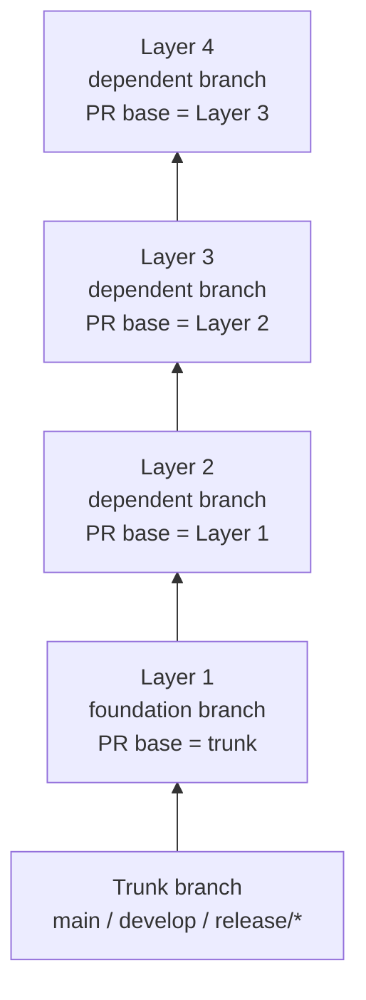
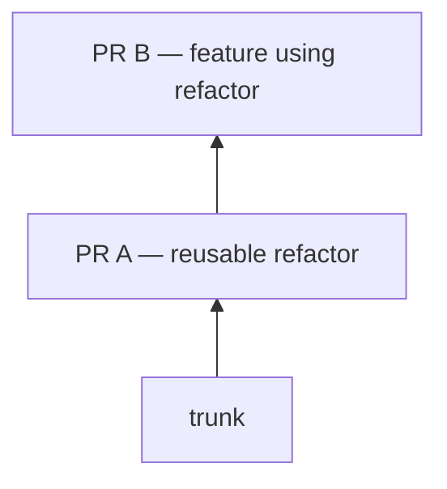
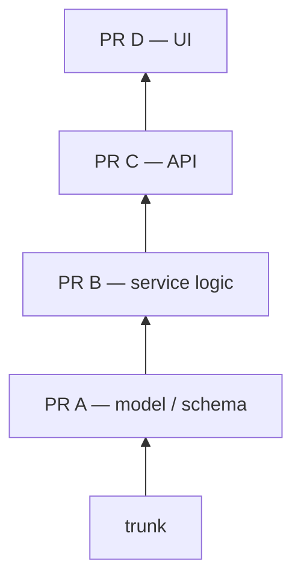
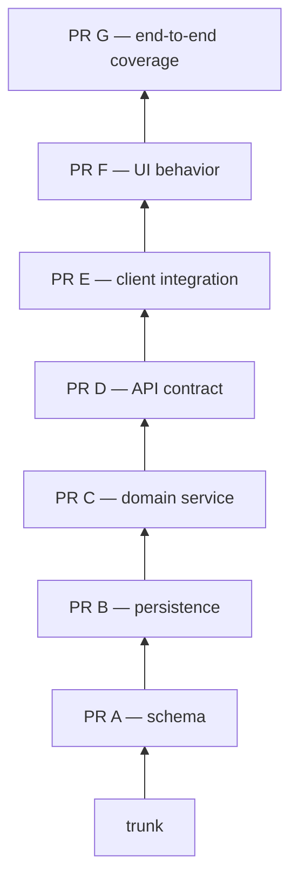
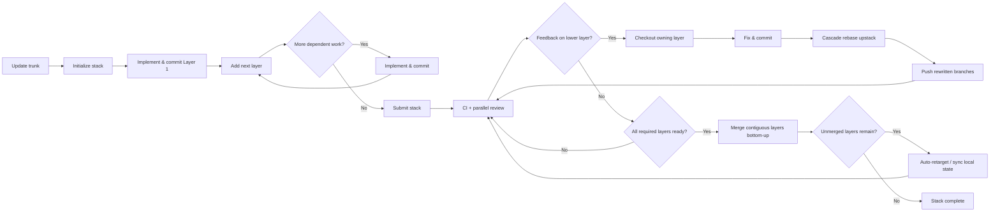

# GitHub Stacked Pull Requests: Architecture, Workflows, and a Practical Guide to `gh stack`

## Executive summary

GitHub’s native **stacked pull requests** feature, announced in public preview on July 30, 2026, formalizes a workflow that teams have long implemented with chained Git branches or third-party tools such as Graphite, Git Town, Jujutsu, and Sapling. A GitHub stack consists of two or more pull requests in the same repository: the bottom pull request targets a trunk branch such as `main`, while every pull request above it targets the branch immediately below. Each PR therefore presents only its own incremental diff, even though higher branches contain the cumulative changes beneath them. citeturn1view1turn2view0

The central value proposition is **decomposition without serialization**. A developer can separate a large feature into small, logically dependent changes—schema, library, API, UI, tests, for example—without waiting for each lower change to merge before beginning the next one. Reviewers can review those layers independently and in parallel, while GitHub understands their dependency relationship, applies the stack base’s branch rules and relevant CI checks to every layer, displays the whole chain in a stack map, and can merge contiguous layers from the bottom upward. citeturn2view0turn4view2

GitHub also addresses the historical operational weakness of stacked development: **cascading rebases**. Its official `github/gh-stack` GitHub CLI extension introduces `gh stack init`, `add`, `submit`, `checkout`, `rebase`, `sync`, `push`, `modify`, `link`, and `merge`, plus navigation commands. A lower-layer edit can be propagated through the branches above it with a cascading rebase rather than a sequence of hand-maintained Git operations. `gh stack sync` goes further by fetching, reconciling the remote stack, fast-forwarding the trunk, cascading rebases, pushing rewritten branches, and synchronizing PR/stack state. citeturn3view0turn4view0

The most important operating rule is:

> **Put foundations lower, dependencies higher; make changes in the layer that owns them; review from the bottom upward; and propagate lower-layer changes upward before merging.**

GitHub’s own engineering example follows exactly this pattern, separating data, API, integration, and UI into successive layers. GitHub additionally recommends reading the overall stack top-down to understand the eventual goal, but reviewing implementation bottom-up so that each dependency is understood before the layer that consumes it. citeturn1view2

As of August 8, 2026, the feature remains a **public preview and is explicitly subject to change**. GitHub said at launch that availability was rolling out to repositories over several days and merge-queue integration over the following weeks, so repositories may still differ in availability during the rollout. Stacked PRs work on GitHub.com, GitHub Mobile, GitHub CLI, REST/API/webhook surfaces, and GraphQL read APIs, but **not GitHub Desktop**, and all stack branches must live in the **same repository**—cross-fork stacks are not supported. citeturn1view1turn2view0

For CLI prerequisites, GitHub’s current documentation contains a noteworthy inconsistency. The stacked-PR quickstart specifies **GitHub CLI 2.90.0 or later and Git 2.20 or later**, while both the command reference and `github/gh-stack` README say the extension itself requires `gh` 2.0+. The prudent interpretation is to follow the stricter quickstart requirement—`gh >= 2.90.0` and Git >= 2.20—rather than relying on the extension’s lower technical floor. GitHub CLI 2.97.0 was the latest listed release at the time of this research, and GitHub advised users to update to it because that release addressed several security vulnerabilities. citeturn2view1turn2view2turn6view2turn9search0

## What stacked pull requests are and why they matter

A stack is fundamentally an **ordered dependency chain of ordinary Git branches and ordinary pull requests**. There is no special Git object representing a layer: GitHub overlays stack metadata and stack-aware lifecycle operations on conventional branches and PRs. The first PR targets the stack’s trunk; each subsequent PR targets the preceding PR’s head branch. A stack can terminate on the repository default branch or another branch such as a release branch. citeturn2view0turn6view1



The distinction between the **Git view** and the **review view** is crucial. The topmost branch contains all commits inherited from every lower branch, but its PR is computed against the branch immediately beneath it. Consequently, a UI PR can show only the UI-specific change even though the UI branch also contains the underlying model and API code in its history. GitHub describes each layer as a discrete change of one or more commits, with its PR displaying only the difference between that branch and the branch below. citeturn2view0turn10view3

This solves a real tension in conventional feature-branch development. With one large feature PR, different concerns become mixed into a single review surface. With completely independent branches from `main`, genuine dependencies have to be duplicated, mocked, cherry-picked, or held until prerequisite branches merge. A stack makes the dependency itself explicit: downstream work can begin immediately while upstream review is still underway. citeturn2view0turn8search20

### Benefits and their trade-offs

| Property | One large feature PR | Independent PRs from trunk | Stacked PRs |
|---|---|---|---|
| Review scope | Large cumulative diff | Small, but dependencies can be artificial | Small incremental diff for each layer citeturn2view0 |
| Start dependent work before prerequisite merges | Yes, inside same giant branch | Awkward | Yes, naturally citeturn2view0 |
| Dependency representation | Implicit inside code | Often absent | Explicit branch/PR chain citeturn2view0 |
| Reviewer specialization | Harder when concerns are mixed | Good | Excellent when layers follow ownership boundaries citeturn1view2 |
| Rebase maintenance | One branch | Many independent branches | Potentially complex, but automated by `gh stack` citeturn4view0 |
| CI cost | Usually one PR run | One run per PR | One run per stack layer unless optimized citeturn4view2 |
| Merge ordering | One merge | Arbitrary | Bottom-up dependency order citeturn4view1 |
| Cross-fork contribution | Supported by ordinary PRs | Supported | **Not supported** for a stack citeturn6view0 |

GitHub argues that narrowly scoped PRs make review easier and let work continue without waiting for prerequisite changes to land. The company also positions stacks as particularly relevant to high-volume and AI-assisted development, where code generation can outpace human review and decomposition becomes an important mechanism for maintaining comprehensibility. citeturn2view0turn1view2

The trade-off is that a stack is a dependency graph collapsed into a line. Changes to an early layer can rewrite the ancestry of every layer above it. That is why rebasing has historically been the difficult part of stacked workflows; GitHub explicitly identifies it as such and built cascading rebase operations into both the web experience and `gh stack`. citeturn2view0

A second trade-off is CI multiplication. GitHub evaluates each stacked PR as though it ultimately targets the stack base, meaning a workflow configured for PRs into `main` can execute once for **every layer**. This is desirable for correctness but can significantly increase Actions usage for deep stacks. GitHub therefore exposes `stack.position`, `stack.size`, and base metadata so expensive jobs can be limited to strategically chosen layers. citeturn4view2

## Stack design, branching strategies, and example layouts

The best stacks are organized by **dependency boundaries**, not arbitrary line counts or commit counts. GitHub’s rule is simple: when code in one layer depends on another layer, the dependency must be in that same branch or somewhere below it. A new layer is appropriate when work moves into a different concern, ownership area, or independently reviewable unit. citeturn2view0

A useful mental hierarchy is:

```text
trunk
  ↓
foundational contract / schema / refactor
  ↓
core implementation
  ↓
integration / API
  ↓
consumer / UI
  ↓
polish / follow-on behavior
```

That ordering minimizes “reverse dependencies”: an early PR should ideally make sense without knowing how a higher PR will eventually use it.

GitHub’s own published example decomposes a product-search feature into a catalog/data layer, a search API, chat/API integration, and UI/citation behavior. Different reviewers can then focus on data modeling, backend contracts, integration, or UX instead of reasoning about all four simultaneously. citeturn1view2

### Illustrative stack sizes

The labels “small,” “medium,” and “large” below are **design examples, not GitHub-imposed limits**.

| Stack size | Example decomposition | Appropriate when | Main risk |
|---|---|---|---|
| **Small: two layers** | `foundation` → `consumer` | A prerequisite refactor/API change unlocks one dependent change | Stacking may be unnecessary if both can independently target trunk |
| **Medium: four layers** | `model` → `service` → `integration` → `UI` | A feature crosses clear architectural boundaries | Lower-layer review changes cause several rebases |
| **Large: seven layers** | `schema` → `storage` → `domain` → `API` → `client` → `UI` → `integration-tests` | Large migrations or coordinated multi-owner work | Review context, CI multiplication, and conflict propagation grow with depth citeturn4view2turn10view1 |

A small stack might look like:



A medium stack:



A larger stack:



The last form should not be interpreted as “more stacking is better.” Git Town’s long-running stacked-development guidance recommends stacking **only genuinely dependent changes** and placing unrelated work on separate top-level branches. Graphite likewise recommends that every PR remain independently intelligible and atomic enough to review on its own. Those lessons transfer directly to native GitHub stacks. citeturn10view1turn10view0

### Common branching strategies

**Foundation-first vertical stack.** Put types, schemas, reusable abstractions, or refactors at the bottom; place implementations and consumers progressively above. This is the model closest to GitHub’s examples. citeturn2view0turn1view2

**Refactor → behavior stack.** First isolate a semantics-preserving structural cleanup, then add the behavioral change on top. Reviewers can separately ask “is this refactor safe?” and “is the new behavior correct?” This also reduces noisy diffs.

**Backend → API → frontend stack.** Useful where ownership boundaries naturally map to layers. GitHub’s published engineering example explicitly uses this architecture and assigns different reviewer audiences to different layers. citeturn1view2

**Migration stack against a release branch.** The stack’s trunk need not be the default branch; `gh stack init --base <branch>` can use a development or release branch as the stack base. The branch-protection and CI semantics then flow from that base. citeturn2view0turn2view2

**Multiple independent stacks.** When two pieces of work do not depend on each other, make them independent branches or separate stacks. Artificially putting unrelated work in one chain imposes a merge order that does not actually exist. Git Town’s guidance reaches the same conclusion from years of stacked-workflow experience. citeturn10view1

## End-to-end lifecycle: create, update, review, rebase, resolve, and merge

A healthy stacked-PR lifecycle can be summarized as follows. GitHub’s stack-aware tooling is designed around this cycle. citeturn2view1turn4view0turn4view3turn4view1



### Creating the stack locally

Start from an up-to-date trunk and authenticate the CLI:

```bash
git switch <trunk>
git pull --ff-only

gh auth login
gh extension install github/gh-stack
```

The quickstart requires a repository to which you can push and documents Git >= 2.20 plus GitHub CLI >= 2.90.0. citeturn2view1

Initialize the first layer:

```bash
gh stack init --base <trunk> layer-1
```

or interactively:

```bash
gh stack init
```

`init` creates/adopts branches and establishes local stack tracking. It also automatically enables Git’s `rerere` mechanism so Git can remember and reuse conflict resolutions across repetitive rebases. citeturn2view2turn6view2

Implement the first unit:

```bash
git add .
git commit -m "Implement foundational change"
```

Add the next layer:

```bash
gh stack add layer-2
```

Then repeat:

```bash
# edit files
git add .
git commit -m "Implement dependent change"

gh stack add layer-3
```

`gh stack add` creates the new branch at the current `HEAD`, records it at the top of the stack, and checks it out. It must normally be invoked while on the top layer. citeturn2view2

A compact workflow can stage and commit while creating layers:

```bash
gh stack add -Am "Implement service layer" service-layer
gh stack add -Am "Implement API layer" api-layer
```

Here `-A/--all` stages tracked and untracked files, `-m/--message` commits them, and `-u/--update` can be substituted for `-A` when only tracked files should be staged. `-A` and `-u` are mutually exclusive. citeturn3view0

### Inspecting and submitting

Before publishing:

```bash
gh stack view
gh stack view --short
gh stack view --json
```

`view` displays the branch ordering, associated PR links/status, and recent commit information. citeturn2view2

Then:

```bash
gh stack submit
```

`submit` pushes branches, creates missing PRs, gives them the proper chained base branches, and creates or updates GitHub’s stack relationship. In an interactive terminal it presents an editor for PR titles, descriptions, and draft/ready state. citeturn3view0

For automation:

```bash
gh stack submit --auto
```

creates automatically titled new PRs as drafts, while:

```bash
gh stack submit --auto --open
```

makes new PRs ready for review. citeturn3view0

### Creating directly on GitHub.com

The web flow does not require local `gh stack` tracking. Create the bottom PR normally, then create the next PR with its base set to the first PR’s branch and select **Create stack**. Repeat upward. GitHub then displays a stack icon and stack map that links the layers and reports their status. citeturn7view0

GitHub can also recognize an existing sequence of open PRs whose base/head branches already form the appropriate chain and show a banner proposing that the sequence be linked as a stack. Existing stacks can be extended from the web through **Add to stack**, which automatically uses the current top PR’s branch as the next base. citeturn7view0

### Reviewing

Each PR should be reviewed primarily as the discrete change represented by its layer. GitHub’s engineering guidance suggests **reading top-down for overall intent but reviewing bottom-up for implementation**, because each higher layer depends on concepts established below. citeturn1view2

For a four-layer stack, a reviewer might therefore first understand the end goal from the top PR description and stack map, then review:

```text
PR 1 — foundation
      ↓
PR 2 — service
      ↓
PR 3 — integration
      ↓
PR 4 — UI
```

Each PR can receive independent approval or change requests, and different layers can be reviewed concurrently. GitHub enforces stack-base branch protections on each layer rather than allowing higher layers to escape those requirements merely because they directly target another feature branch. citeturn2view0

From the CLI:

```bash
gh pr review <pr-number> --approve

gh pr review <pr-number> --request-changes \
  --body "Please keep validation in this layer."

gh pr review <pr-number> --comment \
  --body "Consider documenting this contract."
```

`gh pr review` supports approvals, comments, and change requests independently of whether the PR belongs to a stack. citeturn11search2

### Updating a lower layer

Suppose feedback arrives on `layer-2` while development has continued through `layer-4`.

Check out the layer that **owns** the requested change:

```bash
gh stack checkout layer-2
```

Make and commit the fix:

```bash
git add .
git commit -m "Address review feedback"
```

Then propagate it upward:

```bash
gh stack rebase --upstack
gh stack push
```

This pattern is important. GitHub explicitly recommends changing the correct lower branch rather than putting a workaround into whichever upper branch happens to be checked out. `--upstack` rebases the current layer and branches above it so the updated dependency flows through the remainder of the chain. citeturn4view0turn4view3

### Rebasing an entire stack

To incorporate trunk changes and reconstruct a fully linear stack:

```bash
gh stack rebase
gh stack push
```

`gh stack rebase` fetches the remote and works upward from the trunk, ensuring every layer contains the new tip of its parent in its history. If an already-merged PR is encountered, the extension can switch to the appropriate `--onto` behavior to replay remaining commits correctly. citeturn5view0

Useful scopes include:

```bash
# Trunk through current branch
gh stack rebase --downstack

# Current branch through top
gh stack rebase --upstack

# Rebase layers relative to each other without updating trunk
gh stack rebase --no-trunk
```

The default whole-stack form is normally the clearest choice when the trunk itself advanced. citeturn5view0

### Resolving cascading conflicts

When `gh stack rebase` encounters a conflict, it stops and identifies conflicted files. Resolve Git’s normal conflict markers:

```text
<<<<<<<
current content
=======
rebased content
>>>>>>>
```

then stage the resolutions:

```bash
git add <resolved-files>
```

and continue:

```bash
gh stack rebase --continue
```

The command resumes the cascade through the remaining branches. To abandon the complete stack rebase:

```bash
gh stack rebase --abort
```

which restores the branches to their pre-operation state. citeturn6view0turn5view0

If `gh stack sync` discovers a rebase conflict, its behavior is intentionally conservative: it restores the stack rather than leaving a partially rebased chain. GitHub’s troubleshooting guidance is then to run an explicit interactive `gh stack rebase`, resolve conflicts, and follow it with `gh stack push`. citeturn6view0

### Merging

Stacks always merge in dependency order from the **bottom upward**. You can merge the lowest PR alone, a contiguous prefix of the stack, or the entire stack. You cannot merge a middle PR while leaving an unmerged dependency beneath it. citeturn4view1

For example:

```text
PR 4  ┐ stays open
PR 3  ┘
PR 2  ← requested merge point
PR 1  ← must merge too
main
```

Merging through PR 2 lands PR 1 and PR 2. Higher PRs stay open and are automatically adjusted so the next remaining layer becomes the new bottom of the stack. citeturn2view0turn4view1

From the CLI:

```bash
# Interactive
gh stack merge

# Remote stack by stack number
gh stack merge <stack-number>

# Merge everything through a specific PR
gh stack merge <pr-number>

# Merge whole active stack without prompting
gh stack merge --yes --squash
```

`gh stack merge` supports merge, squash, and rebase methods unless a merge queue controls the strategy. citeturn5view0

One subtlety in the current documentation is worth emphasizing. The CLI reference describes a selected stacked merge as an **all-or-nothing operation** after preflight, but the troubleshooting documentation warns that an unexpected conflict or intermittent failure can still halt execution partway through, leaving lower PRs already merged and higher PRs open. In practical terms, users should not interpret “all-or-nothing” as database-transaction atomicity across every eventual server-side merge step. citeturn5view0turn6view0

## GitHub CLI deep dive

The native CLI experience comes from the official `github/gh-stack` extension rather than the built-in `gh pr` command family. The extension uses ordinary GitHub CLI authentication and stores local stack metadata in `.git/gh-stack`; its metadata is therefore local repository state rather than a committed file. citeturn6view2

### Installation and prerequisite check

```bash
git --version
gh --version
gh auth status

gh extension install github/gh-stack
```

If not already authenticated:

```bash
gh auth login
```

GitHub’s quickstart currently documents Git >= 2.20 and `gh` >= 2.90.0. The lower `gh >= 2.0` statement in the extension reference/README appears to be the extension’s technical compatibility statement rather than the current quickstart’s recommended product prerequisite; following the 2.90.0 requirement avoids that ambiguity. No separate minimum `gh-stack` extension release number is specified in the cited setup documentation. citeturn2view1turn2view2turn6view2

### Core command comparison

| Goal | Recommended command | Important flags/behavior |
|---|---|---|
| Start a stack | `gh stack init [branches...]` | `--base <branch>` selects trunk; can adopt existing branches; enables `git rerere` citeturn2view2 |
| Add next layer | `gh stack add [branch]` | `-A`, `-u`, `-m`; must normally be at stack top citeturn2view2 |
| Inspect stack | `gh stack view` | `--short`, `--json` citeturn2view2 |
| Check out an existing stack | `gh stack checkout <selector>` | Accepts stack number, PR number, PR URL, or local branch name; no argument opens picker citeturn2view2 |
| Navigate layers | `gh stack up`, `down`, `top`, `bottom`, `trunk`, `switch` | Direction is relative to trunk citeturn5view0 |
| Push branches only | `gh stack push` | `--remote`; uses per-branch `--force-with-lease` citeturn5view0 |
| Create/update PRs and stack | `gh stack submit` | `--auto`, `--open`, `--remote` citeturn3view0 |
| Cascade branch ancestry | `gh stack rebase` | `--upstack`, `--downstack`, `--no-trunk`, `--continue`, `--abort`, `--remote` citeturn5view0 |
| Full synchronization | `gh stack sync` | Fetch + reconcile + rebase + push + PR sync; `--prune`, `--remote` citeturn3view0 |
| Reorder/restructure | `gh stack modify` | Interactive drop/fold/insert/reorder/rename; `--continue`, `--abort` citeturn4view0 |
| Link branches managed by another tool | `gh stack link ...` | `--base`, `--open`, `--remote`; arguments bottom→top citeturn5view0 |
| Merge stack/prefix | `gh stack merge` | `--yes`, `--merge`, `--squash`, `--rebase`, `--merge-method` citeturn5view0 |
| Stop treating PRs as a stack | `gh stack unstack` | `--local`; alias `delete`; restrictions apply to merged/queued PRs citeturn3view0 |

### Creating a complete stack non-interactively

A reusable pattern is:

```bash
git switch <trunk>
git pull --ff-only

gh stack init --base <trunk> layer-foundation

# Implement layer 1
git add .
git commit -m "Add foundational changes"

gh stack add layer-service

# Implement layer 2
git add .
git commit -m "Add service layer"

gh stack add layer-interface

# Implement layer 3
git add .
git commit -m "Add interface layer"

gh stack view

gh stack submit --auto --open
```

`submit` replaces the need to run `push` separately when the goal is to create or update PRs: it pushes and then reconciles PR/stack state itself. By contrast, `push` deliberately updates only branches and does not create or change PRs. citeturn3view0

### Checking out stacks versus checking out individual PRs

For stack-aware work:

```bash
gh stack checkout <stack-number>
gh stack checkout <pr-number>
gh stack checkout <pr-url>
```

A remote stack checkout fetches its stack information, pulls its branches, and establishes local stack tracking. With no argument, the command offers a searchable picker containing local and remote stacks. citeturn2view2

The standard:

```bash
gh pr checkout <pr-number>
```

is different: it checks out the single PR branch and supports options such as `--detach`, `--force`, or an alternate local branch name, but it does not provide `gh stack`’s whole-stack hydration/tracking behavior. Therefore, `gh stack checkout` is usually preferable when the intention is to continue developing or rebasing the stack rather than merely inspect one PR. citeturn11search1turn2view2

### Updating a stack

For routine “bring everything current” maintenance:

```bash
gh stack sync
```

Conceptually, `sync` performs:

```text
fetch
  ↓
reconcile GitHub stack with local stack
  ↓
fast-forward trunk when possible
  ↓
cascade rebase
  ↓
push branches
  ↓
sync PR state
  ↓
sync GitHub stack metadata
  ↓
optionally prune merged branches
```

GitHub documents this as a single command covering fetch, reconciliation, rebase, push, PR synchronization, stack synchronization, and optional branch pruning. citeturn3view0

After lower PRs have merged:

```bash
gh stack sync --prune
```

is particularly useful because it can refresh trunk, rebase the remaining layers, push them, synchronize GitHub state, and remove obsolete merged local branches. citeturn4view0

For controlled updating where conflicts need to be resolved interactively, use the explicit sequence:

```bash
gh stack rebase
gh stack push
```

instead. citeturn6view0

### `gh stack rebase` versus `gh pr update-branch`

The standard GitHub CLI also provides:

```bash
gh pr update-branch <pr-number>
gh pr update-branch <pr-number> --rebase
```

which updates **one PR branch** relative to its PR base. citeturn0search1

By contrast:

```bash
gh stack rebase
```

understands the entire branch chain and cascades ancestry changes through successive stack layers. Consequently, for stack maintenance, `gh stack rebase` or `gh stack sync` is the appropriate abstraction; `gh pr update-branch` remains useful as a conventional per-PR command but is not a substitute for cascade maintenance across dependent branches. This distinction follows directly from the documented scopes of the two commands. citeturn0search1turn5view0

### Reordering and restructuring

The central command is:

```bash
gh stack modify
```

It opens an interactive terminal UI. Current operations include:

| Operation | Key | Meaning |
|---|---:|---|
| Drop | `x` | Remove branch/commits from the tracked stack while preserving branch and associated PR |
| Fold down | `d` | Incorporate branch commits into layer below |
| Fold up | `u` | Incorporate branch commits into layer above |
| Insert below | `i` | Add empty layer toward trunk |
| Insert above | `I` | Add empty layer toward top |
| Move downward | `Shift`+`↓` | Reorder toward trunk |
| Move upward | `Shift`+`↑` | Reorder away from trunk |
| Rename | `r` | Rename a layer |
| Undo staged edit | `z` | Undo previous staged structural operation |

Changes are previewed before application and applied on save. The command requires an active stack, clean working tree, no in-progress rebase, no queued PR in the stack, and linear non-diverged history. citeturn2view2turn4view0

A reordering workflow therefore looks like:

```bash
gh stack rebase
gh stack modify

# In the TUI:
# Shift+↑ / Shift+↓ to reorder
# Ctrl+S to apply

gh stack submit
```

`submit` after restructuring pushes the rewritten branches and recreates/reconciles the GitHub stack relationship. citeturn4view0

If structural rewriting causes conflicts:

```bash
git add <resolved-files>
gh stack modify --continue
```

or:

```bash
gh stack modify --abort
```

restores the previous stack snapshot. citeturn6view0

### Pushing safely

```bash
gh stack push
```

pushes active, non-merged/non-queued branches and performs explicit `--force-with-lease` checks for the branches because rebasing may have rewritten them. Importantly, GitHub documents the multi-branch push as **non-atomic**: some branches can successfully update while another branch is rejected. In that case, fix the rejected branch and rerun `gh stack push`; already successful updates remain in place. citeturn5view0

This behavior is significantly safer than habitually using raw:

```bash
git push --force
```

because force-with-lease protects against overwriting an unexpected remote tip. It does not, however, make simultaneous stack updates transactional. citeturn5view0

### Linking branches managed by other stack tools

Native GitHub stacked PRs do not require `gh stack` to own local branch management. GitHub explicitly supports workflows in which tools such as Jujutsu, Sapling, or Git Town maintain the local hierarchy and `gh stack link` merely publishes that hierarchy as a GitHub stack. citeturn6view1

Given three branches already managed elsewhere:

```bash
gh stack link layer-1 layer-2 layer-3
```

Arguments are supplied **bottom to top**. `link` pushes branch arguments as needed, finds existing PRs where possible, creates missing PRs with correct bases, and links them into a stack. citeturn5view0

For a non-default trunk:

```bash
gh stack link \
  --base <trunk> \
  --open \
  layer-1 layer-2 layer-3
```

For existing PRs:

```bash
gh stack link <pr-1> <pr-2> <pr-3>
```

and an existing remote stack can be extended by specifying its stack number first. citeturn5view0

### Useful ordinary `gh pr` commands around a stack

`gh stack` does not replace the general PR CLI. These commands remain useful:

```bash
gh pr status --conflict-status
gh pr checks <pr-number>
gh pr view <pr-number>
gh pr review <pr-number> --approve
gh pr review <pr-number> --request-changes
```

`gh pr status --conflict-status` gives a conventional PR-level overview of conflicts, CI and review information, while `gh stack view` shows stack ordering and stack-local state. They answer complementary questions. citeturn11search3turn2view2

## CI, review, merge queues, and automation

GitHub’s native implementation differs from a purely conventional chain of PRs in an important way: **stack semantics influence how rules and CI are evaluated**.

The merge requirements of stack layers are derived from the stack base. Thus, if the stack ultimately targets `main`, branch-protection requirements such as CODEOWNER approvals apply across the layers even when an individual upper PR directly targets another feature branch. Likewise, GitHub Actions workflows that normally run for PRs targeting `main` are evaluated for every PR in the stack. citeturn2view0turn4view2

This eliminates an old weakness of manually chained PRs: a mid-stack PR can no longer silently avoid the checks that would normally apply when its code eventually reaches trunk. citeturn2view0

### CI optimization

The downside is potentially substantial duplicated computation. A stack of six PRs may cause a qualifying workflow to run six times. GitHub exposes stack metadata at:

```text
github.event.pull_request.stack
```

including:

```text
.stack.number
.stack.size
.stack.position
.stack.base.ref
.stack.base.sha
```

Position is one-based, with position `1` representing the original bottom PR. citeturn4view2

For example, inexpensive checks can run on all layers while an expensive end-to-end test runs only on the stack top:

```yaml
- name: Full integration test at top of stack
  if: >
    github.event.pull_request.stack != null &&
    github.event.pull_request.stack.position ==
      github.event.pull_request.stack.size
  run: ./run-expensive-integration-tests
```

The top branch contains the entire cumulative feature, making it a natural point for certain full-system tests, although which jobs are safe to deduplicate depends on the project. GitHub explicitly documents the top and lowest-unmerged positions as useful conditions for controlling expensive CI work. citeturn4view2

A workflow targeting only the current lowest unmerged layer can use the fact that its direct PR base equals the stack base:

```yaml
if: >
  github.event.pull_request.stack != null &&
  github.event.pull_request.stack.base.ref ==
    github.event.pull_request.base.ref
```

As lower PRs merge, the next layer becomes the lowest unmerged PR and is automatically rebased/retargeted to the stack base, so the condition moves naturally upward. citeturn4view2

### Review strategy

A good reviewer should avoid serializing the whole stack unnecessarily. Graphite’s long-standing guidance is to start reviewing promptly rather than waiting for every lower PR to merge, while still working bottom-up when reviewing multiple layers. It also recommends that each layer be understandable as an independent review unit and that different reviewers be assigned according to the expertise needed by each change. citeturn10view0

That aligns closely with GitHub’s native rationale: layers can be reviewed independently and simultaneously while the stack map gives reviewers context about where a PR sits in the broader change. citeturn1view1

A strong PR description in a stack should therefore distinguish:

```text
This layer:
  - What this PR introduces
  - Why the change belongs here
  - Tests and risks specific to this layer

Stack context:
  - What lower layer it depends on
  - What higher layers will build on it
  - What is deliberately NOT included here
```

This is not merely documentation hygiene: it preserves the abstraction boundary that makes a stack easier to review than a monolithic PR.

### Merge requirements and merge queues

A stacked PR can merge only if it and every relevant lower PR satisfy required checks/reviews and the branch chain is sufficiently linear. If a lower branch changes and the chain diverges, GitHub displays a **Rebase stack** action rather than allowing a stale stack to land. citeturn4view1turn4view0

GitHub’s server-side rebase is convenient:

```text
Rebase stack
   ↓
update stack trunk ancestry
   ↓
rebase each successive layer
   ↓
force-push rewritten branches
   ↓
re-run CI
```

but GitHub cautions that server-generated rebased commits are **not signed**. A repository requiring signed commits should therefore use:

```bash
gh stack rebase
gh stack push
```

so rewritten commits follow the developer’s local Git signing configuration. citeturn4view0turn6view0

Stacks support merge queues. GitHub submits the PRs in dependency order; if a queued lower PR is removed/ejected, every PR above it is also removed from the queue because those layers can no longer land safely. Very large stacks may be split between consecutive merge groups; GitHub allows a group to exceed its configured maximum by up to 50% to try to keep a stack together before splitting it. citeturn4view1turn6view0

When using:

```bash
gh stack merge
```

against a base governed by a merge queue, the queue—not the CLI—selects the merge method. Consequently `--merge`, `--squash`, `--rebase`, and `--merge-method` are ignored with a warning in that situation. citeturn5view0

One present limitation is important: **native GitHub auto-merge is not supported for stacked pull requests**. This should not be confused with third-party tools such as Graphite that offer their own “merge when ready” workflow. Native stacks can, however, participate in merge queues. citeturn4view1turn10view0

## Best practices, pitfalls, troubleshooting, and community lessons

The native implementation removes much of the mechanical burden of stacking, but it does not remove the need to design good dependency boundaries. Indeed, automation makes it easier to create deep stacks, so discipline becomes more—not less—important.

### Recommended operating practices

**Keep every layer single-purpose.** GitHub says each layer should represent a discrete reviewable change, while both Graphite and Git Town independently recommend atomic or single-responsibility branches. The best practical test is whether a reviewer can understand why one layer is correct without needing to inspect several higher ones. citeturn2view0turn10view0turn10view1

**Stack only real dependencies.** If two changes can safely target trunk and merge in either order, there is little benefit in making one depend on the other. Artificial dependency chains increase CI, rebase, and merge-order costs without adding useful information. citeturn10view1

**Put fixes in their owning layer.** A review request for an API contract should change the API layer, even if the developer is currently working three layers higher. Then cascade the update using `gh stack rebase --upstack` and `gh stack push`. GitHub explicitly recommends this rather than introducing compensating changes in an inappropriate upper layer. citeturn4view0

**Review promptly and bottom-up.** Waiting for Layer 1 to merge before anyone even looks at Layer 2 defeats much of the throughput advantage. Parallel review is compatible with dependency-aware bottom-up reasoning. GitHub and Graphite’s guidance converge on this principle. citeturn1view2turn10view0

**Keep the stack synchronized.** The longer a stack drifts from its trunk or from itself, the more likely its eventual rebase will expose conflicts. `gh stack sync` provides the native one-command mechanism, while long-established stacking tools such as Git Town similarly recommend regular synchronization. citeturn3view0turn10view1

**Prefer `gh stack` operations to ad hoc branch surgery.** Ordinary `git rebase`, `git branch -f`, and `gh pr edit --base` can all manipulate the underlying objects, but `gh stack rebase`, `modify`, `submit`, and `sync` understand local tracking and GitHub’s stack relationship. Bypassing that layer unnecessarily increases the probability that local branches, PR bases, and remote stack metadata diverge. This is an inference from the state-reconciliation behavior documented for the stack commands. citeturn3view0turn4view0

**Restructure early.** `gh stack modify` is powerful enough to insert, fold, rename, drop, and reorder layers, but changing structural boundaries after detailed reviews have already begun invalidates reviewer assumptions and may force substantial re-review. Recent community guidance for the native feature makes the same practical recommendation. citeturn10view3

**Optimize CI deliberately on deep stacks.** Do not automatically disable expensive jobs across intermediate layers; instead distinguish checks that validate the incremental layer from checks that need the whole cumulative feature. GitHub’s exposed `stack.position`/`size` metadata exists specifically to make this decision explicit. citeturn4view2

### Troubleshooting matrix

| Symptom | Likely cause | Recommended response |
|---|---|---|
| `gh stack rebase` stops with conflicts | Lower/trunk changes overlap a stack layer | Resolve files, `git add ...`, then `gh stack rebase --continue`; use `--abort` to restore pre-rebase state citeturn6view0 |
| `gh stack sync` reports a conflict | Automatic cascade could not safely complete | Sync restores original branches; run `gh stack rebase` interactively, then `gh stack push` citeturn6view0 |
| `gh stack modify` refuses to start | Dirty tree, non-linear history, active rebase, queued PR, or no active stack | Clean/stabilize state; generally run `gh stack rebase` first when history is non-linear citeturn6view0 |
| Modify interrupted | Conflict or terminal interruption | Resolve + `git add` + `gh stack modify --continue`, or restore with `gh stack modify --abort` citeturn6view0 |
| Stack cannot merge | Missing approval/check or diverged history below target | Verify all lower layers, then rebase/push or use web **Rebase stack** citeturn6view0 |
| Push updates some layers but rejects another | Per-branch force-with-lease failure | Investigate remote branch, then rerun `gh stack push`; push is not atomic citeturn5view0 |
| Mid-stack PR was closed | Higher layers still depend on it | Reopen or restructure/unstack; closing the middle layer blocks layers above citeturn6view0 |
| Commit signatures disappear | Web/server-side rebase rewrote commits | Rebase locally with `gh stack rebase`, then `gh stack push` citeturn6view0 |
| Cannot stack fork branches | GitHub native stacks require one repository | Move branches into same repository or use ordinary non-stacked fork PRs citeturn6view0 |
| `gh stack` exit code `9` | Feature unavailable for repository | Repository does not currently have stacked PRs enabled/available citeturn5view0 |
| Local and GitHub stack have different compositions | Independent local and remote edits created true divergence | `gh stack sync` offers remote-as-source, delete remote stack, or cancel; recreate with `submit` where appropriate citeturn3view0turn4view0 |
| Merge queue ejects one lower PR | Queue failure or removal | Higher queued stack layers are also removed; resolve underlying issue and re-add stack citeturn6view0 |

### Diverged local and remote stacks

One of the more sophisticated `gh stack sync` behaviors concerns stack composition, not Git commit conflicts.

Suppose locally:

```text
trunk
 └─ A
     └─ B-local
```

while a teammate has altered the GitHub stack to:

```text
trunk
 └─ A
     └─ B-remote
```

Neither is a clean extension of the other. GitHub calls this a **diverged stack**. Interactive `sync` can use the remote composition as the source of truth, delete the GitHub stack object so the local version can later be resubmitted, or cancel. In non-interactive environments it avoids guessing and aborts the synchronization without pushing changes. citeturn3view0turn4view0

This conservatism is desirable: automatically reconciling two independently edited dependency graphs could silently discard one developer’s intended stack structure.

### Beware server-side rebasing in signed-commit repositories

This is one of the most consequential preview-era pitfalls. GitHub’s convenient web **Rebase stack** operation rewrites commits on GitHub’s infrastructure, and those resulting commits are not signed. A repository whose rules require signed commits can therefore turn a previously compliant stack into a non-compliant one merely by using the web rebase. GitHub’s recommended alternative is local rebasing with the CLI. citeturn4view0turn1view2

Use:

```bash
gh stack rebase
gh stack push
```

and ensure the local Git signing configuration is correct. citeturn6view0

### Community experience and what it adds

GitHub’s preview announcement says teams behind **Next.js/Vercel, TED, and WHOOP** were early users of the native capability. Their reported motivation is consistent: development throughput—particularly AI-assisted throughput—has made very large PRs a reviewer bottleneck, and decomposition into dependency-ordered PRs improves the human review surface without forcing development to stop after every layer. citeturn1view1

GitHub’s own engineering article demonstrates the pattern with a four-layer product-search stack and emphasizes assigning different reviewer audiences to data, backend, integration, and UI concerns. It also gives a useful review heuristic: understand the overall story from the top, then validate implementation from the bottom upward. citeturn1view2

**Graphite**, which popularized a dedicated stacked-PR workflow before GitHub offered native stack objects, provides useful organizational lessons: make layers atomic; begin review promptly instead of serializing the entire stack; review bottom-up; mark unfinished changes clearly; and assign reviewers based on each layer’s subject matter. Those principles carry over cleanly, although Graphite-specific features such as its own merge-when-ready behavior should not be confused with GitHub native functionality—GitHub currently documents native auto-merge as unsupported for stacks. citeturn10view0turn4view1

**Git Town** offers another mature community perspective. Its documentation advocates one change per branch, stacking only dependent work, synchronizing regularly, and using `rerere` to reduce repetitive rebase-conflict work. GitHub’s extension independently incorporates that last lesson by automatically enabling `git rerere` when initializing a stack. Git Town also describes “phantom conflicts” that can arise when rewritten or squash-merged ancestry makes equivalent changes appear to Git as different commits—one reason disciplined synchronization remains valuable even with native tooling. citeturn10view1turn2view2

GitHub has deliberately left room for these ecosystems rather than replacing them outright. Because native stacks remain based on conventional branches and PRs, local history can still be managed with **Jujutsu, Sapling, Git Town, or similar tools**, after which `gh stack link` can publish the resulting chain as a native GitHub stack. Teams can therefore adopt GitHub’s stack visualization, rule enforcement, CI semantics, and merging without necessarily standardizing every developer on GitHub’s local stack manager. citeturn6view1

### Practical decision rule

Use a stacked PR when the work can be expressed as:

```text
A must exist before B
B must exist before C
C must exist before D
```

and each of those steps is independently meaningful to a reviewer.

Use independent PRs instead when the relationship is:

```text
A can merge independently
B can merge independently
C can merge independently
```

And use one ordinary PR when splitting the change would create more coordination overhead than review benefit.

That distinction captures the essential value of GitHub’s new feature. Stacked PRs are not primarily a way to create **more pull requests**; they are a way to encode **real implementation dependencies while preserving small review boundaries**. GitHub’s native support matters because it moves the most failure-prone parts of the historical workflow—dependency visualization, cascading rebase management, CI/rule propagation, stack-aware navigation, and ordered multi-PR merging—from team convention or third-party tooling into GitHub itself. citeturn2view0turn2view2turn4view1