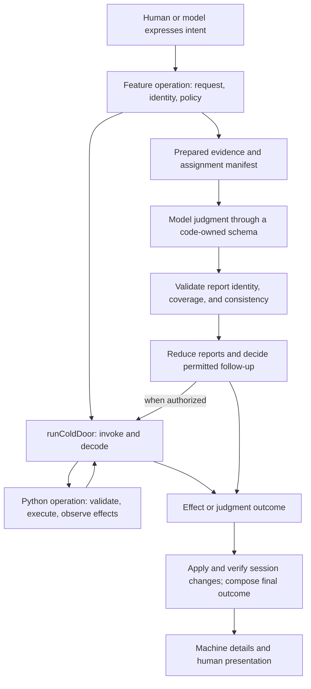

# Command interface and structured output opportunities

Assessment date: 2026-09-25. This is a proposed direction for perk maintainers,
grounded in the snapshots below. It changes no runtime behavior or shared contract.

## Recommendation

**Extend the semantic guarantees of perk's strongest operations to the rest of the
workflow.** The live Python command interface and structured LLM output are two
ways of making the session dependable: callers express intent through a small
interface, while code owns the procedure, validation, and interpretation of the
result.

Perk already does substantial work on both fronts. The highest-value next step is
to bind review classification to code-prepared feedback and validate the returned
judgments against it. On the command side, preserve complete outcomes through
execution, session reconciliation, and presentation, then consolidate remaining
mechanical sequences such as ordinary PR conflict repair. Explicit draft handoffs
are a further opportunity to reduce dependence on conversational completion.

The priority here is **reliable, consistent UX**, followed by simplicity and upkeep.
The companion [Pi integration assessment][pi-assessment] prioritizes upkeep across
the wider integration. These are different questions: this memo concerns what a
workflow operation guarantees, regardless of which execution engine hosts it.
Expected wins below are architectural judgments, not measured defect-rate or
latency improvements.

## Evidence and scope

| Source | Inspected snapshot and use |
| --- | --- |
| Perk | 3.7.0, `2c7b4866bb087e70e1674befdec93a2b6242b3e7`; current implementations, contracts, and tests decide what already exists. |
| Erk | Local checkout at `2656c0e1a830f42cf7b9b6ed36f59a0ced7e3b97`, April 12, 2026; Python command design and agent orchestration prior art. This is not a claim about current upstream. |

The earlier [CLI/Pi principle][cli-vs-pi], [Python CLI guidelines][cli-guidelines],
and [erk study][prior-art] explain the lineage. Their historical prescriptions
must be read against current code: Python is called throughout live sessions, and
Pi-native tools can expose those operations without asking a model to assemble
shell procedures. The [shared contract][contracts] remains the behavioral record.

Findings are source-inspected unless stated otherwise. Existing tests were read as
evidence of intended coverage. One offline TypeBox schema probe was performed
during planning, described below. No model-provider calls, GitHub mutations, live
conflict repairs, or engine compatibility certification support this assessment.

## The shared principle

An agent should spend judgment on choices that need judgment. Once it has chosen
an operation, it should not also have to remember a mechanical recipe, reconstruct
identities, copy a schema, calculate totals, or infer whether a process actually
completed its intended effect.

The two interfaces constrain different sources of uncertainty:

- **Command operations** accept intent and own deterministic orchestration over
  files, Git, providers, and durable state. Their results describe what happened,
  including partial or uncertain effects.
- **Judgment operations** prepare evidence, solicit bounded model output, validate
  it against the assignment, and reduce it into a domain outcome. A valid report
  supplies data; code still decides which transitions that data permits.

"One way" means one authoritative meaning and procedure for an operation. A human
CLI, slash command, native tool, and headless caller may all expose it. They need
not have identical syntax or presentation. Equivalent authorized requests should
agree on eligibility, effects, and recovery; human and model entrypoints can still
have different powers. Deterministic session state, review eligibility, report
reduction, and Pi lifecycle handling remain TypeScript responsibilities. Ownership
follows the lifecycle being managed.

This is a responsibility map, not a proposed universal runner. Preparing evidence
may itself call a Python command. Operations without session changes proceed
directly to presentation. Each feature defines how completion, partial effects,
refusal, and uncertainty appear in its outcome.

Deterministic validation has several distinct jobs:

| Check | What it establishes | What it cannot establish |
| --- | --- | --- |
| Shape | Required fields, types, vocabulary, and applicable size bounds | That a syntactically valid ID belongs to this request |
| Identity and scope | The target, assignment, artifact, and returned IDs correspond | That the model understood their contents |
| Coverage and consistency | Required work is accounted for; duplicates, counts, and cross-field states agree | That a complete assessment is substantively correct |
| Transition eligibility | Current evidence permits this save, publication, continuation, or completion | That external state cannot change afterward |
| Effect observation | Which effects and read-backs succeeded, failed, or remain unknown | Atomicity across GitHub, Git, files, and session history |

Reliable UX depends on carrying those distinctions to the user. More JSON alone
does not supply them, and stricter rejection of every optional field can make the
experience worse after a successful mutation.

## Where perk is already doing well

### Live commands

| Existing pattern | Why it is valuable |
| --- | --- |
| [One extension command adapter][cold-door], backed by a [source guard][cold-door-guard] | Centralizes executable selection, scratch-file input, cancellation forwarding, exit/envelope handling, and caller-supplied decoding. Features do not each reinvent process plumbing. |
| [Explicit Python parsing roles][boundary] | Strict machine inputs, tolerant external/stored data, and output serialization have different policies. Runtime validation and domain validation are separate concerns. |
| [Schema snapshots][schema-tests] and [output goldens][golden-tests] | Make changes to registered Python schemas and selected emitted envelopes reviewable. These are useful foundations for cross-plane conformance. |
| [Plan save behind a feature port][plan-save] | Callers use a domain operation that handles backend persistence, session linkage, and claim clearing. Human and model entrypoints share the operation. |
| [Mechanical land finalization][land-finalize] | Python owns post-merge bookkeeping, node completion, and conditional objective closure, with explicit treatment of secondary failures. The model's later reconciliation pass concerns prose and judgment. |
| [Batch thread resolution][resolve-threads] and [address finalization][address-feature] | Input validation precedes thread effects; publication precedes resolution. Finalization distinguishes known partial resolution from unverified resolution and corroborates nominal success against requested threads. |
| [Shared tool results][tool-result] and [human reporting][report] | Provide established seams for structured details, visible failures, and headless diagnostics. Feature outcomes can drive both presentations. |

Address finalization is particularly strong. It preserves successful publication
facts when resolution fails, derives retry input from per-thread evidence, avoids
repeating a reply known to have posted, and withholds completion when success rows
do not corroborate the request. Its [feature tests][address-tests] and
[registered-tool tests][address-tool-tests] exercise those distinctions. These
provide a concrete model for other operation results.

The [decode policy][decode-policy] is also an asset: authoritative persisted facts
are validated strictly; malformed advisory detail may be dropped while preserving
a known successful effect. A dropped field must not authorize a follow-up that
requires it. Where possible, display fields are derived from validated facts
instead of independently decoded.

### Structured judgment and authoring

| Existing pattern | Why it is valuable |
| --- | --- |
| [Code-owned classifier assignment and schema][classifier] | Removed the parent's obligation to transcribe a schema into a borrowed subagent call. The source records the malformed-report problem that motivated this. |
| [ReportWave][report-wave] | Owns assignment normalization, completeness policy, opaque handles, and collection. A settled result drains once within the owning instance; notification text is not the report. |
| [Recorded review eligibility][automated-review] | Recorded waves carry PR identity, coverage, and a minimum verdict. Incomplete coverage cannot become a clean review; actionable evidence cannot be erased by a parent's clean verdict. |
| [Session audit][audit] | Uses code-owned assignment identity, checks echoed identity, sanitizes reports, and represents missing or ambiguous evidence explicitly. |
| [Learn harvest][harvest] | Validates manifests and path scope, correlates reports with planned lanes, and computes metadata through a deterministic post-pass. It does not ask the model to own all bookkeeping. |
| [Conflict-resolution reports][conflict-resolution] | Derive types, local shape validation, and engine schema from owned schemas, then apply cross-field checks before interpreting completion. |
| [Objective drafts][objective-draft] and [plan source selection][plan-source] | Structured tool inputs carry free-form prose into verified artifacts. Review and save consume explicit artifacts with defined provenance rather than treating all assistant text as an approved draft. |

The review publication flow is an important qualification to any claim that
reports are "only schema-checked." For recorded waves, the [publishing adapter][automated-adapter]
passes the expected PR to the Python operation, and the feature keeps evidence of
the permitted verdict. The backward-compatible standalone posting path is
distinct; the recorded-wave guarantees should not be attributed to every posting
call. Likewise, collection once within an instance is not durable exactly-once
execution across restarts.

Structured output also does not require turning prose into a rigid outline.
An objective draft can contain Markdown plus structured roadmap data, be reviewed
as Markdown, and preserve the reviewed artifact through persistence. Some content
validation deliberately remains with Python at save time. The valuable property
is explicit data flow and authority, not JSON as the human surface.

## What erk adds to the assessment

Erk demonstrates that the command principle survives a change of agent host.
Its [migration guidance][erk-migration] moves testable mechanical procedures out
of slash-command prose. The strongest transferable idea is **operation-level
completeness**: remove sequencing obligations from the caller, as well as giving
each individual command a predictable response.

| Erk evidence | Perk comparison and remaining lesson |
| --- | --- |
| [Landed-objective update][erk-landed] combines context discovery, node updates, table rendering, and an action comment; the [calling workflow][erk-landed-caller] leaves prose reconciliation to judgment. | Perk already puts its corresponding mechanical bookkeeping in land finalization. Use this as evidence for the division of responsibility, not a missing perk feature. Search for comparable mechanical sequences still carried by prompts. |
| [Batch resolution][erk-batch] validates the complete input shape before processing and emits per-item results. | Perk already adopts this pattern and adds strong interpretation of partial outcomes in address finalization. Batch validation does not make the subsequent remote effects transactional. |
| [Objective check operation][erk-check-operation] serves [human][erk-check-human] and [machine][erk-check-machine] adapters. The [machine decorator][erk-machine] supplies request parsing, structured errors, and schema introspection. | Reinforces shared domain operations behind different entrypoints. Perk already has Python models and feature ports; importing erk's decorator or creating a separate command namespace would need an additional demonstrated benefit. |
| [Inference hoisting][erk-inference] makes a generated branch slug an explicit input; [plan save][erk-plan-save] requires it when creating a branch. | Keep judgment inputs explicit and mechanical execution testable. Erk's nested-Claude failure explains that particular migration; it is not evidence that Pi has the same execution constraint. |
| [Feedback fetching][erk-feedback] consolidates acquisition; [classification preparation][erk-classify] derives facts and applies explicit policies before the LLM handles ambiguous material. | Perk already consolidates fetching. The additional opportunity is to bind the prepared input to the judgment operation and compute more non-judgment fields in code. Erk's specific classification heuristics require separate evaluation before adoption. |

Erk is useful prior art, not proof of uniform enforcement. Its machine decorator's
`output_types` supplies schema metadata; the wrapper serializes callback results
without validating them against those declared output types. Its landed update
performs several remote writes sequentially without a transaction. The older
batch command reports failures in JSON while exiting zero, whereas its machine
decorator uses nonzero exits for structured errors. Perk should preserve its own
defined envelope semantics and verify them through actual consumers.

Pi changes the most natural entrypoint: native tools can expose feature operations
directly, own schemas and assignment identity, and return machine details alongside
human presentation. It does not remove the value of the Python operation behind
that entrypoint. Conversely, a long prompt is not automatically misplaced Python
logic: interpreting a diff or resolving a semantic conflict still needs judgment.

## Prioritized opportunities

### 1. Bind review classification to prepared evidence

**Current gap.** The [feedback CLI][feedback] deterministically resolves the active
plan's PR and emits typed feedback, including mechanically computed totals. The
classifier child is instructed to fetch that feedback itself. The parent feature
does not prepare and retain the request's feedback identity; the [classifier
adapter][address-adapter] exposes the engine-validated report as `unknown` without
a feature-level check against a prepared feedback set.

The report schema owns shape and vocabulary, but it permits a model-supplied PR,
repeated IDs, unrestricted integer counts, and counts inconsistent with its arrays.
The offline probe compiled that schema locally with TypeBox and accepted both:

| Probe input | Local schema result |
| --- | --- |
| One praise thread, with counts reporting 99 actionable and zero praise | Accepted |
| Duplicate thread IDs and a negative actionable count | Accepted |

These are demonstrations of the schema's limits, not evidence that the installed
engine or a real user workflow produced either report. Nor is the report itself
an automatic instruction to mutate GitHub: address still has parent judgment and
separate finalization checks. The missing guarantee is between the input evidence
and the classification presented to that parent.

**Proposed owner and interface.** Introduce a feature-owned classification operation
over the existing feedback command and `ReportWave`. It prepares a feedback
artifact and retains its target and item identities, routes the artifact to the
child, and returns a validated classification outcome. The model supplies
classifications and explanations. Code supplies target identity, paths and other
available source facts, and derived totals. Preserve raw-feedback isolation from
the parent conversation.

Validate membership, uniqueness, required coverage, allowed vocabulary, and bounded
report size. Make the treatment of resolved threads, discussion comments, and
PR-level reviews explicit; the current feedback payload includes reviews that
the classifier report does not represent as their own collection. Decide which
facts are policy-derived and which need judgment before reducing the report shape.
Avoid importing erk's "informational" heuristics as established truths.

Before an eventual mutation, re-establish the current target and relevant item
membership in the operation that owns the effect. The snapshot proves what was
classified; it cannot prove that remote state has remained unchanged. Any new
cross-plane target/precondition fields belong in the shared contract when built.

**Win and acceptance.** The parent no longer has to reconcile identities or count
categories. Unknown or duplicate items, missing required coverage, and mismatched
targets cannot become a successful classification. Valid judgments over valid
inputs retain their prose. The schema probe cases become negative semantic tests
or disappear because those fields are derived rather than model-authored.

### 2. Carry complete outcomes through the UX seam

**Current gap.** Perk has strong domain results, but information can become less
complete as it reaches a particular entrypoint. [Plan save][plan-save] returns
session linkage and claim-clear outcomes. Its [adapter][plan-adapter] deliberately
omits those from the rendered save result, preserving existing output, while the
session seam reports failures separately. These failures are already visible;
the opportunity is a coherent machine and human account of the entire operation.

Similarly, `runColdDoor` handles execution and decoding; it cannot generally tell
whether a remote effect landed before cancellation, lost output, or a decoding
failure. Its failure arm should not be interpreted as universal evidence of no
effect. Address finalization already models this distinction locally.

**Proposed owner and interface.** Extend feature outcomes where information is
lost, starting with plan save. Keep durable effect facts, required session
reconciliation, advisory bookkeeping, and recovery guidance separately observable.
Have tool details and human renderers project the same outcome. Retain established
lower-level diagnostics while avoiding duplicate notifications as composition
improves.

Use domain-specific states, not one global `success` ladder. A saved plan with
unverified session linkage and a partially resolved review batch need different
recovery. Preserve validated partial results; drop malformed advisory detail when
the primary effect is established; withhold any follow-up whose necessary evidence
is absent. Define read-back or convergence for an uncertain effect before making
automatic retry a feature. Do not add blanket retries to the transport adapter.

**Win and acceptance.** A human and a headless caller can distinguish "saved; local
linkage needs repair" from "save failed" using the same operation result. Successful
publication remains visible after failed resolution. Lost responses never produce
an unsupported "nothing changed" claim or an unqualified instruction to repeat a
possibly completed mutation.

### 3. Move remaining mechanical conflict procedure into commands

**Current gap.** Ordinary PR conflict repair already has a typed result and
cross-field validation, yet its [task text][conflict-resolution] still assigns
context discovery, rebase procedure, verification, and force-with-lease pushing to
the child. Its completion fields are model reports of those actions. Structural
consistency of a report does not independently establish that checks ran or a
push reached the intended ref.

**Proposed owner and interface.** Develop a Python-owned PR repair lifecycle that
captures the target and relevant refs, begins or resumes the mechanical operation,
exposes unresolved work to the editing agent, verifies the resulting tree, and
performs authorized publication with appropriate preconditions. The TypeScript
feature owns delegation and session transitions. The model resolves semantic
conflicts and explains blockers; command results establish mechanical outcomes.
This can require several explicit lifecycle calls. One canonical operation does
not mean one blocking process must contain the LLM interaction.

Treat the [retained stack path][stack-conflict] as a distinct authority model. Its
child may finish the existing rebase and verify, but may not start another rebase,
push, or abort. The [Python continuation implementation][continuation] owns the
retained operation, leases, and publication. A child completion permits an offer
to continue; it does not authorize multi-ref publication. Preserve those limits
and native termination/lock handling while reusing only mechanics that truly
match.

**Win and acceptance.** The child needs fewer procedural instructions, and success
claims become corroborated command facts. Tests must cover stale refs, failed
verification, interrupted execution, and publication refusal. The refactor earns
its place only if callers stop owning mechanical steps; wrapping the same prompt
in another module is insufficient. This is a larger lifecycle change than the
first two priorities, so implement it separately after characterizing current
recovery behavior.

### 4. Make explicit artifacts the normal authoring completion path

**Current gap.** [Plan source selection][plan-source] already prefers a verified
draft, then an explicit parameter. Manual save alone retains a final fallback to
the latest assistant message; review excludes that fallback. The extractor cannot
distinguish a finished plan from conversational prose.

**Proposed owner and interface.** Extend the existing authoring operations and
provider adapters so supported authoring paths leave an explicit current draft
and return its verified identity. Reuse the artifact through review and save.
Keep Markdown inside that interface and preserve the existing fallback until the
provider paths that depend on it have a supported replacement.

**Win and acceptance.** Saving a draft does not depend on whether the assistant's
last utterance happened to contain the intended document. Review continues to bind
to the actual reviewed artifact. A missing or invalid draft produces an explicit
outcome; compatibility callers remain supported during migration.

## Refactoring that encourages consistent use

The reusable unit should be a **feature operation with a complete outcome**.
Perk already has examples in plan save, address finalization, review publication,
audit, and harvest. Deepen those modules and make their usage conventional.

| Concern | Ownership and adoption rule |
| --- | --- |
| Python command | Keep request validation, mechanical orchestration, effect observation, and domain results together. Human and machine adapters project that operation. Prefer a complete domain capability over a collection of helpers whose ordering remains in a prompt. |
| TypeScript judgment operation | Own prepared inputs, schema, semantic validation, completeness/retry policy, and reduction. Adapters receive a domain outcome instead of reconstructing meaning from raw reports. |
| Transport | Continue using `runColdDoor` and `ReportWave`. They own execution mechanics; target-specific validity and recovery stay in feature modules. |
| Schema and types | Derive types, validators, and engine schema from a common feature-owned declaration where practical, as conflict reports already do. Keep Python models authoritative for their CLI inputs/outputs. Share cross-plane agreements through `shared/`; do not add a second generated interface hierarchy. |
| Presentation | Render machine details and human messages from domain outcomes. Presentation may compress detail, but must preserve completion, uncertainty, and the permitted next action. |
| Adoption | When a prompt tells a model to compute a derivable fact, perform a fixed mutation sequence, or parse terminal prose to choose a workflow transition, first look for an existing operation to deepen. Keep instructions that genuinely require interpretation. |

For code-prepared evidence, retain code-owned routing and identity outside model
output wherever possible. If a report echoes identity, compare it to the request.
Treat returned prose as data, including explanations inside valid JSON. Deterministic
reducers can establish coverage and a conservative verdict floor; they cannot
prove the correctness of the underlying review.

Add producer-to-consumer conformance at the operations being improved. The existing
Python schema snapshots and selected output goldens verify producer behavior;
registered-tool tests exercise TypeScript consumers with fake CLI responses. These
are complementary, but a manually authored fake can agree with its consumer while
drifting from the producer. Use fixtures produced by the real Python serializers
in tests that pass through the actual TypeScript adapter. Test meaningful failure
and advisory-field policies alongside the happy path. This is a targeted extension
of existing suites, not a claim that all cross-plane testing is absent.

Implement the classifier and save-outcome changes as bounded exemplars first.
Extract shared machinery only when a second feature has the same obligations.
Then migrate PR repair mechanics separately and improve authoring handoffs by
provider. No new universal command registry, machine-only CLI tree, judgment DSL,
or execution engine is required by these findings.

## Acceptance and evidence to collect

These are acceptance scenarios for future implementation, not tests run for this
memo. Preserve existing behavior covered by the cited tests before extending it.

| Scenario | Required observation |
| --- | --- |
| Well-formed report for the wrong target or an unknown item | Feature validation refuses the outcome; no subsequent effect is authorized by it. |
| Duplicate IDs, missing required items, contradictory fields, or invented totals | Semantic validation detects the problem, or code derives the field so the model cannot supply it. |
| Missing or failed reviewer lane | Coverage stays explicit. Incomplete evidence never becomes a clean review; valid surviving reports remain available under the flow's policy. |
| Invalid item late in a batch | Input validation finishes before thread mutations begin. Once execution begins, later remote failures are reported as partial effects, not rolled back by implication. |
| Reply posted, thread resolution failed | Recovery avoids blindly reposting the reply; known successes and uncertainty survive into machine details and human guidance. |
| Cancellation, response loss, or bad output after an effect | Report uncertainty and use domain-specific observation or convergence before retrying. Do not assume process settlement establishes domain completion. |
| Save succeeded, session linkage rejected or unverified | The saved artifact remains a success fact; reconciliation failure and supported recovery are observable without a contradictory overall failure claim. |
| Stale ref or failed verification during repair | Publication is withheld by the mechanical owner. Retained-mode reports cannot acquire PR-mode publication powers. |
| Equivalent authorized request and state through different entrypoints | Eligibility, effects, and recovery agree even where wording or available UI differs; intentional actor restrictions remain intact. |
| Python output changes while TypeScript is unchanged | Conformance tests detect incompatible authoritative fields and preserve the defined tolerance for advisory fields. |
| Assistant speaks after finishing a draft | Explicit artifact selection remains stable; the compatibility fallback is exercised only in its specified save-only tier. |

Use `pytest` and `node:test` for implementation coverage, with narrow checks during
iteration and the repository's established final gate. Classify evidence honestly:
schema tests prove accepted shape; feature tests prove policy and reduction;
adapter tests prove projection; provider or live execution tests are needed for
claims about external effects.

Measure the proposed wins through removed caller obligations: fewer fixed steps
left in prompts, fewer identities or totals copied by a model, fewer independent
interpretations of completion, and fewer entrypoint-specific recovery branches.
Execution cost and latency may improve when unnecessary model work disappears,
but those require measurement. The strongest immediately testable improvement is
that invalid or uncertain evidence produces a consistent, truthful outcome.

[pi-assessment]: ./deep-opportunities-pi-integration.md
[cli-vs-pi]: ../design/first-principles/cli-vs-pi.md
[cli-guidelines]: ../design/first-principles/python-cli-guidelines.md
[prior-art]: ../design/first-principles/prior_art.md
[contracts]: ../../shared/contracts.md
[cold-door]: ../../extension/substrate/coldDoor.ts
[cold-door-guard]: ../../extension/coldDoorGuard.test.ts
[boundary]: ../../src/perk/boundary.py
[schema-tests]: ../../tests/test_contract_schemas.py
[golden-tests]: ../../tests/test_json_goldens.py
[plan-save]: ../../extension/authoring/plan/save.ts
[plan-adapter]: ../../extension/pi/v1/plan.ts
[land-finalize]: ../../src/perk/delivery/finalize.py
[resolve-threads]: ../../src/perk/cli/commands/pr/resolve_threads_cmd.py
[address-feature]: ../../extension/delivery/address.ts
[address-adapter]: ../../extension/pi/v1/delivery/address.ts
[address-tests]: ../../extension/delivery/address.test.ts
[address-tool-tests]: ../../extension/pi/v1/delivery/address.test.ts
[tool-result]: ../../extension/substrate/result.ts
[report]: ../../extension/surfaces/report.ts
[decode-policy]: ../learned/workflow/cold-door-client.md
[classifier]: ../../extension/waves/reviewClassifierWave.ts
[report-wave]: ../../extension/waves/reportWave.ts
[automated-review]: ../../extension/codeReview/automated.ts
[automated-adapter]: ../../extension/pi/v1/codeReview/automated.ts
[audit]: ../../extension/learning/audit.ts
[harvest]: ../../extension/learning/harvest.ts
[conflict-resolution]: ../../extension/delivery/conflictResolution.ts
[objective-draft]: ../../extension/authoring/objective/draft.ts
[plan-source]: ../../extension/authoring/plan/source.ts
[feedback]: ../../src/perk/cli/commands/pr/feedback_cmd.py
[stack-conflict]: ../../extension/delivery/stackConflict.ts
[continuation]: ../../src/perk/delivery/continuation.py
[erk-migration]: https://github.com/dagster-io/erk/blob/2656c0e1a830f42cf7b9b6ed36f59a0ced7e3b97/docs/learned/cli/slash-command-exec-migration.md
[erk-landed]: https://github.com/dagster-io/erk/blob/2656c0e1a830f42cf7b9b6ed36f59a0ced7e3b97/src/erk/cli/commands/exec/scripts/objective_apply_landed_update.py
[erk-landed-caller]: https://github.com/dagster-io/erk/blob/2656c0e1a830f42cf7b9b6ed36f59a0ced7e3b97/.claude/commands/erk/system/objective-update-with-landed-pr.md
[erk-batch]: https://github.com/dagster-io/erk/blob/2656c0e1a830f42cf7b9b6ed36f59a0ced7e3b97/src/erk/cli/commands/exec/scripts/resolve_review_threads.py
[erk-check-operation]: https://github.com/dagster-io/erk/blob/2656c0e1a830f42cf7b9b6ed36f59a0ced7e3b97/src/erk/cli/commands/objective/check/operation.py
[erk-check-human]: https://github.com/dagster-io/erk/blob/2656c0e1a830f42cf7b9b6ed36f59a0ced7e3b97/src/erk/cli/commands/objective/check/cli.py
[erk-check-machine]: https://github.com/dagster-io/erk/blob/2656c0e1a830f42cf7b9b6ed36f59a0ced7e3b97/src/erk/cli/commands/objective/check/json_cli.py
[erk-machine]: https://github.com/dagster-io/erk/blob/2656c0e1a830f42cf7b9b6ed36f59a0ced7e3b97/packages/erk-shared/src/erk_shared/agentclick/machine_command.py
[erk-inference]: https://github.com/dagster-io/erk/blob/2656c0e1a830f42cf7b9b6ed36f59a0ced7e3b97/docs/learned/architecture/inference-hoisting.md
[erk-plan-save]: https://github.com/dagster-io/erk/blob/2656c0e1a830f42cf7b9b6ed36f59a0ced7e3b97/src/erk/cli/commands/exec/scripts/plan_save.py
[erk-feedback]: https://github.com/dagster-io/erk/blob/2656c0e1a830f42cf7b9b6ed36f59a0ced7e3b97/src/erk/cli/commands/exec/scripts/get_pr_feedback.py
[erk-classify]: https://github.com/dagster-io/erk/blob/2656c0e1a830f42cf7b9b6ed36f59a0ced7e3b97/src/erk/cli/commands/exec/scripts/classify_pr_feedback.py
