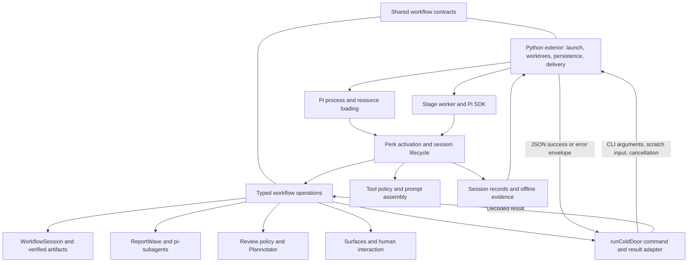

# Deep opportunities in perk's Pi integration

Assessment date: 2026-09-24. This is a refactoring direction for perk maintainers,
grounded in the snapshots below. Refactors and experiments are proposals; this
document changes no runtime contract or compatibility claim.

## Recommendation

**Consolidate the browser-review lifecycle first, then improve effective-access
transitions.** These have concrete evidence in today's code: duplicated asynchronous
review choreography and mode-change calls that return no effective result. Keep the
existing extension architecture as the default while making those local improvements.

With **simplicity and upkeep** as the primary objective, investigate smaller options
before acquiring another runtime. Existing prompt tooling can guide an observability
experiment. Structured pi-subagents delegation may simplify report transport while
retaining the engine. An owned SDK executor, Chord composition, Harness durability,
and detached presentation are separate bets with different costs and acceptance tests.

This ordering is architectural judgment based on source evidence and change scope.
It is not backed by a churn, defect-rate, or implementation-cost study. Broader
session-attachment and prompt-coordinator proposals need stronger evidence of caller
obligations they would remove.

Measure elegance by how many facts a caller must know, how locally a maintainer can
change behavior, and how directly tests exercise the same interface as callers.
A new owner earns its place by removing obligations, not by shortening an entrypoint.

## Evidence and what has already landed

| Subject | Inspected snapshot |
| --- | --- |
| Perk | 3.7.0, `2c7b4866bb087e70e1674befdec93a2b6242b3e7` |
| Development SDK | Installed Pi coding-agent and agent-core 0.87.0; coordinated development pins in [package.json][package] |
| Borrowed extensions | Project-installed pi-subagents 0.70.1 and Plannotator 0.27.17; delegation API also checked against pi-subagents release commit `1ac7b5e2652e9571164847ac2905ab4aded92791` |
| Upstream Pi source | `1b6ddca87ca041e3b02b387d5a321eb77fc39eca`, September 21; a post-release checkout, kept distinct from installed 0.87.0 |

The main research inputs are the September 21 [Pi][pi-assessment],
[pi-subagents][subagents-assessment], and [Plannotator][plannotator-assessment]
assessments; the [v3 Pi memo][v3]; and the [TypeScript decomposition][decomposition],
[session-management][session-planning], and [headless-execution][headless] plans.
The earlier [future-proofing proposal][future-proofing] supplies useful questions,
but current code decides which of its suggested seams still need work.

Several recommendations in those documents are now history:

| Earlier recommendation | Current disposition | Consequence for this memo |
| --- | --- | --- |
| Separate Pi registration from workflow features | Landed: Pi-free feature homes, typed operations, `WorkflowSession`, and opaque `ReportWave` lifecycle | Preserve and deepen these interfaces; another directory decomposition is not the priority. |
| Delegate context projection to Pi | Landed, including edit-aware projection | Preserve it; investigate visibility into the resulting context. |
| Repair `/btw` seeding and simplify summarization | Landed in 3.6.0 | The remaining live-runtime probe is a distinct session-construction concern. |
| Centralize session-only plan reads and startup facts | Landed | Examine specific transition callers before adding another owner. |
| Improve session discovery and naming | Landed in 3.5.0, including run-based resume | Preserve native Pi conversation selection and the distinction between resume and fresh launch. |
| Remove FFF and `completionGuard` workarounds; use a pinned stack patch | Landed in 3.6.0 | These are no longer refactoring opportunities. |
| Share the host SDK with native consumers | Landed in 3.7.0 | Treat the bridge as a working adaptation with an upstream retirement condition. |
| Retain finished reports when the engine deadline expires | Landed in 3.7.0 | Preserve deadline partials in any execution replacement. |

These dispositions are supported by the [changelog][changelog],
[context evidence][context-evidence], [session interface][workflow-session],
[lifecycle implementation][lifecycle], [SDK bridge][sdk-bridge], and
[report transport][transport]. Historical assessments remain useful snapshots;
their lists should not be copied into a new backlog without this reconciliation.

Evidence in this memo is **source-inspected** unless explicitly attributed to an
earlier assessment. Existing tests were inspected as characterization and future
acceptance surfaces. This assessment ran no model-provider calls, live browser
reviews, compatibility certification, or runtime experiments. Proposed wins remain
hypotheses until their stated acceptance criteria pass.

## The current interface and its lifetimes

Python owns the session exterior: positioning, worktrees, run identity, convergence,
and dispatch. TypeScript owns in-session transitions and state. Shared contracts
connect them. This is also a live command interface: saves, reviews, and delivery
operations call back into Python throughout a session.

The diagram groups responsibilities, rather than specifying imports. These
responsibilities have different lifetimes:

| Lifetime | Owner and invariant |
| --- | --- |
| Process | SDK namespace bridge and module identity; the bridge deliberately survives reload and does not deregister in production. |
| Extension activation | Restriction floor, registrations, and owned controllers; a report child's floor cannot be cleared by changing stage or navigating the tree. |
| Session and selected branch | Run linkage, workflow history, verified artifacts, and scope; launched stage, selected stage, and checkout linkage are distinct facts. |
| Turn or operation | Injected context, review/wave identities, budgets, cancellation, and terminal evidence; an asynchronous result must still belong to its consumer. |
| Presentation | Browser, footer, and observer state; closing or replacing a presentation is not inherently authorization to save, publish, or abort execution. |

The [composition root][root] sequences identity, restrictions, gate installation,
refinement import, pointer capture, feedback, and presentation. Some ordering is
necessary: restricting tools before fallible reconciliation is a safety property.
Its length alone does not establish a missing session-attachment abstraction.

The live [command adapter][cold-door] already owns executable selection, cancellation
forwarding, JSON envelope checks, and caller-supplied payload validation. Because
`pi.exec` has no stdin channel, content travels through run-scoped scratch files.
Unexpected success payloads report possible CLI/extension version skew. Preserve
this seam and its [shared contract][contracts]; include it when assessing upkeep.

Other integration is already appropriately deep. The exterior's [Pi exec seam][pi-exec]
serves plain, staged, and resumed launches. The [stage worker][stage-worker]
interprets workflow completion separately from SDK settlement. `ReportWave` gives
callers assignments, opaque references, reports, and completeness; a completion
notice is not the authoritative report. The [surfaces module][surfaces] owns rich UI.
These are assets to keep.

## Priorities within the existing integration

| Disposition | Work | Expected win | Evidence and confidence |
| --- | --- | --- | --- |
| Refactor first | Browser-review operation lifecycle | Remove repeated readiness, stale-decision, and cleanup choreography | High confidence in duplication; maintenance benefit still to be demonstrated |
| Refactor second | Effective-access transition results | Callers respond to applied access and failures without inferring success | Concrete API gap; wider attachment extraction unproven |
| Investigate | Runtime prompt observability | Explain what guidance reaches a turn using the existing prose map | Static tooling exists; need for a coordinator unproven |
| Characterize | Supported configuration and packaging surface | Make compatibility obligations and adoption costs explicit | Constraints established; savings from reducing support unmeasured |

### 1. Own the browser-review operation lifecycle

The [plan][plan-browser] and [objective][objective-browser] browser doors repeat a
substantial sequence: open the guarded review slot, start Plannotator, prime
annotations and draft-review context, observe readiness, reject late decisions
after degradation, capture setup output, route a decision, and conditionally clear
owned surfaces. The [browser-open core][browser-handoff] already shares port
selection and readiness polling. The opportunity is above that core.

Introduce one internal operation owner composed with the existing [draft-review
slot][draft-review]. It acquires readiness and decision observation, supersession
checks, setup-output capture, companion-surface ownership, and cleanup. Bindings
retain subject-specific completion: plan direct edits, objective/gist/refinement
revision semantics, and ordinary PR versus stack publication remain distinct.
Approval still depends on valid reviewed bytes and destination.

The expected win is deleting the duplicated asynchronous protocol. Begin with plan
and objective doors. Prove reviewed-byte and destination checks, superseding opens,
readiness timeout followed by late approval, early decision, abort, session
replacement, and idempotent cleanup. A retiring operation must not clear a successor's
surfaces. Retain the unconfirmed-save latch and direct-edit behavior.

Local consolidation cannot manufacture server cancellation. The supplier protocol
does not return an owned server handle with ready URL and cancellation. Aborting
perk's wait and closing the server remain distinct. Port coordination, polling, and
console interception can disappear only when a supported supplier interface replaces
their jobs.

### 2. Return effective access from mode transitions

[Tool gating][gating] exposes `enter`, `exit`, `syncFromState`, and `isActive`.
The first three return no outcome. In particular, `exit` can retain read-only access
because of the activation's restriction floor. The [plan toggle][plan-binding]
announces that access was restored after calling it. This is a source-level mismatch
between requested and effective access; no user-visible failure was reproduced here.

Start by making mode transitions report applied, restricted, or failed outcomes
with the effective access observation. This should remove caller inference while
keeping persistence and tool installation in the existing controller. The result
describes that observation; asynchronous work must recheck live authority.

The [refinement binding][refinement] also pairs entry with stage synchronization,
but its context-validation and persistence order has domain meaning. Consolidate
only repeated gate application that preserves that meaning. Keep startup and
navigation sequencing in their current owners until another extraction demonstrates
a specific simplification. No broad session-attachment type is prescribed.

Acceptance covers ordinary and restricted exits, stage-scoped access, persistence
failure, and host tool-installation failure. Preserve restrictions across reload and
navigation, bare-session behavior, and deliberately inactive tools. Retain late-tool
`resources_discover` reconciliation and structural `tool_call` enforcement. Identity,
allowlists, and the activation floor remain necessary; the process-wide SDK bridge
keeps its separate lifetime.

### 3. Observe prompt assembly before centralizing it

Pi supplies canonical active-message projection. Perk's [context injection][context-injection]
already consolidates its main inject/retain pair. [Binding delivery][binding-delivery],
[agent scratch][scratch], and tool gating retain legitimate distinct evidence rules:
active guidance markers, exact current scratch content, and full-branch mode guidance.

The [prose map][prose-map], [structural catalog][prose-catalog], and [assembly
preview][assembly-preview] already describe sources, session shapes, and ordered
assemblies. The preview renders authored layers under a selected scenario; optional
layers retain presence markers, and external contributions become placeholders.
It does not execute a live hook sequence or prove what reached a model turn.

Use that foundation and the [real-SessionManager evidence tests][context-tests] to
compare expected layers with outgoing context in a bounded scenario. Cover cold
prompts before persistence, warm bindings, edits, compaction, stage changes, and
scratch exclusion in children. Preserve each carrier's delivery evidence; assistant
text or a quoted summary cannot prove that owned guidance was delivered.

The first expected win is explaining “what guidance reaches this turn, and why?”
without duplicating the source catalog. Observation adds its own maintenance cost.
Introduce an assembly coordinator only if the exercise exposes recurring ordering
failures or callers reconstructing the same sequence. Distinct hooks and retention
rules alone do not justify merging their ownership.

### 4. Make the support surface explicit

[Development pins and wildcard peers][package], [unpinned borrowed packages and
selected providers][package-settings], and installed artifacts describe different
things. Record the version/provider/execution-mode combinations actually supported
and their evidence alongside existing compatibility records, starting with the
[subagents reverification procedure][reverify]. A source-guidance baseline and a
live-certified combination must remain distinguishable.

The [bare-import guard][import-guard] enforces the bare-clone/zero-runtime-dependency
rule: extension imports resolve through relative files, Node, and supported host
aliases. A public pi-subagents subpath or a published Chord package therefore still
needs a supported loading arrangement. Every architecture comparison must include
packaging, provider registration, credentials, and CLI/extension version alignment.

The immediate win is visible obligations and more targeted conformance coverage.
Reducing supported combinations might save more upkeep than a local extraction, but
this assessment has no usage evidence to justify that choice. No borrowed-package
pin, support removal, or new launch-time version gate is recommended here.

### Smaller current-stack capabilities

These are independent candidates from the September assessments:

| Capability | Disposition and possible win | Required proof |
| --- | --- | --- |
| pi-subagents `allowedAgents` ceiling | Candidate adoption for agents with an unconditional no-descendant policy; enforce an existing instruction | Verify empty-list parsing, denied foreground/background descendant attempts, unchanged parent access, and structured completion. Keep perk's separate tool/bash restrictions. |
| Required child-extension registration | Investigate reliable delivery of narrow report enforcement | Resolve the public API's package-loading seam; verify disposal, path identity, override/denial behavior, and separation from foreground writers. Avoid loading the full parent extension as the solution. |
| Pi actionable `turn_end` / `agent_before_settle` | Bounded worker experiment for simpler budget/completion handling | Prove persisted follow-up, continuation, cancellation, and one terminal result. `agent_settled` remains notification-only; settlement does not prove workflow success. |

The [subagents assessment][subagents-assessment] specifies parser and loading
constraints; the [Pi assessment][pi-assessment] specifies lifecycle semantics.
Adoption remains conditional on those checks. Neither API availability nor a new
hook is sufficient reason to rewrite current execution.

## Comparing architectural options

These directions can be combined, but each must justify its own costs.

| Direction | Potential simplification | Responsibilities acquired | Disposition |
| --- | --- | --- | --- |
| Existing extension, targeted refactors | Fewer repeated review protocols and inferred access results | More complete ownership in current modules | Recommended local direction |
| Structured pi-subagents report delegation | Remove generated workflow scripts while keeping child execution with the engine | Batch scheduling, terminal correlation, parent notification | First report-transport experiment |
| Owned SDK report execution | Remove report-specific supplier orchestration and transport | Runtime policy, resources, credentials, supervision, packaging | Compare only after the smaller option |
| Chord composition | Simplify activation/disposal and observation wiring | Service integration, loading, lifecycle semantics | Independent composition experiment |
| Harness durability | Durable operation admission and recovery | Extension parity, storage, authorization, effect reconciliation | Independent experiment; defer production adoption |
| Detached presentation | Observe execution independently of a UI connection | Subscription identity, reconnect, control authorization | Independent experiment; no host migration assumed |

### Report execution: preserve the caller, compare implementations

[`ReportWave.start/collect/run`][report-wave-module] already hides assignment
validation, completeness, and drain-once collection. Changing executors primarily
offers internal locality. The private [adapter][transport] currently speaks ping,
generated script spawn, completion, stop, and aggregate reads. Compare alternatives
at prepared assignments and typed lane outcomes, above that script-shaped seam.

The [foreground conflict resolver][conflict-resolver] already uses pi-subagents'
[structured delegation API][up-delegation]. It carries request/run/node identity,
agent, task, cwd, model/skill options, schema, cancellation, and terminal results.
Investigate using it for report lanes, or a modest upstream addition, before owning
SDK sessions. The possible win is removing script generation and aggregate-file
transport while retaining the engine's agent loading and execution. Perk would
still need event correlation, concurrency scheduling, batch settlement, and a
completion wake.

This is not an established report replacement. The inspected request lacks a
worktree override and perk's report-restriction packet; the conflict resolver
currently refuses incompatible global worktree defaults. A single foreground writer
does not prove restricted, concurrent report execution. Establish execution in the
requested working directory without creating another worktree, fresh context,
required skills, model/provider overrides, restriction delivery, queued cancellation,
and terminal semantics first. Public required-extension registration may help but
has the loading constraints above.

For an **owned SDK executor**, compare explicit per-session restriction/resource
inputs with process-isolated workers. Current [runner-child authorization][child-restrictions]
reads process-global inputs; concurrent in-process sessions must not toggle them
to simulate isolation. Explicit session policy requires proof of independent state
and enforcement. Processes offer stronger isolation but add startup, supervision,
credential/runtime transfer, and [worker packaging][worker-launch] costs. No topology
is selected by this assessment.

An SDK replacement could remove report-specific scripts, supplier RPC reconciliation,
completion-before-spawn buffering, and aggregate-file transport. It acquires agent
profile/model resolution, schema-output tools, resources, credentials, cancellation,
quiescence, and notification. The existing [worker SDK adapter][sdk-adapter] is useful
prior art for binding, abort, and disposal; extract common mechanics only when a
second implementation proves them. Stage terminal proof and report completion
remain separate policies.

Both candidates must preserve completed siblings on deadline partials, strict and
best-effort completeness, overlapping collection, and authoritative reports separate
from telemetry receipts. Test successful concurrent lanes, malformed/missing and
duplicate outputs, hung lanes, cancellation during setup/execution, parent loss,
attempted writes/delegation, and provider/agent overrides. Receiving structured output
does not prove the child has stopped acting. Replace the native completion wake and
[model-facing waiting guidance][review-wave] together.

Use installed-engine conformance checks for delegation and a real SDK with scripted
provider responses for the owned candidate. Adopt only when those checks pass and
the removed obligations outweigh the new ones. Keep current transport otherwise.
Neither experiment eliminates pi-subagents wholesale: conflict resolution remains.
The SDK bridge also still serves pi-web-access and remaining pi-subagents usage.

### Composition, durability, and presentation: independent proofs

[Chord][up-chord] supplies provider-first activation, reverse disposal, stable service
handles, and replicated observations. AgentHarness supplies durable operation
mechanics. The inspected [Pi package exports][up-package] keep application-host
`client` and `experimental/plugin` entries source-only and exclude their implementations
from normal distributions; installed 0.87.0 matches that policy. Library availability
does not establish a distributable host that runs perk.

The inspected [worker lifecycle][up-worker] retains active operations after
presentation demand disappears. That corrects any blanket claim that detach always
stops work. However, its default Harness construction supplies read/write/bash and
empty resources, rather than perk's extension path. Its [service roadmap][up-services]
defers workspace/plugin authorization. Harness [`watchSession`][up-harness] remains
unimplemented, and its [storage specification][up-storage] labels format 4
pre-stabilization. These are limits of the inspected snapshot.

| Experiment | Acceptance and rejection |
| --- | --- |
| Chord composition | Compare one read-only workflow observation through ordinary typed composition and Chord under hydration, replacement, failed reload, disconnect, and disposal. Adopt only if it removes caller lifecycle obligations and satisfies packaging requirements; reject extra service-token plumbing without that reduction. |
| Harness durability | Run a disposable existing perk stage with actual tools/resources and terminal evidence. Prove budgets, cancellation, restart, duplicate admission, and reconciliation of uncertain external effects. Defer if extension parity or storage/recovery remains unresolved. |
| Detached presentation | Observe one execution through existing surfaces and a headless observer. Prove disconnect/reconnect, consistent identity, and authorized control without cancelling work when observation stops. Compare current-host/subprocess options before acquiring a service host. |

A Chord result neither gates nor proves Harness durability. A detach demonstration
does not prove crash recovery. The ordinary subprocess RPC option in [Pi session
driving][session-driving] is also relevant when isolation or external control is the
actual requirement.

Retain Python as the migration default. Worktrees, objective-length coordination,
run identity, and delivery authority outlive a Pi session, and their implementation
is mature. Those lifetimes justify explicit ownership; they do not prove that two
languages are permanently necessary. Language consolidation needs its own evidence
about policy migration and the live command interface.

## Retire host adaptations through explicit upstream contracts

Several mechanisms compensate for missing host or supplier capabilities. The
maintenance opportunity is to obtain those capabilities and remove their substitutes,
with a concrete retirement test for each:

| Current adaptation | Replacement contract to seek | Deletion proof |
| --- | --- | --- |
| Native SDK bridge, generated ESM facades, consumer census, and package-order rule | Supported host namespace resolution for native extension consumers | Real installed consumers share host class/value identity across reload and lazy imports without perk's loader hooks. |
| `/btw`'s private `ModelRegistry.runtime` probe | Public session construction using the active model/provider runtime | Side sessions preserve runtime-only providers and API-key overrides without inspecting private fields. |
| Snapshot/census reconciliation around `setActiveTools` | Composable effective-tool policy with an explicit resource lifecycle | Late tools, foreign deactivation, stage scope, and child restrictions compose without timing repairs. |
| Plannotator port environment, readiness probes, and setup-output interception | Typed per-review readiness, result, logging, and cancellation handle | Concurrent and superseded reviews work without process-global coordination or guessed server readiness. |
| Contextless pi-subagents reply hold and duplicate-scope diagnosis | Session-scoped discovery and responder identity | Duplicate loading cannot produce a false launch failure or confuse active responders. |

The relevant implementation is in the [SDK bridge][sdk-bridge],
[package convergence][package-settings], [`/btw`][btw], [tool gate][gating],
[Plannotator bridge][plannotator-bridge], and [wave RPC adapter][rpc]. These
mechanisms should remain while their causes remain. Pi hook-unsubscribe support,
for example, does not establish unique responders on a separate extension event bus.

Track these retirement conditions with the existing doctor, selfcheck,
installed-consumer tests, and compatibility procedures. Package convergence stays
with `init`; legacy repair stays with `doctor --fix`.

These are upstream-dependent deletion opportunities, with no delivery or measured
payoff promised. Pursue them independently of local refactors and host experiments;
retain each adaptation until its replacement passes the relevant conformance checks.

## Sequence, verification, and limits

Begin with the browser lifecycle, then narrow access-transition results. Characterize
prompt visibility and the support surface without committing to a new coordinator
or support reduction. The smaller capability candidates and upstream retirement work
can proceed independently. For reports, evaluate structured delegation before an
owned executor. Chord, durability, and detached presentation remain independent
research; production service-host adoption is deferred.

Each implementation slice should demonstrate fewer caller obligations through the
existing `pytest` and `node:test` suites and the repository's CI and dogfood gates.
Use real SessionManager instances, temporary repository fixtures, recording host
adapters for adverse ordering, and installed-package conformance where appropriate.
Keep prose-tooling checks in their existing opt-in suite. For every slice, compare
removed caller sequences and compatibility mechanisms with responsibilities acquired;
line counts alone do not demonstrate a maintenance win.

Preserve two adjacent interfaces. The [offline evidence parser][evidence-parser]
isolates Pi's JSONL grammar from learning normalization; a format-4 or independent
evidence export needs a verified producer contract. `WorkflowSession` hides
branch-owned state and verified artifacts; current-value storage does not replace
branch history, fork inheritance, or audit evidence.

Performance, reliability, and recovery benefits require evidence from the proposed
experiments. Later implementation must update [shared contracts][contracts] for
cross-plane behavior, user docs for visible behavior, and the perk-expert mirror for
configuration/provider/backend changes. This memo makes none of those changes.

[package]: ../../package.json
[changelog]: ../../CHANGELOG.md
[pi-assessment]: pi-assessment-2026-09-21.md
[subagents-assessment]: pi-subagents-assessment-2026-09-21.md
[plannotator-assessment]: plannotator-assessment-2026-09-21.md
[v3]: upcoming-pi-changes-memo-v3.md
[decomposition]: ts-decomposition/memo.md
[session-planning]: pi-session-management.md
[headless]: deepen-headless-execution/memo.md
[future-proofing]: future-proofing-decomposition.md
[session-driving]: deepen-headless-execution/pi-session-driving.md
[root]: ../../extension/index.ts
[lifecycle]: ../../extension/session/lifecycle.ts
[workflow-session]: ../../extension/session/workflowSession.ts
[cold-door]: ../../extension/substrate/coldDoor.ts
[pi-exec]: ../../src/perk/run/pi_exec.py
[stage-worker]: ../../extension/worker/stageExecution.ts
[sdk-adapter]: ../../extension/worker/sdkAdapter.ts
[surfaces]: ../../extension/surfaces/surfaces.ts
[context-evidence]: ../../extension/pi/v1/contextEvidence.ts
[context-injection]: ../../extension/pi/v1/contextInjection.ts
[context-tests]: ../../extension/pi/v1/contextEvidence.test.ts
[binding-delivery]: ../../extension/substrate/bindingDelivery.ts
[scratch]: ../../extension/substrate/agentScratch.ts
[prose-map]: ../design/prose-prompt-map.md
[prose-catalog]: ../../tools/prose-map/catalog.ts
[assembly-preview]: ../../packages/perk-dev/src/perk_dev/prose_review/assembly.py
[import-guard]: ../../extension/bareImportGuard.test.ts
[reverify]: ../developers/pi-subagents-reverify.md
[plan-binding]: ../../extension/pi/v1/plan.ts
[gating]: ../../extension/substrate/toolGating.ts
[refinement]: ../../extension/pi/v1/objectiveRefinement.ts
[plan-browser]: ../../extension/pi/v1/planReviewBrowser.ts
[objective-browser]: ../../extension/pi/v1/objectiveReviewBrowser.ts
[draft-review]: ../../extension/pi/v1/draftReview.ts
[browser-handoff]: ../../extension/pi/v1/providers/plannotatorHandoff.ts
[plannotator-bridge]: ../../extension/pi/v1/providers/plannotator.ts
[sdk-bridge]: ../../extension/substrate/nativeSdkBridge.ts
[package-settings]: ../../src/perk/convergence/init/settings.py
[btw]: ../../extension/vendor/btw/btw.ts
[transport]: ../../extension/waves/transport.ts
[report-wave-module]: ../../extension/waves/reportWave.ts
[child-restrictions]: ../../extension/substrate/childRestrictions.ts
[rpc]: ../../extension/waves/rpcAdapter.ts
[review-wave]: ../../extension/pi/v1/codeReview/reviewWave.ts
[worker-launch]: ../../src/perk/run/run_worker.py
[conflict-resolver]: ../../extension/pi/v1/delivery/conflictResolverEngine.ts
[evidence-parser]: ../../src/perk/learn/session_jsonl.py
[contracts]: ../../shared/contracts.md
[up-package]: https://github.com/earendil-works/pi/blob/1b6ddca87ca041e3b02b387d5a321eb77fc39eca/packages/coding-agent/package.json
[up-chord]: https://github.com/earendil-works/pi/blob/1b6ddca87ca041e3b02b387d5a321eb77fc39eca/packages/chord/README.md
[up-worker]: https://github.com/earendil-works/pi/blob/1b6ddca87ca041e3b02b387d5a321eb77fc39eca/packages/coding-agent/src/experimental/session-worker.ts
[up-services]: https://github.com/earendil-works/pi/blob/1b6ddca87ca041e3b02b387d5a321eb77fc39eca/packages/coding-agent/src/experimental/services/README.md
[up-harness]: https://github.com/earendil-works/pi/blob/1b6ddca87ca041e3b02b387d5a321eb77fc39eca/packages/agent/src/harness/runtime/harness.ts
[up-storage]: https://github.com/earendil-works/pi/blob/1b6ddca87ca041e3b02b387d5a321eb77fc39eca/packages/agent/docs/harness.md
[up-delegation]: https://github.com/nicobailon/pi-subagents/blob/1ac7b5e2652e9571164847ac2905ab4aded92791/src/api/delegation.ts
