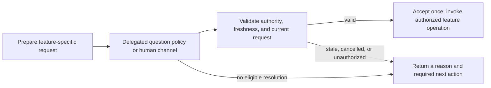

# A shared decision foundation for v1 and v2

2026-10-05. A proposed investment before the Durable integration. This document specifies
direction and acceptance criteria; it introduces no runtime behavior.

**Make questions and review decisions explicit enough to resolve through delegated policy or
a human channel, then validate them before they affect the workflow.** The initial v1 pilot
would answer narrowly delegated questions and prepare human plan review. It would not grant
plan approval or save a plan on policy authority. Existing saves following human approval
would retain their feature-owned path.

This develops the decision boundary behind the [working vision][vision], the
[workflow walkthrough][workflows], and the [parallel v2 workspace][v2]. The
[strategy proposal][strategy] explains the larger opportunity.

## Why invest before v2

Headless v1 and Durable v2 encounter the same domain problem: work needs a decision, and the
person who could make it may not be attached. Headless execution can sometimes use authority
delegated in advance. A durable execution can retain the question and receive a human answer
later. Both need to know what was asked, who could decide, what actually happened, and whether
the answer still applies.

The [earlier headless memo][headless] proposed more: bounded recipes, a Python objective
conductor, an execution ledger, and autonomous plan approval after a critic wave. Its
[execution contract][old-contract] usefully separated canonical facts from execution receipts.
Keep that distinction, explicit delegation, and bounded outcomes. Building the whole conductor
and ledger now would commit to orchestration that the Durable proposal may replace.

Decision handling offers an independent v1 benefit. A supported unattended session could
continue through authorized preference questions and stop with a useful account of the human
review it still needs. V2 could reuse the meaning and validation of those interactions while
extending their lifetime. This is smaller than general unattended workflow recipes, which
remain a possible next investment once the decision boundary works.

## Where the concerns overlap today

The seams are distributed across borrowed tools, Perk feature operations, host bindings, and
Python doors. A missing terminal currently stands for several different limitations.

| Current interaction | Evidence and behavior | Consequence for this investment |
| --- | --- | --- |
| Structured questions | Perk [installs a required borrowed questionnaire][borrow]. Its [reconciler][question-reconcile] removes the tool without UI; its [handler][question-handler] also refuses. | Availability and resolution need an explicit adapter; a headless model cannot simply call the current tool. |
| Review launch and verdict | [Launch selection][review-launch] asks about critics and an optional angle. The [headless review test][review-skip] expects a soft skip. [Plan review][plan-review] already has distinct approval, denial, dismissal, abort, and unavailable outcomes. | Choosing review preparation is separate from authorizing a save. Preserve the feature operation. |
| Project CI | [CI policy][ci] runs for existing trust, an explicit allow flag, or prior approval; otherwise it confirms with UI and refuses without it. | Existing authorization has meaning independent of presentation. |
| Formal GitHub reviews | The [submission operation][formal-review] refuses headless formal approval/request-changes; comment submission follows different rules. | A questionnaire default cannot supply formal review authority. |
| Stack operations | Python [sync][stack-sync], [recovery][stack-recovery], and [landing][stack-land] preview consequential actions and require explicit authorization. | These are operation-specific decisions, not generic affirmative dialogs. |
| Learning | Bare headless [`/learn`][learn] takes the canonical skip path. | Lack of turn-driving capability currently produces a workflow decision; a question resolver alone cannot supply the missing execution machinery. |

Distinguish four conditions: information is missing; authority is missing; a presentation
channel is unavailable; or the host cannot execute the requested work. They need different
recovery. “No UI” cannot tell a coordinator which condition occurred.

Guidance participates too. The [objective-author skill][objective-author] explicitly asks the
human to choose delivery policy even though incremental is recommended. The pilot must
preserve that requirement. A label cannot silently revise a skill's authority boundary.
CI, formal review, stack operations, and learning are inventory and possible later consumers,
not migrations included in this first investment.

## What the foundation should own

### Keep the operations specific

Question resolution and plan review should remain separate operations. A questionnaire chooses
answers; plan review judges particular bytes and may lead to a backend save. Their inputs,
effects, and recovery differ. Follow the existing [module-contract guidance][module-contracts]:
named feature inputs and outcomes, with validation at transport boundaries.

Candidate responsibilities are “resolve these authoring questions within this delegation” and
“prepare this plan for human review.” These are conceptual interface sketches, not exported
names or a public schema. Share request identity, provenance, and lifecycle checks only where
working callers establish the same semantics. Avoid a universal prompt handler or an approval
policy object containing switches for every feature.

Each operation needs a small set of facts:

- **Subject and freshness:** the run or execution, the question or reviewed artifact, its
  relevant revision, and any destination on which the decision depends.
- **Authority:** the human principal or explicit policy delegation, its scope and version, and
  the approved intent that constrains it.
- **Resolution:** the offered choices, actual answer or verdict, actor, and channel, with enough
  context to explain why the answer was accepted.
- **Lifetime:** which request is current, whether it was cancelled or superseded, and whether
  its answer has already been consumed.

The runtime owns how those facts live. V1 can bind them to an active session; v2 can persist
them. Neither requires moving saved plans or objectives out of GitHub/Linear. Python doors
remain callers of the operation boundaries described in the workflow companion.

“Accept once” concerns the logical decision. It does not promise exactly-once effects in an
issue backend. Approval, attempted save, and confirmed save remain distinct facts.

### Treat recommendations as advice within delegated scope

The initial policy would accept an unambiguous recommendation only for a question within an
explicitly delegated class of choices. For single-select, exactly one eligible recommended
option is required. For multi-select, the explicitly supported policy can select all recommended
options only when their combination is permitted. No recommendation, conflicting recommendations,
incomplete context, or an unsupported question produces an unresolved outcome.

For an authorized export change, a permitted choice between test-fixture naming schemes might
be delegated. A question about customer retention periods requires information or authority
the policy may not possess. Appending `(Recommended)` changes neither case.

The borrowed package encodes recommendation in option text, not a typed authority or
recommendation field. Its adapter must validate that convention and retain the complete
questionnaire, including relevant previews. Selection order alone is insufficient.

Unlike the old headless proposal, the first pilot would not ask the model to invent a missing
recommendation and retry. It would retain the unresolved question and the reason. It would
also distinguish an unavailable route from a human declining to answer. An answer accepted
from policy must say so in both its receipt and the model-facing result.

## A bounded v1 pilot

### First prove the borrowed question bridge

The current [worker binding][worker-binding] uses JSON mode with no UI context. The older
[session-driving proposal][session-driving] suggested an in-process SDK binding with RPC
semantics and a policy-backed UI. This remains a plausible compatibility adapter.

The inspected official SDK documentation says [RPC dialogs][sdk-rpc] use correlated request
and response IDs, and [`hasUI`][sdk-ui] is true in RPC mode. The borrowed package's
[RPC walker][question-rpc] uses select/input calls. Those facts justify a spike, not a claim
that the bridge already works against Perk's declared runtime.

Two concrete gaps must be solved:

1. The borrowed [prompt event][question-event] supplies questions and options, but no stable
   request ID, tool-call identity, reply channel, or preview content beyond a presence flag.
   It is a notification event, not a complete decision interface. The tool handler also leaves
   its tool-call ID and cancellation signal unused. Matching the next dialog by title or
   emission order cannot establish safe ownership under concurrent calls.
2. The [response envelope][question-envelope] describes successful answers as coming from the
   user and cancellation as a user declining. Supplying policy choices through UI callbacks
   alone would misattribute them. A side receipt does not correct what the model is told.

Characterize the actual supported SDK and borrowed package together. Prove tool-call
correlation, cancellation, full semantic input capture, truthful output, and cleanup when the
SDK replaces a session. The [SDK replacement contract][sdk-replacement] requires rebinding
extensions and subscriptions. A transient RPC dialog ID is not a durable workflow identity.

Use supported adapter seams where sufficient. If the borrowed package needs a small versioned
integration seam, establish that dependency explicitly before claiming the pilot is shippable.
Do not compensate with English-title matching, localized sentinel parsing, or a second
first-party questionnaire. Unsupported previews or interaction forms stay unresolved until
their complete meaning can be carried.

RPC semantics can also make other UI-dependent branches reachable. The pilot must recognize
its supported question operation and report other interactions as unsupported; it must not
answer arbitrary confirm/editor/custom calls. Bind the behavior only for the opt-in pilot.

### Prepare review and preserve human authority

The review half should take an already-authored plan, prepare its review context and any
explicitly requested critic evidence, then route to an existing human review surface when
available. It would not build an autonomous authoring recipe or approve a plan because a
critic wave completed.

The valuable existing boundary is [`reviewPlanDraft`][plan-review], with its typed reviewer
result, cancellation checkpoint, and feature-owned completion logic. Its approval/save path
uses the [shared gate invariant][approval-gate]: a failed save does not release that gate.
Preserve the current human-approved path, including its handling of reviewer edits.

The [draft-review guards][review-guards] already protect exact reviewed artifact bytes,
save destination, current review/run/subject, and uncertain saves. Their [tests][review-tests]
are the behavioral baseline. The current implementation holds an in-memory slot, a Symbol,
and an `isCurrent` closure. Extract host-independent comparisons where the pilot needs them;
keep the v1 slot binding until a second lifecycle earns another implementation.

The source-sensitive checks matter: editor and parameter reviews differ from artifact reviews.
Do not replace them with one generic digest comparison. Likewise, an unknown save result must
retain the existing refusal to retry automatically; a fresh receipt format cannot eliminate
Linear's create/marker uncertainty.

If no human route is available, the pilot should return the review subject, evidence
references, and the required next action as unresolved. It must not fabricate approval or
interpret the current headless soft skip as completion. The existing [worker outcome][worker-outcome]
has no first-class pending-decision case. Any production integration that crosses the Python/
TypeScript boundary must deliberately extend its contract and callers; this document chooses
no new wire shape. Ordinary v1 behavior remains unchanged outside the opt-in pilot.

## How Durable extends the same decisions

A future v2 execution could reach a question outside delegated scope, commit its identity and
context, and ask the owner through Slack or text messaging. The owner could answer later;
Perk would authenticate the reply, recover the pending request, revalidate its authority and
subject, and consume a valid answer once. A changed plan, cancelled execution, or superseding
request would prevent an old response from advancing the work.

The same question could therefore resolve immediately through an authorized v1 policy, reach
a human in an attached session, or remain pending in v2. The feature meaning survives while
the channel and lifetime change.

Upstream [application documents][durable-docs] can participate in atomic commits alongside
entries and tasks. [Task waits][durable-tasks] wait on task identities. These are useful
mechanisms; they do not constitute a demonstrated human-question or messaging API. Perk still
needs persisted decision records, identity and authorization mapping, notification delivery,
reply correlation, duplicate handling, supersession, and a tested way to wake the appropriate
work.

Record the policy version and authority used for a pending request. Durable
[settings][durable-settings] are not persisted, so host configuration alone cannot explain an
older decision after restart. Notifications and backend saves are external effects: record
intent, use stable identities where supported, and reconcile ambiguous results. The upstream
[recovery test][durable-recovery] explicitly exercises two service calls producing one applied
effect through an idempotency key. It does not prove arbitrary external operations execute once.

This future adapter belongs with the [v2 integration][v2], using its storage and host ownership.
The upstream [storage contract][durable-storage] permits one owner process per store and has
backend-specific crash guarantees. Start with a pending decision that survives a process
restart; shared access, remote hosting, and messaging delivery require additional proofs.

## Sequence, acceptance, and deferred work

Implement in four increments, each with a working caller:

1. **Characterize dependencies and behavior.** Resolve the runtime-version mismatch below;
   reproduce questionnaire, RPC, and review behavior with the supported packages. Establish
   whether the borrowed integration seam is sufficient.
2. **Define feature-specific decisions.** Introduce only the identity, delegation, outcomes,
   and provenance needed by the pilot; extract review comparisons without changing existing
   guard behavior.
3. **Ship delegated question resolution.** Bind the SDK adapter for an opt-in bounded session,
   with supported recommendation handling and truthful policy receipts/results.
4. **Ship human review preparation.** Prepare the reviewed subject and evidence, route through
   existing human surfaces, and expose unresolved review when none is available.

Implementation acceptance should exercise these observable outcomes:

| Scenario | Required result |
| --- | --- |
| Valid delegated recommendation | Exact allowed answer; policy identity/version and context recorded; model told the actual actor. |
| Missing facts, ambiguous recommendation, or choice beyond delegation | Unresolved with reason; no invented answer or model re-prompt loop. |
| Concurrent questions, cancellation, or session replacement | No cross-delivery, late acceptance, or orphaned ownership. |
| Plan prepared; no human approval | No policy-authorized approval/save; the review remains required. |
| Changed artifact or destination; superseded review | Existing source-sensitive rejection behavior preserved. |
| Save outcome unknown | No blind retry or gate release. |
| CI, formal review, stack authorization, and ordinary v1 | Existing policies preserved; enabling the pilot grants no incidental authority. |
| Later v2 restart and repeated reply | Pending request recovered; only one valid logical acceptance; external effects reconciled separately. |

The final row is a later Durable proof, not a condition for shipping the bounded v1 pilot.
A later delegated plan-approval policy would require **full coverage from the four standard
critics plus Ponytail**, with every finding dispositioned and the final reviewed subject
identified. This explicitly tightens the old memo's partial-coverage-with-warning policy.
Coverage alone is not approval authority; that later policy needs its own delegation and
revision/evidence rules.

General recipes, an objective conductor, a new execution ledger, autonomous approval/save,
messaging adapters, and migrations of the other inventoried consumers remain subsequent work.
Runtime implementation must amend shared contracts and user documentation where behavior
changes. This planning document adds no commands, configuration schema, store, or public API.

## Evidence baseline

Perk observations use checkout `91719e4933389fece395cd570d0b8a0f7506b7b8`. Borrowed-tool
observations use the installed [questionnaire 2.12.0][question-package]. SDK observations use
the installed [coding-agent 0.87.0][sdk-package], while Perk's [root manifest][manifest] pins
development dependency **0.99.2**. Installed-package links identify local inspection artifacts,
not files guaranteed in a fresh checkout. That mismatch prevents treating this inspection as
compatibility proof for the declared pin or the ongoing Pi 1.0 work.

Durable citations use the library mirror at `b7dfc049e917a265a5aefa9f3952a2dec9b81cfd`,
package 1.0.3. Cited tests were inspected, not executed for this proposal. The proposed policy
and adapters remain Perk work; upstream persistence establishes mechanisms, not their product
semantics.

[vision]: vision.md
[workflows]: pi-durable-workflows.md#each-fact-keeps-one-owner
[v2]: pi-durable-v2.md
[strategy]: pi-in-the-sky.md
[headless]: ../deepen-headless-execution/memo.md
[old-contract]: ../deepen-headless-execution/objective-execution-contract.md#authorities
[borrow]: ../../../src/perk/convergence/init/settings.py#L77-L81
[question-reconcile]: ../../../.pi/npm/node_modules/@juicesharp/rpiv-ask-user-question/reconcile.ts
[question-handler]: ../../../.pi/npm/node_modules/@juicesharp/rpiv-ask-user-question/ask-user-question.ts#L318-L345
[review-launch]: ../../../extension/pi/v1/review.ts#L374-L391
[review-skip]: ../../../extension/pi/v1/planReview.test.ts#L209-L223
[plan-review]: ../../../extension/authoring/plan/review.ts
[ci]: ../../../extension/delivery/ci.ts#L99-L113
[formal-review]: ../../../extension/codeReview/submission.ts
[stack-sync]: ../../../src/perk/cli/commands/objective/stack/sync_cmd.py#L115-L166
[stack-recovery]: ../../../src/perk/cli/commands/objective/stack/recover_cmd.py#L170-L208
[stack-land]: ../../../src/perk/cli/commands/objective/stack/land_cmd.py#L390-L419
[learn]: ../../../extension/pi/v1/learning/learn.ts#L517-L523
[objective-author]: ../../../skills/perk-objective-author/SKILL.md#L40-L46
[module-contracts]: ../ts-decomposition/module-contracts.md#keep-operations-specific
[worker-binding]: ../../../extension/worker/sdkAdapter.ts#L188-L200
[session-driving]: ../deepen-headless-execution/pi-session-driving.md
[sdk-rpc]: ../../../node_modules/@earendil-works/pi-coding-agent/docs/rpc.md#extension-ui-protocol
[sdk-ui]: ../../../node_modules/@earendil-works/pi-coding-agent/docs/extensions.md#ctxhasui
[question-rpc]: ../../../.pi/npm/node_modules/@juicesharp/rpiv-ask-user-question/rpc-fallback.ts
[question-event]: ../../../.pi/npm/node_modules/@juicesharp/rpiv-ask-user-question/events.ts
[question-envelope]: ../../../.pi/npm/node_modules/@juicesharp/rpiv-ask-user-question/tool/response-envelope.ts
[sdk-replacement]: ../../../node_modules/@earendil-works/pi-coding-agent/docs/sdk.md#L156-L169
[approval-gate]: ../../../extension/authoring/review/approvalGate.ts
[review-guards]: ../../../extension/pi/v1/draftReview.ts#L1-L20
[review-tests]: ../../../extension/pi/v1/draftReview.test.ts
[worker-outcome]: ../../../extension/worker/stageExecution.ts#L60-L96
[durable-docs]: https://github.com/earendil-works/pi/blob/b7dfc049e917a265a5aefa9f3952a2dec9b81cfd/packages/durable/README.md#your-own-state
[durable-tasks]: https://github.com/earendil-works/pi/blob/b7dfc049e917a265a5aefa9f3952a2dec9b81cfd/packages/durable/README.md#child-tasks
[durable-settings]: https://github.com/earendil-works/pi/blob/b7dfc049e917a265a5aefa9f3952a2dec9b81cfd/packages/durable/README.md#settings
[durable-recovery]: https://github.com/earendil-works/pi/blob/b7dfc049e917a265a5aefa9f3952a2dec9b81cfd/packages/durable/test/harness-tasks-recovery.test.ts#L111-L144
[durable-storage]: https://github.com/earendil-works/pi/blob/b7dfc049e917a265a5aefa9f3952a2dec9b81cfd/packages/durable/README.md#storage
[question-package]: ../../../.pi/npm/node_modules/@juicesharp/rpiv-ask-user-question/package.json
[sdk-package]: ../../../node_modules/@earendil-works/pi-coding-agent/package.json
[manifest]: ../../../package.json#L66
