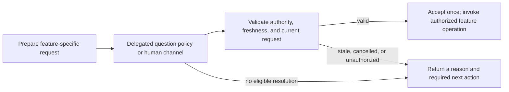

# A shared decision foundation for v1 and v2

2026-10-05. A proposed v1 investment independent of the Durable experiments. This document specifies
direction and acceptance criteria; it introduces no runtime behavior.

**Make questions and review decisions explicit enough to resolve through delegated policy or
a human channel, then validate them before they affect the workflow.** The initial v1 pilot
would prepare an existing draft for human plan review under explicit authority. It would not grant
plan approval or save a plan on policy authority. Existing saves following human approval
would retain their feature-owned path.

This develops the decision boundary behind the [working vision][vision], the
[workflow walkthrough][workflows], and the [parallel v2 workspace][v2]. The
[strategy proposal][strategy] explains the larger opportunity.

## Why share decision semantics

Headless v1 and Durable v2 encounter the same domain problem: work needs a decision, and the
person who could make it may not be attached. Headless execution can sometimes use authority
delegated in advance. A durable execution can retain the question and receive a human answer
later. Both need to know what was asked, who could decide, what actually happened, and whether
the answer still applies.

The [earlier headless memo][headless] proposed more: bounded recipes, a Python objective
conductor, an execution ledger, and autonomous plan approval after a critic wave. Its
[execution contract][old-contract] usefully separated canonical facts from execution receipts.
Keep that distinction, explicit delegation, and bounded outcomes. Building the whole conductor
and ledger now would commit to orchestration that the Durable proposal may replace.

Review preparation offers an independent v1 benefit: gather authorized critic evidence for
an existing draft and stop with a useful account of the human review it still needs. V2 could
reuse those semantics while extending their lifetime. General unattended recipes and question
resolution remain separate investments; neither blocks the early Durable decision proof.

## Where the concerns overlap today

The seams are distributed across borrowed tools, Perk feature operations, host bindings, and
Python doors. A missing terminal currently stands for several different limitations.

| Current interaction | Evidence and behavior | Consequence for this investment |
| --- | --- | --- |
| Structured questions | Perk [installs a required borrowed questionnaire][borrow]. Its [reconciler][question-reconcile] removes the tool without UI; its [handler][question-handler] also refuses. | A separate compatibility investigation is needed; this is not the first pilot's caller. |
| Review launch and verdict | [Launch selection][review-launch] asks about critics and an optional angle. The [headless review test][review-skip] expects a soft skip. [Plan review][plan-review] already has distinct approval, denial, dismissal, abort, and unavailable outcomes. | Choosing review preparation is separate from authorizing a save. Preserve the feature operation. |
| Project CI | [CI policy][ci] runs for existing trust, an explicit allow flag, or prior approval; otherwise it confirms with UI and refuses without it. | Existing authorization has meaning independent of presentation. |
| Formal GitHub reviews | The [submission operation][formal-review] refuses headless formal approval/request-changes; comment submission follows different rules. | A questionnaire default cannot supply formal review authority. |
| Stack operations | Python [sync][stack-sync], [recovery][stack-recovery], and [landing][stack-land] preview consequential actions and require explicit authorization. | These are operation-specific decisions, not generic affirmative dialogs. |
| Learning | Bare headless [`/learn`][learn] takes the canonical skip path. | Lack of turn-driving capability currently produces a workflow decision; a question resolver alone cannot supply the missing execution machinery. |

Distinguish four conditions: information is missing; authority is missing; a presentation
channel is unavailable; or the host cannot execute the requested work. They need different
recovery. “No UI” cannot tell a coordinator which condition occurred.

Guidance participates too. The [objective-author skill][objective-author] explicitly asks the
human to choose delivery policy even though incremental is recommended. The pilot must
preserve that requirement. A label cannot silently revise a skill's authority boundary.
CI, formal review, stack operations, and learning are inventory and possible later consumers,
not migrations included in this first investment.

## What the foundation should own

### Keep the operations specific

Question resolution and plan review should remain separate operations. A questionnaire chooses
answers; plan review judges particular bytes and may lead to a backend save. Their inputs,
effects, and recovery differ. Follow the existing [module-contract guidance][module-contracts]:
named feature inputs and outcomes, with validation at transport boundaries.

The first responsibility is “prepare this plan for human review”; a later one could be
“resolve these authoring questions within this delegation.” These are conceptual sketches, not exported
names or a public schema. Share request identity, provenance, and lifecycle checks only where
working callers establish the same semantics. Avoid a universal prompt handler or an approval
policy object containing switches for every feature.

Each operation needs a small set of facts:

- **Subject and freshness:** the run or execution, the question or reviewed artifact, its
  relevant revision, and any destination on which the decision depends.
- **Authority:** the human principal or explicit policy delegation, its scope and version, and
  the approved intent that constrains it.
- **Resolution:** the offered choices, actual answer or verdict, actor, and channel, with enough
  context to explain why the answer was accepted.
- **Lifetime:** which request is current, whether it was cancelled or superseded, and whether
  its answer has already been consumed.

The runtime owns how those facts live. V1 can bind them to an active session; v2 can persist
them. Neither requires moving saved plans or objectives out of GitHub/Linear. Python doors
remain callers of the operation boundaries described in the workflow companion.

“Accept once” concerns the logical decision. It does not promise exactly-once effects in an
issue backend. Approval, attempted save, and confirmed save remain distinct facts.

### Establish delegation at the feature boundary

The pilot's trusted caller identifies the review-preparation operation and supplies explicit
authority for its allowed choices. A model-authored question category or `(Recommended)` label
cannot establish scope. Only preparation choices already owned by that feature can be delegated;
plan scope, delivery policy, approval, and save authority do not follow from them.

Missing authority, facts, or supported execution capability produces an unresolved outcome.
Record policy identity and the actual actor in both the receipt and any model-facing result.
Do not describe a policy choice as a human answer, or re-prompt the model to invent missing
authority. Recommendation handling belongs to the separate questionnaire investigation below.

## A bounded v1 pilot

### Prepare an existing draft

Build one bounded preparation caller around an already-authored plan, its review/save
destination, and explicit preparation authority. The caller would validate the exact subject,
resolve only authorized preparation choices, gather the requested critic evidence, and hand
that same subject and evidence to an existing human review route when available. It would
not drive plan authoring or treat completed critics as approval.

The existing [launch chooser][review-launch] owns browser review with or without a reviewer
wave and an optional custom angle. That is the initial policy seam. No critic work starts
without explicit authority naming the permitted standard critic set and resource bounds;
custom angles must be supplied explicitly, not invented by the resolver. Absent critic
authorization, preparation can hand off the draft without launching a wave. Retain requested
reports and expose incomplete or unavailable coverage honestly.

The current [worker drive][worker-outcome] supports only `implement` and `address` and lacks a
pending-decision outcome. Giving its [JSON-mode SDK binding][worker-binding] UI callbacks does
not create a review-preparation workflow. Give this bounded caller a supported v1 binding and
typed prepared/pending, cancelled, and failed outcomes; any new cross-plane invocation must
deliberately extend the contract and callers. This proposal chooses no command or wire shape.

### Preserve human review and save semantics

The valuable existing boundary is [`reviewPlanDraft`][plan-review], with its typed reviewer
result, cancellation checkpoint, and feature-owned completion logic. Its approval/save path
uses the [shared gate invariant][approval-gate]: a failed save does not release that gate.
Preserve the current human-approved path, including its handling of reviewer edits.

The [draft-review guards][review-guards] already protect exact reviewed artifact bytes,
save destination, current review/run/subject, and uncertain saves. Their [tests][review-tests]
are the behavioral baseline. The current implementation holds an in-memory slot, a Symbol,
and an `isCurrent` closure. Extract host-independent comparisons where the pilot needs them;
keep the v1 slot binding until a second lifecycle earns another implementation.

The source-sensitive checks matter: editor and parameter reviews differ from artifact reviews.
Do not replace them with one generic digest comparison. Likewise, an unknown save result must
retain the existing refusal to retry automatically; a fresh receipt format cannot eliminate
Linear's create/marker uncertainty.

If no human route is available, return the exact review subject, retained evidence references,
destination, and pending human-review requirement. Preparation may be complete while review
remains pending; the current headless soft skip cannot stand for approval or completed review.
The v1 record can remain session-bound. Restart persistence is a v2 proof, not a prerequisite
for this pilot. Ordinary v1 behavior remains unchanged outside the opt-in caller.

## Separate questionnaire compatibility investigation

The older [session-driving proposal][session-driving] suggests an SDK binding with RPC
semantics and policy-backed UI. Official docs say [RPC dialogs][sdk-rpc] have correlated IDs
and [`hasUI`][sdk-ui] is true in RPC mode; the borrowed [walker][question-rpc] uses select/input.
These facts justify a separate spike against supported package versions, not a pilot dependency.

Two gaps remain concrete. The [prompt event][question-event] lacks stable request/tool-call
identity, a reply channel, and full preview content; the handler ignores its tool-call ID and
cancellation signal. The [response envelope][question-envelope] attributes successful answers
to the user and cancellation to user refusal. UI callbacks alone cannot safely correlate or
truthfully attribute delegated answers. A side receipt does not fix the model-facing result.

Prove full semantic input, correlation, cancellation, provenance, and [session replacement][sdk-replacement]
cleanup through a supported or explicitly versioned supplier seam. Do not match English titles
or dialog order, parse localized sentinels, or build a second first-party questionnaire. RPC
also exposes other UI branches; no generic auto-answering of confirm/editor/custom calls follows.

A later recommendation policy needs a trusted, feature-owned category and explicit delegation.
Single-select needs exactly one eligible recommendation; multi-select must validate the combined
scope. Missing facts, ambiguous recommendations, or unsupported previews remain unresolved.
The borrowed package's recommendation-in-option-text convention supplies advice, not authority.

## How Durable extends the same decisions

The early v2 proof is a pending human decision over fixture evidence, with no model or UI
transport. The [workflow companion][persisted-decisions] owns its protocol: retain identity and
authority, validate an authorized reply, and consume it while creating one continuation in a
single local commit. The pending decision survives the task that requested it. The experimental
continuation is conversation-owned in the retained execution conversation, so replying does not
require a live requester or waiter. Application cancellation governs new admission across tasks.

A lost acknowledgment may follow a successful commit. The feature must distinguish definite
rejection from uncertain acceptance and recover the retained receipt before retrying. The
companion's [commit-recovery rules][commit-outcomes] belong inside the decision module, keeping
each caller from reconstructing them. Reply-before-wait, reply-after-requester-completion,
duplicates, supersession, changed subject, cancellation, and lost acknowledgment are required
cases in the [validation sequence][validation]. This proof can proceed independently of both
the v1 pilot and questionnaire investigation.

Later, the same feature meaning could reach a human through an attached client or messaging
adapter. Those channels would add authentication, notification delivery, and reply correlation.
Persisting a decision does not make a backend save atomic or preserve unrecorded policy;
the companion's [resume rules][resume-rules] still apply. Shared access, remote hosting, and
messaging require their own proofs rather than being prerequisites for decision persistence.

## Sequence, acceptance, and deferred work

Implement in four increments, each with a working caller:

1. **Characterize supported review behavior.** Resolve the runtime-version mismatch below
   for the selected v1 binding; establish the existing review and save guards as the baseline.
2. **Define the preparation request.** Supply an existing draft, destination, trusted feature
   identity, explicit preparation authority, and bounded outcomes through one opt-in caller.
3. **Prepare authorized evidence.** Resolve only permitted launch choices, run explicitly
   authorized critics, and retain their reports against the exact subject.
4. **Hand off to human review.** Use existing review/save semantics when a route is available;
   otherwise return evidence and a pending review requirement without approval or save.

Implementation acceptance should exercise these observable outcomes:

| Scenario | Required result |
| --- | --- |
| Valid delegated preparation choice | Only the authorized feature choice is applied; policy identity/version and context recorded; actual actor identified. |
| Missing critic authority | No critic work; permitted plain preparation remains available. |
| Custom angle absent | Run only the authorized standard critics; do not invent an angle. |
| Requested critic fails or is unavailable | Retain completed evidence and report incomplete coverage; no implied clean review. |
| Cancellation, supersession, or session replacement | No late acceptance, cross-delivery, or orphaned ownership. |
| Plan prepared; no human route or approval | Evidence and pending review requirement returned; no policy-authorized approval/save. |
| Changed artifact or destination; superseded review | Existing source-sensitive rejection behavior preserved. |
| Save outcome unknown | No blind retry or gate release. |
| CI, formal review, stack authorization, and ordinary v1 | Existing policies preserved; enabling the pilot grants no incidental authority. |
| Independent v2 restart and repeated reply | Pending request survives its requesting task; one valid acceptance creates one continuation; acknowledgment loss is reconciled before retry; external effects reconciled separately. |

The final row is the independent early Durable proof, not a condition for shipping the v1 pilot.
Questionnaire recommendation and RPC compatibility tests belong to their separate investigation.
A later delegated plan-approval policy would require **full coverage from the four standard
critics plus Ponytail**, with every finding dispositioned and the final reviewed subject
identified. This explicitly tightens the old memo's partial-coverage-with-warning policy.
Coverage alone is not approval authority; that later policy needs its own delegation and
revision/evidence rules.

General recipes, an objective conductor, a new execution ledger, autonomous approval/save,
messaging adapters, and migrations of the other inventoried consumers remain subsequent work.
Runtime implementation must amend shared contracts and user documentation where behavior
changes. This planning document adds no commands, configuration schema, store, or public API.

## Evidence baseline

Perk observations use checkout `91719e4933389fece395cd570d0b8a0f7506b7b8`. Borrowed-tool
observations use the installed [questionnaire 2.12.0][question-package]. SDK observations use
the installed [coding-agent 0.87.0][sdk-package], while Perk's [root manifest][manifest] pins
development dependency **0.99.2**. Installed-package links identify local inspection artifacts,
not files guaranteed in a fresh checkout. That mismatch prevents treating this inspection as
compatibility proof for the declared pin or the ongoing Pi 1.0 work.

Durable evidence in the linked companions uses the library mirror at
`b7dfc049e917a265a5aefa9f3952a2dec9b81cfd`,
package 1.0.3. Cited tests were inspected, not executed for this proposal. The proposed policy
and adapters remain Perk work; upstream persistence establishes mechanisms, not their product
semantics. The [strategy evidence appendix][evidence] records the technical manual's snapshot,
its captured experiment, and the limits of that evidence.

[vision]: vision.md
[workflows]: pi-durable-workflows.md#each-fact-keeps-one-owner
[v2]: pi-durable-v2.md
[strategy]: pi-in-the-sky.md
[headless]: ../deepen-headless-execution/memo.md
[old-contract]: ../deepen-headless-execution/objective-execution-contract.md#authorities
[borrow]: ../../../src/perk/convergence/init/settings.py#L77-L81
[question-reconcile]: ../../../.pi/npm/node_modules/@juicesharp/rpiv-ask-user-question/reconcile.ts
[question-handler]: ../../../.pi/npm/node_modules/@juicesharp/rpiv-ask-user-question/ask-user-question.ts#L318-L345
[review-launch]: ../../../extension/pi/v1/review.ts#L374-L391
[review-skip]: ../../../extension/pi/v1/planReview.test.ts#L209-L223
[plan-review]: ../../../extension/authoring/plan/review.ts
[ci]: ../../../extension/delivery/ci.ts#L99-L113
[formal-review]: ../../../extension/codeReview/submission.ts
[stack-sync]: ../../../src/perk/cli/commands/objective/stack/sync_cmd.py#L115-L166
[stack-recovery]: ../../../src/perk/cli/commands/objective/stack/recover_cmd.py#L170-L208
[stack-land]: ../../../src/perk/cli/commands/objective/stack/land_cmd.py#L390-L419
[learn]: ../../../extension/pi/v1/learning/learn.ts#L517-L523
[objective-author]: ../../../skills/perk-objective-author/SKILL.md#L40-L46
[module-contracts]: ../ts-decomposition/module-contracts.md#keep-operations-specific
[worker-binding]: ../../../extension/worker/sdkAdapter.ts#L188-L200
[session-driving]: ../deepen-headless-execution/pi-session-driving.md
[sdk-rpc]: ../../../node_modules/@earendil-works/pi-coding-agent/docs/rpc.md#extension-ui-protocol
[sdk-ui]: ../../../node_modules/@earendil-works/pi-coding-agent/docs/extensions.md#ctxhasui
[question-rpc]: ../../../.pi/npm/node_modules/@juicesharp/rpiv-ask-user-question/rpc-fallback.ts
[question-event]: ../../../.pi/npm/node_modules/@juicesharp/rpiv-ask-user-question/events.ts
[question-envelope]: ../../../.pi/npm/node_modules/@juicesharp/rpiv-ask-user-question/tool/response-envelope.ts
[sdk-replacement]: ../../../node_modules/@earendil-works/pi-coding-agent/docs/sdk.md#L156-L169
[approval-gate]: ../../../extension/authoring/review/approvalGate.ts
[review-guards]: ../../../extension/pi/v1/draftReview.ts#L1-L20
[review-tests]: ../../../extension/pi/v1/draftReview.test.ts
[worker-outcome]: ../../../extension/worker/stageExecution.ts#L60-L96
[question-package]: ../../../.pi/npm/node_modules/@juicesharp/rpiv-ask-user-question/package.json
[sdk-package]: ../../../node_modules/@earendil-works/pi-coding-agent/package.json
[manifest]: ../../../package.json#L66
[persisted-decisions]: pi-durable-workflows.md#persisted-decisions
[commit-outcomes]: pi-durable-workflows.md#commit-outcomes-and-recovery
[evidence]: pi-in-the-sky.md#appendix-evidence-and-boundaries
[resume-rules]: pi-durable-workflows.md#resuming-safely
[validation]: pi-durable-v2.md#validation-sequence
