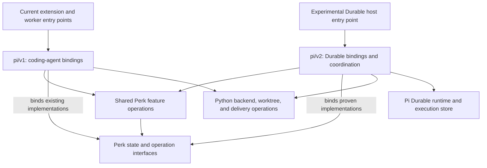

# A parallel path to Pi Durable

2026-10-05. A development proposal for Perk maintainers, accompanying [Pi in the sky][vision]
and [How a durable perk would work][workflows]. The first explains the opportunity; the second
walks through TypeScript coordination with Python doors and issue-backed plans. This document
recommends how to develop that architecture alongside today's implementation.

For the intended first-v2 product experience and future development, see
[Perk with Pi Durable: a working vision](vision.md).

For pre-v2 work that improves unattended v1 sessions and prepares durable decisions, see
[A shared decision foundation for v1 and v2](decision-foundation.md).

## Recommendation

**Build the Durable integration in `extension/pi/v2` as a private npm workspace, with its own
host entry point, while keeping the current extension and worker as the default.** Reuse Perk
feature operations through their existing interfaces, and introduce Durable execution machinery
where its lifetime and storage semantics require it.

Here, `v2` names Perk's second integration generation. It does not imply Pi 2.0, a new Perk
product version, or automatic compatibility with the current coding-agent extension. The
earlier [decomposition topology][topology] anticipated a future `pi/application` family beside
`pi/v1`; this is a concrete proposal for that role, informed by the released Durable package.

The aim is to keep ordinary Perk useful throughout the experiment. Its Python doors,
installation behavior, and current runtime would remain available, including the ongoing
Pi 1.0 compatibility work. Shared code could receive narrowly justified changes with regression
coverage. The directory would organize the work; entry-point, dependency, and execution
separation would make coexistence credible.

This proposal is for a development workspace inside the repository. Independent publication,
default-runtime cutover, and migration of existing executions would require later plans.

## Source layout and ownership

The initial arrangement would be small:

```text
extension/
  index.ts                 current extension entry point
  workerMain.ts            current worker entry point
  authoring/               existing Perk feature operations
  delivery/
  codeReview/
  learning/
  session/                 existing session and artifact interfaces
  waves/                   current report-wave implementation
  worker/                  current SDK stage execution
  pi/
    v1/                    current coding-agent bindings
    v2/                    proposed private workspace
      package.json         own dependencies and explicit host scripts
      tsconfig.json        own compilation scope
      host.ts              experimental composition and startup
```

The v2 files above are proposed, not existing scaffolding. Create each with its first working
caller. Further directories should follow actual differences in responsibility rather than
copying the entire v1 layout in advance.

V2 would own Durable tool registration, task ownership, checkpoint/recovery adaptation, storage
binding, and host startup. Its TypeScript coordinator would select the next domain action for
a v2 execution. Existing Python operations would continue to perform worktree, backend, and
delivery operations through explicit calls. V1 would retain its present control path.

The intended dependency direction is:



Neither integration would import the other. Shared features would import neither integration,
and Durable objects would stay outside shared feature interfaces. The existing
[import-direction rules][import-rules] already protect much of that direction, including
type-only imports. The new integration would extend those checks to its own entry graph.

Use named module interfaces such as plan saving and publication. Do not introduce a universal
host interface that combines every current hook, tool, UI operation, and future task. When a
feature needs a new capability, prove its interface with that feature and retain its domain
types. This follows the earlier decomposition's [operation-specific approach][type-laws].

## Package and verification isolation

The current [package manifest][package] installs `extension/index.ts`, ships the extension
tree, and has no runtime dependency section. The [bare-import guard][bare-imports] and
[packaging test][packaging-test] preserve loading from a bare git checkout without installing
dependencies into Perk's package. Adding Durable imports anywhere under the current source
census would fail that guard even if startup never reached them.

The recommended package arrangement would therefore make four explicit changes when the
first experiment is implemented:

1. Register the private v2 workspace with its own dependencies and host entry. Keep the
   ordinary Pi package entry pointed at the current extension; the experimental host would
   start only through an explicit development path.
2. Exclude v2 from the current extension's published files. Keep its production dependency
   contract intact. Verify both the package contents and loading from a checkout with the
   v2 source present but its dependencies unavailable.
3. Give v2 a dedicated typechecking and test target. Preserve the current source and test
   coverage while routing v2 tests exactly once through the repository's verification entry
   points. Continue using `node:test` and `pytest` for Perk's regression coverage.
4. Separate source corpora deliberately. Keep cycle and direction checks across the owned
   code, apply the current bare-import restriction to the current runtime, and check v2's
   declared dependencies and allowed shared interfaces separately. Exclude installed
   dependency trees from owned-source scans.

These changes are necessary because today's [TypeScript project][tsconfig] includes the
extension tree and the [test commands][test-commands] select its test files recursively.
Several source guards also walk that tree. A nested workspace can place dependencies beneath
it; their declarations must not accidentally become Perk production source. Conversely,
excluding v2 from an old-runtime check must not leave it without an equivalent applicable
check. Controls should demonstrate that prohibited cross-imports are still rejected.

An npm workspace is part of a root-managed install, with linked local packages; it is not
an independent dependency universe. The root lockfile records the installed dependency tree.
The proposed v2 workspace would share that lockfile, so development installs and lockfile
reviews would change even though the shipped v1 extension keeps its installation contract.
([npm workspaces][npm-workspaces], [lockfile semantics][npm-lockfile])

V2 should declare the runtime packages it uses and pin its direct experimental dependencies.
The first installation proof must verify what each entry actually resolves, including shared
module imports, instead of relying on workspace placement or incidental hoisting. The
inspected [Durable manifest][durable-package] requires Node 22.19.0 or newer and depends on
Chord and pi-ai 1.0.3-compatible releases; the current Perk development pins are different.
Preserve those existing pins unless their own compatibility work changes them. Startup and
typechecking must exercise both dependency graphs under their stated prerequisites.

V2 initially consumes selected repository module interfaces at the same checkout revision.
Those supported imports should be named and checked; arbitrary access to sibling internals
would defeat the separation. This source arrangement does not establish an independently
installable v2 artifact. Publishing one would require a deliberate shared-code packaging
design and an installation proof of its own.

## What to reuse, adapt, and keep separate

The decomposition gives v2 useful code, but reuse must be demonstrated at the interface:

| Existing module | Observed property | Proposed treatment |
| --- | --- | --- |
| [Plan saving][plan-save] | The feature accepts a `PlanBackend` and `WorkflowSession`; approval/save ordering has a shared [gate operation][approval-gate]. | Reuse the feature's semantics through adapters that satisfy those interfaces. Keep backend failure and approval behavior visible. |
| [Change publication][submit-feature] | Publication and follow-up policy use injected capabilities; the current [Python submit door][submit-door] performs external operations. | Reuse the operation and Python implementation. Translate Durable calls and outcomes at v2's edge. |
| [WorkflowSession][workflow-session] | Artifact provenance and digests are centralized, but storage ports and caller-visible reads are synchronous. | Prove transaction and lifetime compatibility on one feature. Reuse integrity rules without assuming a Durable document can simply replace a synchronous file backing. |
| [ReportWave][report-wave] | Assignment/result policy coexists with process-local pending handles and current RPC execution machinery. | Reuse appropriate validation and result semantics; implement durable assignment identity and recovery where needed. Wrapping the existing object does not preserve its handles across restart. |
| [Stage execution][stage-execution] and its [SDK adapter][sdk-adapter] | SDK mechanics are confined, but the current drive implementation remains tied to that adapter and its terminal/budget behavior. | Preserve the current worker. Build the required Durable drive and establish meaningful outcome parity before proposing a shared runner interface. |
| [Tool registration][perk-tool] | A module outside `v1` directly uses coding-agent tool and extension types. | Treat it as a current-runtime binding. Reuse separable policy only after inspection; bind tools to Durable's own registry in v2. |

The import guard's SDK restrictions are direct-specifier checks. A feature can still reach
runtime-specific behavior through local dependencies. Review the transitive imports and the
behavior a caller must understand, including error ordering, cancellation, and storage
visibility. A folder name or a successful typecheck alone is insufficient evidence of reuse.

For example, an asynchronous Durable commit must not let a plan-save feature report that an
artifact is safely retained while its write is still pending. If one feature requires a new
transaction-aware interface, establish that behavior explicitly and verify the existing
backing alongside it. Do not make every v1 state operation asynchronous merely to prepare for
a possible future caller.

The same discipline applies to report waves. Keep proven completeness and report-validation
rules where they fit, while allowing a recovered wave to have a different internal lifetime.
A shared extraction should remove duplicated policy and preserve its tests. Maintaining two
copies with instructions to keep them synchronized would turn a runtime experiment into a
second implementation of Perk's domain rules.

## Coexisting executions

Ordinary Python doors would continue selecting the current runtime by default. The experimental
entry would explicitly select v2 when starting work and retain that runtime identity with the
execution. It would be possible to reconnect to a v2 execution through its host without changing
which implementation owns it. This describes behavior, not proposed public flag syntax.

The initial experiments should use dedicated data directories, disjoint plans, and separate
worktrees and branches. Execution data must have a distinct namespace and lifecycle from
disposable workflow caches. The store location and identity belong to the host's explicit
inputs; this memo does not allocate a new managed `.perk/` layout.

Both runtimes would still use the configured issue backend for approved work and Git/GitHub
for code and PR facts. Separate execution stores do not coordinate competing writers to those
systems. Until a shared admission mechanism is proven, they must not concurrently drive the
same plan or branch. One v2 execution would have one coordinator deciding its next action;
the current Python supervisor would not also advance that execution.

Durable's [storage contract][storage] requires one owning process per store. Clients would
observe and command that owner. Detachment would leave work admitted; stopping the owner would
pause local execution until recovery. Cancellation would stop further admission and address
owned work while retaining evidence of effects already attempted. It would not undo a remote
mutation by changing a checkpoint.

Reverting an experimental launch choice is different from migrating a running execution.
To return affected work to the current workflow, finish or cancel v2 work, reconcile external
effects, and establish the canonical handoff state. Start a deliberate current-runtime action
from that state. Do not silently fall back to v1 after a v2 failure or treat its transcripts
as interchangeable session files. Retain the execution store for diagnosis and recovery.

## Four validation stages

The experiment should grow through working behavior, with the current regression suites
continuing to pass. The stages below are proposed acceptance evidence, not completed results:

| Stage | Working behavior | Evidence needed before expanding |
| --- | --- | --- |
| 1. Package and startup isolation | Start a minimal v2 host through its explicit entry while the normal extension and worker retain their launch paths. | Current package contents exclude v2; current loading works without v2 dependencies; each entry resolves its intended packages; guard controls reject cross-imports; both verification targets execute their intended tests. |
| 2. One restricted report assignment | Run a real Perk report assignment through Durable with a controlled provider on a prepared workspace. | Allowed reads succeed, writes are refused, fresh context receives the exact subject, required resources load, and only a schema-valid terminal report is accepted. Current child restrictions remain the comparison baseline. |
| 3. Partial-wave recovery | Run two reviewers, accept one report, stop the owner, reopen the store, and recover the unfinished assignment. | Reuse the accepted report for unchanged work; preserve subject, restrictions, and budgets; reconcile interrupted operations; accept the aggregate once; demonstrate observer reconnection and scoped cancellation. Changed plan/code revisions must prevent stale evidence from advancing work. |
| 4. Python-driven workflow | Drive one approved node through v2 implementation, draft publication, review, and a persisted human decision in a designated test repository. | One coordinator owns advancement; Python operations retain their checks; publication recovery preserves existing behavior; stale and duplicate decisions are handled; no autonomous ready/merge or false node completion follows from a task finishing. |

Stage 1 earns the right to experiment without requiring the production runtime to participate.
Stage 2 proves the actual Perk binding; a generic agent answering a prompt would not establish
it. The [current report-child policy][child-policy] supplies concrete restrictions and subject
delivery requirements to preserve. New tests should exercise those behaviors through the new
interface rather than repeat the implementation's internal steps.

Stage 3 isolates Durable's proposed advantage. Its inspected [scheduler][scheduler] restores
running tasks to pending checkpoints; the [task recovery test][task-recovery] exercises
close/reopen with an idempotent external effect. Those upstream observations justify the
experiment, but do not prove Perk's policy survives it. Recorded budget use and governing
policy need application treatment because [runtime settings][settings] are not persisted.

Stage 4 builds on Perk's existing correctness machinery. The [publication protocol][publication]
records intent before mutation, and the [PR-creation crash regression][publication-test]
checks rediscovery after an interrupted create. Carry that requirement through the integration.
Durable's atomic commit cannot encompass a GitHub mutation; uncertain outcomes still require
fresh reconciliation. The full old/new user workflow is described in the [workflow companion][workflows].

Each stage should report what coordination or recovery work the new implementation removed,
what it added, and what remains shared. A passing demonstration is necessary, but a second
runtime that retains every old obligation still needs a stronger case before expansion.

## Adoption and exit

Keep v1 the default throughout these stages. Changes to shared interfaces should be bounded
by a working feature and verified against the current implementation. Package isolation,
feature compatibility, and execution recovery are distinct claims; success in one does not
establish the others.

Expand when the experiment both preserves Perk's guarantees and simplifies real callers or
recovery paths. If an interface proves unsuitable, adjust that specific seam with its tests.
If useful behavior requires copying large portions of feature policy or weakening current
guarantees, stop expansion and reconsider the integration. Existing work can continue through
the current runtime while that question is resolved.

A later adoption plan would own user-facing selection, installation outside the development
checkout, execution-store operations, migration of live work, and any default switch. It would
also amend the cross-plane contract where TypeScript takes over next-action selection.
Issue-backend authority and Python doors remain part of the architecture described here;
moving approved work to another store is a separate decision.

If the experiment is retired, first settle its executions and preserve needed evidence, then
remove its entry, package membership, and dedicated verification wiring. Useful shared
improvements can remain when independently justified. No v1 behavior should depend on the
continued existence of the experimental host.

## Evidence baseline

Current Perk observations use commit `91719e4933389fece395cd570d0b8a0f7506b7b8`. Upstream Pi
links pin `b7dfc049e917a265a5aefa9f3952a2dec9b81cfd`, matching the other companions' Durable
baseline. npm references are official CLI v11 documentation, consulted on 2026-10-05.

Code and manifest links identify inspected implementation; documentation describes its stated
contracts; earlier decomposition notes describe design intent and recorded realization.
Linked tests were read, not run. No v2 package, installation proof, Perk/Durable binding,
failure-injection experiment, or runtime cutover was implemented for this document. The layout,
isolation rules, and validation stages above remain proposals.

[vision]: pi-in-the-sky.md
[workflows]: pi-durable-workflows.md
[topology]: ../ts-decomposition/module-contracts.md#target-topology
[type-laws]: ../ts-decomposition/module-contracts.md#keep-operations-specific
[import-rules]: ../../../extension/importDirectionGuard.test.ts
[package]: ../../../package.json
[bare-imports]: ../../../extension/bareImportGuard.test.ts
[packaging-test]: ../../../tests/test_packaging.py#L62-L71
[tsconfig]: ../../../tsconfig.json
[test-commands]: ../../../justfile#L95-L106
[npm-workspaces]: https://docs.npmjs.com/cli/v11/using-npm/workspaces/
[npm-lockfile]: https://docs.npmjs.com/cli/v11/configuring-npm/package-lock-json/
[plan-save]: ../../../extension/authoring/plan/save.ts
[approval-gate]: ../../../extension/authoring/review/approvalGate.ts
[submit-feature]: ../../../extension/delivery/submit.ts
[submit-door]: ../../../src/perk/cli/commands/pr/submit_cmd.py#L1-L9
[workflow-session]: ../../../extension/session/workflowSession.ts
[report-wave]: ../../../extension/waves/reportWave.ts#L638-L686
[stage-execution]: ../../../extension/worker/stageExecution.ts
[sdk-adapter]: ../../../extension/worker/sdkAdapter.ts
[perk-tool]: ../../../extension/pi/perkTool.ts
[child-policy]: ../../design/pi-subagents-child-execution-policy.md
[publication]: ../../../src/perk/delivery/publish.py#L879-L925
[publication-test]: ../../../tests/test_delivery_publish.py#L1387-L1403
[durable-package]: https://github.com/earendil-works/pi/blob/b7dfc049e917a265a5aefa9f3952a2dec9b81cfd/packages/durable/package.json
[storage]: https://github.com/earendil-works/pi/blob/b7dfc049e917a265a5aefa9f3952a2dec9b81cfd/packages/durable/README.md#storage
[scheduler]: https://github.com/earendil-works/pi/blob/b7dfc049e917a265a5aefa9f3952a2dec9b81cfd/packages/durable/src/harness/scheduler.ts#L238-L255
[task-recovery]: https://github.com/earendil-works/pi/blob/b7dfc049e917a265a5aefa9f3952a2dec9b81cfd/packages/durable/test/harness-tasks-recovery.test.ts#L111-L144
[settings]: https://github.com/earendil-works/pi/blob/b7dfc049e917a265a5aefa9f3952a2dec9b81cfd/packages/durable/README.md#settings
