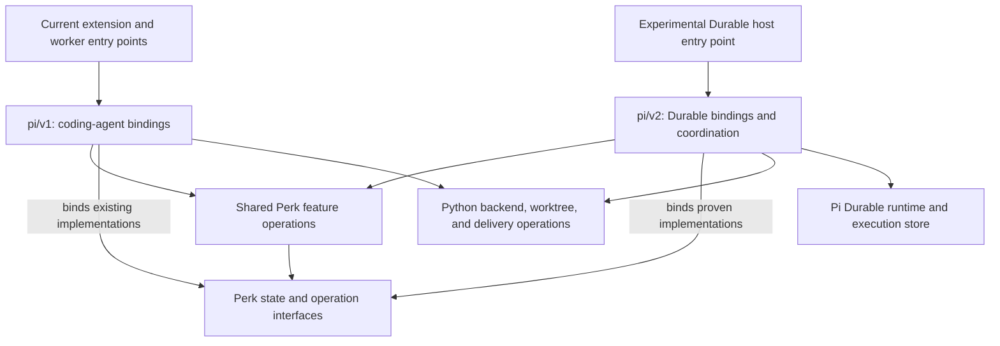

# A parallel path to Pi Durable

2026-10-05. A development proposal for Perk maintainers, accompanying [Pi in the sky][vision]
and [How a durable perk would work][workflows]. The first explains the opportunity; the second
walks through TypeScript coordination with Python doors and issue-backed plans. This document
recommends how to develop that architecture alongside today's implementation.

For the intended first-v2 product experience and future development, see
[Perk with Pi Durable: a working vision](vision.md).

For an independent v1 review-preparation pilot that shares decision semantics with v2, see
[A shared decision foundation for v1 and v2](decision-foundation.md).

## Recommendation

**Build the Durable integration in `extension/pi/v2` as a private npm workspace, with its own
host entry point, while keeping the current extension and worker as the default.** Reuse Perk
feature operations through their existing interfaces, and introduce Durable execution machinery
where its lifetime and storage semantics require it.

Here, `v2` names Perk's second integration generation. It does not imply Pi 2.0, a new Perk
product version, or automatic compatibility with the current coding-agent extension. The
earlier [decomposition topology][topology] anticipated a future `pi/application` family beside
`pi/v1`; this is a concrete proposal for that role, informed by the released Durable package.

The aim is to keep ordinary Perk useful throughout the experiment. Its Python doors,
installation behavior, and current runtime would remain available, including the ongoing
Pi 1.0 compatibility work. Shared code could receive narrowly justified changes with regression
coverage. The directory would organize the work; entry-point, dependency, and execution
separation would make coexistence credible.

This proposal is for a development workspace inside the repository. Independent publication,
default-runtime cutover, and migration of existing executions would require later plans.

## Source layout and ownership

The initial arrangement would be small:

```text
extension/
  index.ts                 current extension entry point
  workerMain.ts            current worker entry point
  authoring/               existing Perk feature operations
  delivery/
  codeReview/
  learning/
  session/                 existing session and artifact interfaces
  waves/                   current report-wave implementation
  worker/                  current SDK stage execution
  pi/
    v1/                    current coding-agent bindings
    v2/                    proposed private workspace
      package.json         own dependencies and explicit host scripts
      tsconfig.json        own compilation scope
      host.ts              experimental composition and startup
```

The v2 files above are proposed, not existing scaffolding. Create each with its first working
caller. Further directories should follow actual differences in responsibility rather than
copying the entire v1 layout in advance.

V2 would own task ownership, checkpoint/recovery adaptation, storage binding, host startup,
and the selected worker binding. Its coordinator would be the sole advancement owner for a
v2 execution; Python could still supply typed eligibility evaluation as well as worktree,
backend, and delivery operations. Moving policy into TypeScript is conditional on demonstrated
benefit. V1 would retain its present control path.

The intended dependency direction is:



Neither integration would import the other. An existing-worker experiment could invoke its
separate process through an explicit adapter without importing v1 bindings into v2.
Shared features would import neither integration, and Durable objects would stay outside
shared feature interfaces. The existing
[import-direction rules][import-rules] already protect much of that direction, including
type-only imports. The new integration would extend those checks to its own entry graph.

Use named module interfaces such as plan saving and publication. Do not introduce a universal
host interface that combines every current hook, tool, UI operation, and future task. When a
feature needs a new capability, prove its interface with that feature and retain its domain
types. This follows the earlier decomposition's [operation-specific approach][type-laws].

## Package and verification isolation

The current [package manifest][package] installs `extension/index.ts`, ships the extension
tree, and has no runtime dependency section. The [bare-import guard][bare-imports] and
[packaging test][packaging-test] preserve loading from a bare git checkout without installing
dependencies into Perk's package. Adding Durable imports anywhere under the current source
census would fail that guard even if startup never reached them.

The recommended package arrangement would therefore make four explicit changes when the
first experiment is implemented:

1. Register the private v2 workspace with its own dependencies and host entry. Keep the
   ordinary Pi package entry pointed at the current extension; the experimental host would
   start only through an explicit development path.
2. Exclude v2 from the current extension's published files. Keep its production dependency
   contract intact. Verify both the package contents and loading from a checkout with the
   v2 source present but its dependencies unavailable.
3. Give v2 a dedicated typechecking and test target. Preserve the current source and test
   coverage while routing v2 tests exactly once through the repository's verification entry
   points. Continue using `node:test` and `pytest` for Perk's regression coverage.
4. Separate source corpora deliberately. Keep cycle and direction checks across the owned
   code, apply the current bare-import restriction to the current runtime, and check v2's
   declared dependencies and allowed shared interfaces separately. Exclude installed
   dependency trees from owned-source scans.

These changes are necessary because today's [TypeScript project][tsconfig] includes the
extension tree and the [test commands][test-commands] select its test files recursively.
Several source guards also walk that tree. A nested workspace can place dependencies beneath
it; their declarations must not accidentally become Perk production source. Conversely,
excluding v2 from an old-runtime check must not leave it without an equivalent applicable
check. Controls should demonstrate that prohibited cross-imports are still rejected.

An npm workspace is part of a root-managed install, with linked local packages; it is not
an independent dependency universe. The root lockfile records the installed dependency tree.
The proposed v2 workspace would share that lockfile, so development installs and lockfile
reviews would change even though the shipped v1 extension keeps its installation contract.
([npm workspaces][npm-workspaces], [lockfile semantics][npm-lockfile])

V2 should declare the runtime packages it uses and pin its direct experimental dependencies.
The first installation proof must verify what each entry actually resolves, including shared
module imports, instead of relying on workspace placement or incidental hoisting. The
inspected [Durable manifest][durable-package] requires Node 22.19.0 or newer and depends on
Chord and pi-ai 1.0.3-compatible releases; the current Perk development pins are different.
Preserve those existing pins unless their own compatibility work changes them. Startup and
typechecking must exercise both dependency graphs under their stated prerequisites.

V2 initially consumes selected repository module interfaces at the same checkout revision.
Those supported imports should be named and checked; arbitrary access to sibling internals
would defeat the separation. This source arrangement does not establish an independently
installable v2 artifact. Publishing one would require a deliberate shared-code packaging
design and an installation proof of its own.

## What to reuse, adapt, and keep separate

The decomposition gives v2 useful code, but reuse must be demonstrated at the interface:

| Existing module | Observed property | Proposed treatment |
| --- | --- | --- |
| [Plan saving][plan-save] | The feature accepts a `PlanBackend` and `WorkflowSession`; approval/save ordering has a shared [gate operation][approval-gate]. | Reuse the feature's semantics through adapters that satisfy those interfaces. Keep backend failure and approval behavior visible. |
| [Change publication][submit-feature] | Publication and follow-up policy use injected capabilities; the current [Python submit door][submit-door] performs external operations. | Reuse the operation and Python implementation. Translate Durable calls and outcomes at v2's edge. |
| [WorkflowSession][workflow-session] | Artifact provenance and digests are centralized, but storage ports and caller-visible reads are synchronous. | Prove transaction and lifetime compatibility on one feature. Reuse integrity rules without assuming a Durable document can simply replace a synchronous file backing. |
| [ReportWave][report-wave] | Assignment/result policy coexists with process-local pending handles and current RPC execution machinery. | Reuse appropriate validation and result semantics; implement durable assignment identity and recovery where needed. Wrapping the existing object does not preserve its handles across restart. |
| [Stage execution][stage-execution] and its [SDK adapter][sdk-adapter] | SDK mechanics are confined, but the current drive implementation remains tied to that adapter and its terminal/budget behavior. | Compare coordination over existing workers with native Durable workers before choosing the binding or proposing a shared runner interface. |
| [Tool registration][perk-tool] | A module outside `v1` directly uses coding-agent tool and extension types. | Treat it as a current-runtime binding. Native Durable workers need their own registry binding; either option must preserve restrictions. |

Upstream already has an [experimental Durable coding-agent host][experimental-host]. It reuses
model/auth/settings and terminal components, owns a SQLite store with a process lock, and
loads project context and skills. Inspect it before duplicating host work. Its documented
exclusions include legacy extensions, images, prompt templates, and login; it neither supplies
Perk's existing extension environment nor establishes a stable host API for us to import.

For the native-worker comparison, begin with the supplied `NodeExecutionEnv` and built-in
tool mechanisms, then bind Perk's restrictions and feature operations. The [technical manual][manual],
pp. 155–157, describes the environment seam; upstream's [exported conformance suite][env-conformance]
is runner-independent and can be driven by `node:test`. This can avoid rebuilding process and
filesystem machinery. A working directory is not a sandbox: the [Node adapter][node-env]
accepts paths outside it, and the built-in tools' [file-mutation queue][mutation-queue] does not
serialize bash or other processes.
Perk must enforce assignment authority at the operation boundary. Remote environments are a
later placement opportunity, not a prerequisite for the first binding.

The import guard's SDK restrictions are direct-specifier checks. A feature can still reach
runtime-specific behavior through local dependencies. Review the transitive imports and the
behavior a caller must understand, including error ordering, cancellation, and storage
visibility. A folder name or a successful typecheck alone is insufficient evidence of reuse.

For example, an asynchronous Durable commit must not let a plan-save feature report that an
artifact is safely retained while its write is still pending. If one feature requires a new
transaction-aware interface, establish that behavior explicitly and verify the existing
backing alongside it. Do not make every v1 state operation asynchronous merely to prepare for
a possible future caller.

The first decision/report module should implement the walkthrough's [acceptance and recovery
rules][decision-proof], hiding transaction ordering and uncertain-commit reconciliation from
its callers. Prove that module with one operation before extracting broader interfaces.

The same discipline applies to report waves. Keep proven completeness and report-validation
rules where they fit, while allowing a recovered wave to have a different internal lifetime.
A shared extraction should remove duplicated policy and preserve its tests. Maintaining two
copies with instructions to keep them synchronized would turn a runtime experiment into a
second implementation of Perk's domain rules.

## Coexisting executions

Ordinary Python doors would continue selecting the current runtime by default. The experimental
entry would explicitly select v2 when starting work and retain that runtime identity with the
execution. It would be possible to reconnect to a v2 execution through its host without changing
which implementation owns it. This describes behavior, not proposed public flag syntax.

The initial experiments should use dedicated data directories, disjoint plans, and separate
worktrees and branches. Adopt the walkthrough's [store and record policy][record-policy]: one
SQLite store per logical objective execution or standalone plan workflow, spanning its commands
and workers. Use conversation-owned continuation tasks in the retained execution conversation.
These are experiment defaults, not production topology decisions. Execution data must have a
distinct namespace and lifecycle from disposable workflow caches. The store location and
identity belong to the host's explicit inputs; this memo does not allocate a new managed
`.perk/` layout.

Both runtimes would still use the configured issue backend for approved work and Git/GitHub
for code and PR facts. Separate execution stores do not coordinate competing writers to those
systems. Until a shared admission mechanism is proven, they must not concurrently drive the
same plan or branch. One v2 execution would have one coordinator deciding its next action;
the current Python supervisor would not also advance that execution.

Durable's [storage contract][storage] requires one owning process per store. Acquire ownership
before opening storage or the harness, which may write recovery state even with scheduling
paused. Observer attachment goes through that owner; forensic read-only inspection needs a
separate path. Detachment would leave work admitted; stopping the owner would stop its scheduler,
while surviving child processes and remote effects still require reconciliation.
Cancellation would stop further admission and address owned work while retaining evidence of
effects already attempted. It would not undo a remote mutation by changing a checkpoint.

Reverting an experimental launch choice is different from migrating a running execution.
To return affected work to the current workflow, finish or cancel v2 work, reconcile external
effects, and establish the canonical handoff state. Start a deliberate current-runtime action
from that state. Do not silently fall back to v1 after a v2 failure or treat its transcripts
as interchangeable session files. Retain the execution store for diagnosis and recovery.

## Validation sequence

The experiment should grow through working behavior, with the current regression suites
continuing to pass. The stages below are proposed acceptance evidence, not completed results:

| Stage | Working behavior | Evidence needed before expanding |
| --- | --- | --- |
| 1. Isolated host | Start a minimal v2 host while the normal extension and worker retain their launch paths. | Current loading works without v2 dependencies; package contents, dependency resolution, guards, and dedicated verification work. One SQLite store spans an execution; exclusive ownership precedes recovery-capable open, and compatibility checks precede scheduler resume. |
| 2a. Restricted report assignment | Compare recoverable supplier collection, Durable coordination over existing workers, and native Durable workers at the same report seam. | Recover the conversation-creation/submission gap without rebinding identity. Preserve exact subject, fresh context, explicit capabilities, allowed reads, refused writes, and cancellation under the [current child policy][child-policy], including resource-rendering failure and restoration after compaction. Accept only valid reports, including tool-controlled completion without recap; expose missing, invalid, token-limited, and tool-error outcomes. |
| 2b. Persisted human decision | With fixture evidence and no model or UI transport, persist a decision and create one conversation-owned continuation from an authorized reply. | Reply before waiter attachment and after the requesting task is terminal. Duplicates, supersession, changed subject, and cancellation across tasks cannot lose or double-consume a valid decision. Distinguish definite storage rejection from an uncertain commit; recover a committed reply and continuation after acknowledgment loss. |
| 3. Failure recovery | Accept one of two reports, kill the owner, reopen under ownership, then recover the remaining assignment. | Retain valid evidence, reject stale evidence, and accept the aggregate once; an enqueued notification is not accepted work. Reconcile surviving children and uncertain effects; enforce compatibility, restrictions, and budget admission on every attempt. A plain status snapshot distinguishes blocked and uncertain work; observers reconnect and cancellation affects only its intended scope. |
| 4. Experimental plan workflow | Drive an approved plan through implementation, incremental draft publication, review, and human handoff in a designated test repository. | One coordinator owns advancement; Python checks remain; validated outcomes authorize continuation through publication and human handoff. Incremental publication recovers through its own path; stacked publication keeps separate regressions; uncertain acceptance is reconciled before retry; ready/merge remain human actions. |
| 5. First usable v2 | Advance a multi-node objective across an external backend change and recover a learn pass over a retained evidence bundle. | Explicit reconciliation refreshes eligibility after edits and merges; task completion does not imply node completion. Valid analyst results and objective progress survive restart and compaction. Learning preserves committed failures, corrections, and provenance; capture/skip closes only after verified backend success. |

Within those stages, require these lifecycle cases from the walkthrough:

| Stage and rule | Scenario and required outcome |
| --- | --- |
| 3: [Parent completion][report-acceptance] | Retain one valid report while another reviewer fails late. Preserve the first report and expose incomplete coverage; never commit aggregate success before required child outcomes are collected and validated. |
| 3: [Cancellation and cleanup][cancellation-scope] | Exercise interrupted cleanup, background work within cancellation scope, faulted/orphaned tasks, and a handler that ignores cancellation. Repeated recovery must not duplicate compensation. Unresolved work stays visible and prevents a false cleanup-verified claim; abort acknowledgment alone is insufficient. |
| 2a: [Transcript binding][transcript-writes] | Submit an application entry during generation and concurrent harness compaction. Verify placement at a safe boundary and retention of accepted application facts. Application-authored history edits and head rewinds remain unsupported by the experimental binding. |

Stage 1 earns the right to experiment without requiring the production runtime to participate.
Stages 2a and 2b are independent after that host exists. The [worker comparison][worker-options]
tests Perk's actual binding; a generic prompt does not establish capability parity. The
[decision protocol][decision-proof] tests durable human control without waiting for the v1
pilot or a browser/messaging adapter. Neither proof needs a complete implementation stage.

Each worker option needs a recorded execution profile: tool concurrency, harness retries,
provider retries, compaction behavior, resolved resources and capabilities, and usage accounting.
Declare differences and compare under stated conditions; a common prompt does not make defaults
equivalent. Native child usage must not be counted again as parent tool usage, while external
workers need adapter accounting. Select concrete settings in the experiment rather than invent
tuning values here. The walkthrough owns [semantic completion][report-acceptance] and
[admission identity][admission-identity]; runtime `done` alone never satisfies this proof.

Stage 3 applies the workflow companion's [resume and budget responsibilities][recovery-contract].
An orderly close/reopen test is insufficient evidence for owner death, surviving subprocesses,
or changed code and policy. Test the failure boundaries that could admit unauthorized effects,
including [local commit uncertainty][commit-outcomes]. Prove the [execution view][execution-view]
with a plain snapshot; browser presentation can follow independently.

Stage 4 must distinguish [incremental submit][incremental-publication] from the
[stacked-publication journal][publication] and its [crash regression][publication-test]. A local
commit cannot encompass GitHub mutation. Stage 5 completes the broader [product vision][product-vision];
the experimental plan workflow alone is not the first usable v2.

For each migrated behavior, compare retained completed work, repeated model/tool work, manual
recovery steps, and coordination obligations removed and added. Measure within that behavior;
keeping v1 available makes repository-wide deletion an unsuitable early success criterion.
A passing demonstration still needs a clear operational benefit before expansion.

## Adoption and exit

Keep v1 the default throughout these stages. Changes to shared interfaces should be bounded
by a working feature and verified against the current implementation. Package isolation,
feature compatibility, and execution recovery are distinct claims; success in one does not
establish the others.

Expand when the experiment both preserves Perk's guarantees and simplifies real callers or
recovery paths. If an interface proves unsuitable, adjust that specific seam with its tests.
If useful behavior requires copying large portions of feature policy or weakening current
guarantees, stop expansion and reconsider the integration. Existing work can continue through
the current runtime while that question is resolved.

A later adoption plan would own user-facing selection, installation outside the development
checkout, execution-store operations, general migration of live work, and any default switch.
Minimal incompatible-resume refusal belongs in the first host, not this later adoption plan.
Implementation would amend the cross-plane contract where the new coordinator takes over advancement.
Issue-backend authority and Python doors remain part of the architecture described here;
moving approved work to another store is a separate decision.

If the experiment is retired, first settle its executions and preserve needed evidence, then
remove its entry, package membership, and dedicated verification wiring. Useful shared
improvements can remain when independently justified. No v1 behavior should depend on the
continued existence of the experimental host.

## Evidence baseline

Current Perk observations use commit `91719e4933389fece395cd570d0b8a0f7506b7b8`. Upstream Pi
links pin `b7dfc049e917a265a5aefa9f3952a2dec9b81cfd`, matching the other companions' Durable
baseline. npm references are official CLI v11 documentation, consulted on 2026-10-05.
The [strategy appendix][evidence] distinguishes the technical manual's source snapshot and
captured experiments from this mirror and the proofs still to run.

Code and manifest links identify inspected implementation; documentation describes its stated
contracts; earlier decomposition notes describe design intent and recorded realization.
Linked tests were read, not run. No v2 package, installation proof, Perk/Durable binding,
failure-injection experiment, or runtime cutover was implemented for this document. The layout,
isolation rules, and validation stages above remain proposals.

[vision]: pi-in-the-sky.md
[workflows]: pi-durable-workflows.md
[product-vision]: vision.md#the-first-v2-three-ordinary-workflows
[worker-options]: pi-in-the-sky.md#compare-worker-runtimes
[decision-proof]: pi-durable-workflows.md#persisted-decisions
[recovery-contract]: pi-durable-workflows.md#resuming-safely
[record-policy]: pi-durable-workflows.md#store-and-record-policy
[admission-identity]: pi-durable-workflows.md#admission-and-conversation-identity
[report-acceptance]: pi-durable-workflows.md#accepting-work-and-continuing
[cancellation-scope]: pi-durable-workflows.md#attaching-stopping-and-moving-machines
[transcript-writes]: pi-durable-workflows.md#transcript-writes-and-compaction
[commit-outcomes]: pi-durable-workflows.md#commit-outcomes-and-recovery
[execution-view]: pi-durable-workflows.md#execution-views-and-learning-evidence
[manual]: ../../Pi-Durable-Technical-Manual.pdf
[evidence]: pi-in-the-sky.md#appendix-evidence-and-boundaries
[env-conformance]: https://github.com/earendil-works/pi/blob/b7dfc049e917a265a5aefa9f3952a2dec9b81cfd/packages/durable/src/testing/env-conformance.ts#L94-L105
[node-env]: https://github.com/earendil-works/pi/blob/b7dfc049e917a265a5aefa9f3952a2dec9b81cfd/packages/durable/src/env/node.ts#L72-L85
[mutation-queue]: https://github.com/earendil-works/pi/blob/b7dfc049e917a265a5aefa9f3952a2dec9b81cfd/packages/durable/src/tools/file-mutation-queue.ts#L28-L31
[incremental-publication]: ../../../src/perk/cli/commands/pr/submit_cmd.py#L230-L295
[experimental-host]: https://github.com/earendil-works/pi/blob/b7dfc049e917a265a5aefa9f3952a2dec9b81cfd/packages/coding-agent/src/experimental/durable/README.md
[topology]: ../ts-decomposition/module-contracts.md#target-topology
[type-laws]: ../ts-decomposition/module-contracts.md#keep-operations-specific
[import-rules]: ../../../extension/importDirectionGuard.test.ts
[package]: ../../../package.json
[bare-imports]: ../../../extension/bareImportGuard.test.ts
[packaging-test]: ../../../tests/test_packaging.py#L62-L71
[tsconfig]: ../../../tsconfig.json
[test-commands]: ../../../justfile#L95-L106
[npm-workspaces]: https://docs.npmjs.com/cli/v11/using-npm/workspaces/
[npm-lockfile]: https://docs.npmjs.com/cli/v11/configuring-npm/package-lock-json/
[plan-save]: ../../../extension/authoring/plan/save.ts
[approval-gate]: ../../../extension/authoring/review/approvalGate.ts
[submit-feature]: ../../../extension/delivery/submit.ts
[submit-door]: ../../../src/perk/cli/commands/pr/submit_cmd.py#L1-L9
[workflow-session]: ../../../extension/session/workflowSession.ts
[report-wave]: ../../../extension/waves/reportWave.ts#L638-L686
[stage-execution]: ../../../extension/worker/stageExecution.ts
[sdk-adapter]: ../../../extension/worker/sdkAdapter.ts
[perk-tool]: ../../../extension/pi/perkTool.ts
[child-policy]: ../../design/pi-subagents-child-execution-policy.md
[publication]: ../../../src/perk/delivery/publish.py#L879-L925
[publication-test]: ../../../tests/test_delivery_publish.py#L1387-L1403
[durable-package]: https://github.com/earendil-works/pi/blob/b7dfc049e917a265a5aefa9f3952a2dec9b81cfd/packages/durable/package.json
[storage]: https://github.com/earendil-works/pi/blob/b7dfc049e917a265a5aefa9f3952a2dec9b81cfd/packages/durable/README.md#storage
