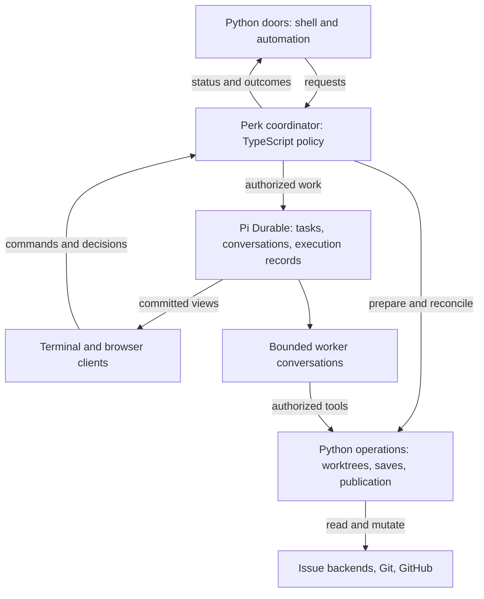

# How a durable perk would work

2026-10-05. A companion to [Pi in the sky][vision] for Perk maintainers. This is a worked
architectural proposal; current behavior and upstream evidence are identified separately.

For stories of using plans, objectives, and `/learn` in v2, and the possibilities beyond them,
see [Perk with Pi Durable: a working vision](vision.md).

For the proposed development layout, isolation rules, and migration stages, see
[A parallel path to Pi Durable](pi-durable-v2.md).

For the proposed shared handling of delegated questions and human review before v2, see
[A shared decision foundation for v1 and v2](decision-foundation.md).

## The architecture in this walkthrough

**Python doors would still drive Perk, and GitHub/Linear would still own saved plans and
objectives.** The change is that TypeScript Perk policy would coordinate work through Pi
Durable, retaining execution progress across conversations and process restarts.

This works through the strategy memo's middle configuration: consolidate orchestration while
keeping approved workflow records in their existing backends. It makes that option concrete
without making it an adoption decision. Moving approved plans into a Perk store remains a
separate proposal.

Python would keep shell entry points and mature preparation, Git, worktree, and backend
operations. The TypeScript coordinator would select eligible actions and enforce workflow
gates. Models would carry out bounded assignments. Durable would schedule tasks, persist their
progress, and expose committed views. Perk would still define what counts as approval,
completion, and permission to continue.

## Doors remain; coordination moves

Today, [`perk implement`][implement-door] selects a saved plan and enters the launch pipeline.
The Python [objective supervisor][supervisor] advances at most one safe action and stops at
human boundaries. The TypeScript extension governs the running session. Cross-language
operations already exist: the warm submit tool delegates to the [Python submit door][submit-door].

In this design, execution-facing Python doors would ask the coordinator to begin an authorized
stage, reconnect to an execution, report status, or request cancellation. Those are semantic
capabilities, not proposed command names. The caller would receive an execution reference and
meaningful outcomes; it would not edit Durable's internal records. Python operations would
keep their domain checks, including validation before a save or publication. Scaffolding and
standalone maintenance would remain available without starting a Durable host.

These are responsibilities, not deployment units. The coordinator would be the single owner
of next-action selection for an execution. Retained Python operations would perform requested
work and report results; a second Python supervisor would not independently advance that
execution.

This would revise the [current two-plane boundary][mental-model], which puts cross-session
supervision in the Python exterior. The new coordinator's lifetime would span many worker
conversations. Preserving Python entry points does not preserve every existing responsibility
assignment; implementing this change would require an explicit cross-plane contract revision.

Cold entry would still resolve the work and prepare its environment. Warm interaction would
retain the relevant conversation context. A fresh implementation would still begin separately
from planning; reconnecting to an existing execution would be an explicit, different action.
Headless clients would use the same policy and outcomes; execution location would not widen
permissions or remove human gates. These are compatibility goals, not a promise that today's
Pi TUI, extension hooks, or passthrough flags work unchanged with Durable.

## One objective node, before and after

Consider an approved objective whose next node needs a plan, implementation, and review. The
plan remains the bounded unit of work. An objective execution coordinates those units; it
does not turn the whole objective into one implementation conversation.

| Moment | Current Perk | Proposed workflow |
| --- | --- | --- |
| Draft and approve | Read-only authoring produces a draft; human review precedes saving it to the issue backend. | Keep that boundary. Retain the draft and pending decision so review can be reacquired after restart. |
| Begin implementation | Python prepares the worktree and launches a fresh, primed session. | Python initiates the operation; the coordinator arranges preparation and admits a bounded implementation assignment with fresh context. |
| Publish | The existing submit path pushes code, creates a draft PR, and updates backend records. | Invoke those operations through the worker's authorized tools and reconcile their outcomes into execution state. |
| Run reviewers | Report children produce results; the wave collector's pending handles belong to its in-memory instance. | Give assignments and accepted reports durable identity so collection can continue after reopening execution. |
| Process interruption | Saved plans, pushed branches, session records, and available reports support recovery; continuation depends on the component. | Recover recorded task progress, preserve completed work, and reconcile unfinished attempts before continuing. |
| Human decision | Human gates remain explicit; browser draft-review decisions do not survive a Pi restart. | Persist the pending request and decision against the exact work reviewed, with stale and duplicate decisions handled explicitly. |
| Address and deliver | Feedback, checks, ready/landing gates, and reconciliation govern progress. | Keep those meanings and gates. Record execution progress without treating a finished task as proof that a PR merged or a node is done. |

The current limitations in this comparison are specific: [ReportWave][wave] keeps collection
references in an instance-owned map, although supplier results have persistence. The
[browser draft-review contract][browser-review] explicitly requires reopening review after a
restart. Perk already supports remote execution and browser review; the proposal extends
their continuity.

Suppose two reviewers examine one code head. The first report has been accepted and committed;
the second reviewer is still working when the host dies. Recovery would proceed as follows:

1. Reopen execution and find the accepted report, outstanding assignment, governing policy,
   and recorded budget use. Finishing one assignment is an execution fact worth preserving.
2. Recheck the relevant plan revision and code head. If they still match, retain the first
   report for this wave. Changed work makes evidence stale for advancement; retaining a
   historical report does not make it a review of the new work.
3. Recover the remaining assignment according to its checkpoint and interrupted-operation
   rules. Preserve its restrictions, exact review subject, and budget accounting across
   attempts. If continuation needs a new attempt or human repair, expose that outcome.
4. Validate completeness and accept the aggregate once. Record any next human gate with the
   revision it concerns. Reconnection or a repeated decision must not advance execution twice.

Durable's [scheduler][scheduler] restores running tasks to pending checkpoints. Its
[tool recovery path][tool-recovery] only replays when both recorded and current policies permit
it; otherwise it reports interruption. These are useful mechanisms, not evidence that the
Perk integration already preserves every guarantee above. Recovery is from recorded progress,
not from an exact machine instruction.

## Each fact keeps one owner

Keeping issue backends does not mean they must store every execution detail. The proposed
division follows the distinction in the earlier [execution-contract sketch][authorities]:

| Fact | Authority in this design |
| --- | --- |
| Approved objective intent, roadmap, saved plans, and their canonical progress | Configured issue/objective backend: GitHub, or Linear issues and Projects. |
| Commits, branch ancestry, worktree contents | Git and the actual workspace; local edits and unpushed commits remain machine-local. |
| PR existence, reviews, CI results, draft/ready state, merge | GitHub under either issue backend. |
| Recoverable delivery operations | Existing delivery protocol and journal, reconciled against fresh Git/GitHub facts. |
| Assignments, attempts, accepted reports, consumed decisions, execution budget accounting | Durable execution records governed by Perk policy. |
| Working drafts and pending decision requests | Perk application state retained with execution, distinct from approved backend records. |
| Materialized plan copies and UI views | Derived representations of the relevant authority. |

For example, the backend says node A has saved plan P. Execution says attempt E is reviewing
commit C, with one report complete. These statements describe different facts. A workspace
view can combine them without becoming another editable copy of the roadmap.

If someone revises P in the backend, the coordinator must detect that its authorization or
evidence may be stale. It would pause affected advancement for reconciliation and the required
review. A saved checkpoint would not silently restore the old plan over the backend or
authorize the expanded work. Backend reads and writes therefore remain necessary.

They also remain outside Durable's atomic commit. A process can fail after a PR is created but
before the execution receipt is saved. Perk's [publication protocol][publication] already
records intent before remote mutation, and its [PR-creation crash test][publication-test]
checks rediscovery of the existing PR. Retain that correctness machinery. Likewise, Durable's
[task recovery test][task-test] exercises two service calls with one idempotent effect; it does
not establish exactly-once execution of arbitrary external operations.

## Attaching, stopping, and moving machines

An execution would have an owner separate from the interactive turn presenting it. Durable's
[background-subagent example][background] demonstrates that lifetime separation. Perk would
need to give each user action an explicit scope:

- **Detach a client:** stop observing; leave execution and pending decisions intact.
- **Interrupt a turn:** stop the targeted interactive work without implicitly cancelling
  independent assignments or the objective execution.
- **Cancel execution:** stop admitting new work and cancel owned work according to policy,
  while preserving records and reconciling effects already attempted. Cancellation cannot
  undo a published PR merely by changing a task's status.

A maintainer could start from the terminal, later open a browser, and see the current work and
pending decision. Durable's [watch interface][watching] supplies committed views on attachment
and subsequent changes. Perk would still build the client transport, actor authorization, and
revision checks. An approval would cover the exact presented work and save destination;
existing stale-review protection would carry forward into a persisted decision lifecycle.

Continued execution requires a running host. Closing a client could leave that host working;
stopping the host pauses work until it restarts. Remote jobs already outlive local terminals
today. The proposed benefit is retaining more execution state and making it consistently
observable.

**The execution store would be real data, even with issue-backed plans.** A fresh clone and
backend access could recover approved work and pushed code, but not every report, checkpoint,
or pending decision. Resuming elsewhere requires access to the execution store and a suitable
workspace; a conversation checkpoint does not back up uncommitted filesystem changes.

The inspected [storage contract][storage] permits one owning process per store. Multiple
clients would connect through that owner, not open independent writers on the same database.
SQLite's documented defaults distinguish process-crash recovery from power or host failure.
Backup, restoration, and workspace placement need their own design; choosing Durable does not
settle them.

## What this enables, and what still needs proof

The shared workspace would let people observe the same running work and contribute decisions
without sharing one model context. Implementation and independent review would retain fresh
contexts, and a long objective could use many bounded conversations. Human gates would keep
their meaning even when the person changes interface or returns after a restart.

The same ownership model could support an approved experiment comparing two implementations.
Each candidate would have a separate worktree, bounded resources, and revision-linked evidence.
Stopping one would leave the other's work intact. Conversation forks could help exploration,
but [forking a conversation][forks] does not clone a filesystem. Selecting a candidate would
carry it into the normal reviewed-plan and delivery path; selection would not itself publish
or merge. This extends the strategy memo's experiment idea without changing ordinary planning's
read-only posture.

The major integration question is how Perk's capabilities bind to Durable. Today's
[SDK adapter][sdk] constructs coding-agent services; Durable exposes its own
[extension registry][extensions]. Those are not demonstrated as interchangeable. Tool/resource
loading, fresh-context rules, [report-child restrictions][child-policy], report validation,
and [artifact provenance and digest checks][artifacts] all need an implementation under the
new runtime. Retained Python operations do not supply that binding by themselves.

Perk must also preserve policy identity and enforce budgets across recovered attempts.
Durable's [runtime settings][settings] are read at use and never stored, so reopening a task
does not restore all governing configuration. The coordinator needs an explicit rule for
resuming under compatible policy or requiring intervention.

The strategy memo's [staged proofs][proofs] provide the evaluation path: establish capability
fit, demonstrate partial-wave recovery, then test a complete workflow with a persisted human
decision. Moving next-action policy into TypeScript earns its place only if those proofs
preserve Perk's guarantees while removing duplicated coordination and recovery work. Deployment,
transport, storage schemas, and migration protocols belong in the resulting implementation
plans. This companion introduces no command syntax or new public API.

## Evidence baseline

Observations of current Perk use commit `9c4e52c041404403c9693eccca49969ed4758ec1`. Upstream links
pin Pi to `b7dfc049e917a265a5aefa9f3952a2dec9b81cfd`, the same source baseline as the strategy
memo. Perk docs and code ground current behavior; upstream documentation describes its supported
mechanisms. Source links identify inspected implementations; earlier planning records remain
proposals. Linked test bodies were inspected, not executed. No Durable integration, failure
injection, or multi-client experiment was run for this companion. Proposed behavior remains
future work; the [strategy memo's evidence appendix][evidence] supplies the broader assessment.

[vision]: pi-in-the-sky.md
[mental-model]: ../../user-docs/explanation/how-perk-thinks.md#two-planes-the-exterior-and-the-interior
[implement-door]: ../../../src/perk/cli/commands/implement_cmd.py
[supervisor]: ../../../src/perk/cli/commands/objective/run_cmd.py#L1-L8
[submit-door]: ../../../src/perk/cli/commands/pr/submit_cmd.py#L1-L9
[wave]: ../../../extension/waves/reportWave.ts#L638-L686
[browser-review]: ../../user-docs/reference/providers-and-backends.md#plannotator-draft-review-transport
[authorities]: ../deepen-headless-execution/objective-execution-contract.md#authorities
[publication]: ../../../src/perk/delivery/publish.py#L879-L925
[publication-test]: ../../../tests/test_delivery_publish.py#L1387-L1403
[sdk]: ../../../extension/worker/sdkAdapter.ts#L458-L526
[child-policy]: ../../design/pi-subagents-child-execution-policy.md
[artifacts]: ../../../extension/session/workflowSession.ts#L531-L566
[proofs]: pi-in-the-sky.md#recommendation-and-proofs
[evidence]: pi-in-the-sky.md#appendix-evidence-and-boundaries
[scheduler]: https://github.com/earendil-works/pi/blob/b7dfc049e917a265a5aefa9f3952a2dec9b81cfd/packages/durable/src/harness/scheduler.ts#L238-L255
[tool-recovery]: https://github.com/earendil-works/pi/blob/b7dfc049e917a265a5aefa9f3952a2dec9b81cfd/packages/durable/src/harness/tool.ts#L93-L110
[task-test]: https://github.com/earendil-works/pi/blob/b7dfc049e917a265a5aefa9f3952a2dec9b81cfd/packages/durable/test/harness-tasks-recovery.test.ts#L111-L144
[background]: https://github.com/earendil-works/pi/blob/b7dfc049e917a265a5aefa9f3952a2dec9b81cfd/packages/durable/test/examples/23-subagent-background.ts#L56-L115
[watching]: https://github.com/earendil-works/pi/blob/b7dfc049e917a265a5aefa9f3952a2dec9b81cfd/packages/durable/README.md#watching-a-conversation
[storage]: https://github.com/earendil-works/pi/blob/b7dfc049e917a265a5aefa9f3952a2dec9b81cfd/packages/durable/README.md#storage
[forks]: https://github.com/earendil-works/pi/blob/b7dfc049e917a265a5aefa9f3952a2dec9b81cfd/packages/durable/README.md#more-conversations-and-forks
[extensions]: https://github.com/earendil-works/pi/blob/b7dfc049e917a265a5aefa9f3952a2dec9b81cfd/packages/durable/README.md#extensions
[settings]: https://github.com/earendil-works/pi/blob/b7dfc049e917a265a5aefa9f3952a2dec9b81cfd/packages/durable/README.md#settings
