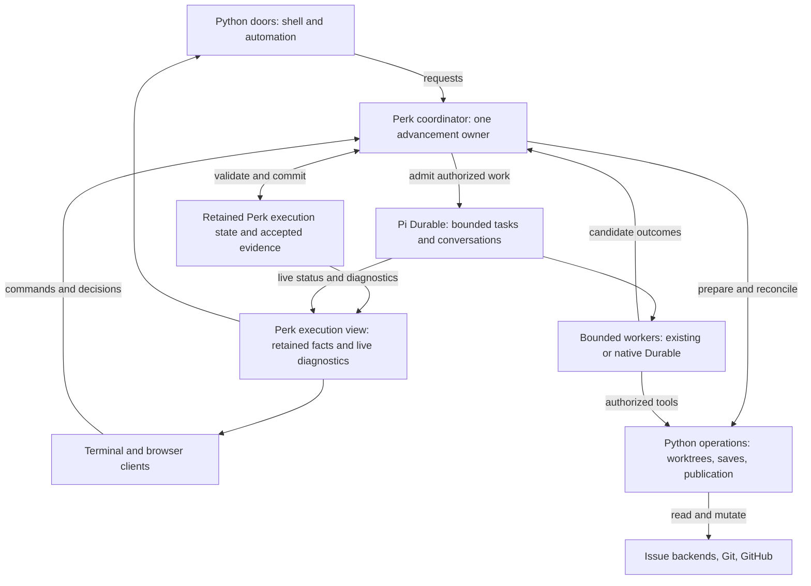

# How a durable perk would work

2026-10-05. A companion to [Pi in the sky][vision] for Perk maintainers. This is a worked
architectural proposal; current behavior and upstream evidence are identified separately.

For stories of using plans, objectives, and `/learn` in v2, and the possibilities beyond them,
see [Perk with Pi Durable: a working vision](vision.md).

For the proposed development layout, isolation rules, and migration stages, see
[A parallel path to Pi Durable](pi-durable-v2.md).

For the independent v1 pilot in delegated review preparation and human review, see
[A shared decision foundation for v1 and v2](decision-foundation.md).

## The architecture in this walkthrough

**Perk would retain execution state and accepted evidence; bounded tasks would perform work;
validated domain outcomes would authorize continuation.** Python doors would still drive Perk,
and GitHub/Linear would still own saved plans and objectives. One Perk coordinator would
advance each execution through Pi Durable across conversations and process restarts.

This works through the strategy memo's middle configuration: consolidate orchestration while
keeping approved workflow records in their existing backends. It makes that option concrete
without making it an adoption decision. Moving approved plans into a Perk store remains a
separate proposal.

Python would keep shell entry points and mature preparation, Git, worktree, and backend
operations. A TypeScript coordinator could consume typed eligibility evaluations from Python;
moving that policy into TypeScript is conditional on a demonstrated benefit. Models would
carry out bounded assignments through the selected worker runtime. Durable would schedule
tasks, persist their progress, and expose committed views. Perk would still define approval,
completion, and permission to continue. The coordinator is application logic over retained
state; it does not require a model conversation or root task to remain continuously active.

## Doors remain; coordination moves

Today, [`perk implement`][implement-door] selects a saved plan and enters the launch pipeline.
The Python [objective supervisor][supervisor] advances at most one safe action and stops at
human boundaries. The TypeScript extension governs the running session. Cross-language
operations already exist: the warm submit tool delegates to the [Python submit door][submit-door].

In this design, execution-facing Python doors would ask the coordinator to begin an authorized
stage, reconnect to an execution, report status, or request cancellation. Those are semantic
capabilities, not proposed command names. The caller would receive an execution reference and
meaningful outcomes; it would not edit Durable's internal records. Python operations would
keep their domain checks, including validation before a save or publication. Scaffolding and
standalone maintenance would remain available without starting a Durable host.

These are responsibilities, not deployment units. The coordinator would be the single owner
of advancement for an execution. Retained Python operations could evaluate eligibility as well
as perform requested work and report results; a second Python supervisor would not independently
advance that execution. Coordinator ownership, canonical-state authority, and worker runtime
are [independent choices][worker-options].

This would revise the [current two-plane boundary][mental-model], which puts cross-session
supervision in the Python exterior. Its replacement would retain coordination state across many
bounded worker conversations. Preserving Python entry points does not preserve every existing
responsibility assignment; implementing this change would require a cross-plane contract revision.

Cold entry would still resolve the work and prepare its environment. Warm interaction would
retain the relevant conversation context. A fresh implementation would still begin separately
from planning; reconnecting to an existing execution would be an explicit, different action.
Headless clients would use the same policy and outcomes; execution location would not widen
permissions or remove human gates. These are compatibility goals, not a promise that today's
Pi TUI, extension hooks, or passthrough flags work unchanged with Durable.

## One objective node, before and after

Consider an approved objective whose next node needs a plan, implementation, and review. The
plan remains the bounded unit of work. An objective execution coordinates those units; it
does not turn the whole objective into one implementation conversation.

| Moment | Current Perk | Proposed workflow |
| --- | --- | --- |
| Draft and approve | Read-only authoring produces a draft; human review precedes saving it to the issue backend. | Keep that boundary. Retain the draft and pending decision so review can be reacquired after restart. |
| Begin implementation | Python prepares the worktree and launches a fresh, primed session. | Python initiates the operation; the coordinator arranges preparation and admits a bounded implementation assignment with fresh context. |
| Publish | The existing submit path pushes code, creates a draft PR, and updates backend records. | Invoke those operations through the worker's authorized tools and reconcile their outcomes into execution state. |
| Run reviewers | Report children produce results; the wave collector's pending handles belong to its in-memory instance. | Give assignments and accepted reports durable identity so collection can continue after reopening execution. |
| Process interruption | Saved plans, pushed branches, session records, and available reports support recovery; continuation depends on the component. | Recover recorded task progress, preserve completed work, and reconcile unfinished attempts before continuing. |
| Human decision | Human gates remain explicit; browser draft-review decisions do not survive a Pi restart. | Persist the pending request and decision against the exact work reviewed, with stale and duplicate decisions handled explicitly. |
| Address and deliver | Feedback, checks, ready/landing gates, and reconciliation govern progress. | Keep those meanings and gates. Record execution progress without treating a finished task as proof that a PR merged or a node is done. |

The current limitations in this comparison are specific: [ReportWave][wave] keeps collection
references in an instance-owned map, although supplier results have persistence. The
[browser draft-review contract][browser-review] explicitly requires reopening review after a
restart. Perk already supports remote execution and browser review; the proposal extends
their continuity.

Suppose two reviewers examine one code head. The first report has been accepted and committed;
the second reviewer is still working when the host dies. Recovery would proceed as follows:

1. Establish exclusive ownership before opening the store or harness; opening can itself
   write recovery state. Keep scheduling paused while finding the accepted report, outstanding
   assignment, governing policy, cancellation state, and budget commitments.
2. Validate resume compatibility, then recheck the relevant plan revision and workspace.
   If they still match, retain the first report for this wave. Changed work makes evidence
   stale for advancement; a historical report does not review the new work.
3. Recover the remaining assignment according to its checkpoint and interrupted-operation
   rules. Preserve its restrictions, exact review subject, and budget accounting across
   attempts. If continuation needs a new attempt or human repair, expose that outcome.
4. Validate completeness and accept the aggregate once. Record any next human gate with the
   revision it concerns. Reconnection or a repeated decision must not advance execution twice.

Durable's [scheduler][scheduler] restores running tasks to pending checkpoints. Its
[tool recovery path][tool-recovery] only replays when both recorded and current policies permit
it; otherwise it reports interruption. These are useful mechanisms, not evidence that the
Perk integration already preserves every guarantee above. Recovery is from recorded progress,
not from an exact machine instruction.

## Each fact keeps one owner

Keeping issue backends does not mean they must store every execution detail. The proposed
division follows the distinction in the earlier [execution-contract sketch][authorities]:

| Fact | Authority in this design |
| --- | --- |
| Approved objective intent, roadmap, saved plans, and their canonical progress | Configured issue/objective backend: GitHub, or Linear issues and Projects. |
| Commits, branch ancestry, worktree contents | Git and the actual workspace; local edits and unpushed commits remain machine-local. |
| PR existence, reviews, CI results, draft/ready state, merge | GitHub under either issue backend. |
| Recoverable delivery operations | Incremental submit convergence or the stacked-publication journal, reconciled against fresh Git/GitHub facts. |
| Assignments, attempts, accepted reports, consumed decisions, cancellation, effect receipts, budget commitments | Perk application state retained with execution, beyond individual tasks. |
| Working drafts and pending decision requests | Perk application state retained with execution, distinct from approved backend records. |
| Materialized plan copies and UI views | Derived representations of the relevant authority. |

For example, the backend says node A has saved plan P. Execution says attempt E is reviewing
commit C, with one report complete. These statements describe different facts. A workspace
view can combine them without becoming another editable copy of the roadmap.

If someone revises P in the backend, a reconciliation trigger must cause the coordinator to
read it again: an explicit refresh, polling, or a backend event. Durable does not observe those
edits itself. Revalidation before advancement would pause affected work for reconciliation and
required review. A saved checkpoint would not restore the old plan over the backend or authorize
expanded work. The same requirement applies when a human merges a PR outside the host.

Backend mutations also remain outside Durable's atomic commit. A process can fail after a PR
is created but before the execution receipt is saved. The [stacked-publication protocol][publication] records
intent before remote mutation; its [PR-creation crash test][publication-test] exercises that
route. [Incremental submit][incremental-publication] instead converges through branch/PR lookup,
push, create/reuse, and reopen behavior. Preserve and prove each route's recovery separately;
the stacked journal is not evidence that incremental submit has the same guarantees. Durable's
[task recovery test][task-test] exercises two service calls with one idempotent effect; it does
not establish exactly-once execution of arbitrary external operations.

## Execution identity and retained evidence

An **execution** is the continuing workflow; an **assignment** identifies bounded work against
a particular subject and restriction set; an **attempt** is one concrete try at that assignment.
Runtime task, conversation, worker, and run IDs map to these identities but do not replace them.
A retry needs its own attempt identity and the original assignment's authority. Changing the
plan revision, relevant Git base/head, workspace state, or evidence bundle requires explicit
revalidation or a new assignment, rather than silently rebinding an old result.

Accepted reports, decision outcomes, cancellation intent, and effect receipts must live in
application state that survives task completion. Durable [drops terminal-task memos][task-memos]
and [retires task-scoped documents][task-documents]; a completed task is not the archive.
An [owned conversation remains usable after its task finishes][conversation-lifetime], so
cancellation policy must govern later admission there too. [Watches][watching] support
reconnection, but slow watchers may receive a coalesced snapshot; a UI event stream cannot
be the audit record. Retained artifacts need provenance and digest checks as well as IDs.

### Store and record policy

The experimental default is **one SQLite store per admitted objective execution or standalone
plan workflow**, spanning its assignments, phases, and commands. This gives that execution one
Session mutation queue and one persistence-failure boundary. Separate stores provide neither
cross-execution transactions nor protection from competing writes to the same branch or
worktree. Production placement and retention remain later decisions.

The [technical manual][manual], pp. 29–35 and 50–59, makes record lifetime a design choice:

| Record | Proposed policy |
| --- | --- |
| Execution, assignment, admission, cancellation, and pending-decision state | Session-scoped application documents that survive individual tasks and worker conversations. |
| Accepted outcomes and effect receipts | Immutable application records associated with their subject and attempt; retain referenced artifacts, provenance, and digests. Later corrections add evidence rather than rewrite history. |
| Task checkpoints, memos, and progress | Disposable runtime state used to recover work; never the sole copy of an accepted outcome or outstanding human decision. |
| Historical conversation documents | Choose history and fork behavior only for a demonstrated feature that needs it; ordinary operational state does not need rewindable history. |

Document kind, scope, history, and fork policy are persistent commitments; a value-version
migration does not change them. Each long-lived mutable document needs an explicit checkpoint
policy to bound reconstruction work. Keep execution data and evidence through the experiments;
defer field layouts, kind names, checkpoint thresholds, and production garbage collection until
their first working consumers provide evidence.

### Admission and conversation identity

Creating a conversation and submitting its first turn are separate commits (manual p. 43).
Persist the assignment-to-conversation mapping in the conversation-creation transaction, then
recover that conversation after interruption. Reuse a submission request ID only for the same
validated subject and operation. Durable's [submission deduplication][submission-identity]
checks the existing request's type, not equivalent payload or plan/code revision; Perk must
enforce that meaning before submission.

Fresh context also needs an explicit capability selection. A child can copy its parent's agent
configuration despite receiving a fresh transcript, and relative selection edits can resolve
against broader host defaults (manual pp. 106–108). Record the resolved tools, extensions, and
resources required by the assignment and enforce restrictions at execution. Required resource
rendering failures must block affected work and surface repair; compaction and resource
restoration must preserve the governing subject and authority. The prompt behavior in manual
pp. 115–117 shows why successful assembly alone does not prove that required instructions
reached the worker.

### Transcript writes and compaction

When a run may be active, host and feature code must submit transcript additions through
boundary-aware write submissions. Raw appends can interleave with generation's request
preparation. Application-document updates continue through ordinary short transactions;
this restriction concerns transcript mutation (manual pp. 163–165).

The initial experimental binding would support forward additions and defer application-authored
history edits and head rewinds. Normal harness-managed compaction remains supported. A concurrent
compaction can obscure a context edit or supersede a head change: its freshness rule compares
cut positions, not arbitrary application revisions. Introducing those rewrites later requires
a separate concurrency proof (manual pp. 97–99).

## Resuming safely

Acquire store ownership before opening storage or calling `Harness.open`, even with scheduling
paused: storage initialization and harness recovery may write (manual pp. 144, 151, 169).
Attaching an observer to the owner and inspecting a forensic copy without mutation are separate
operations. A paused scheduler does not make an ordinary open read-only.

Before enabling the scheduler, the host must validate the recorded execution against available
task/tool code, policy and resource versions, current authorization, and the actual workspace.
The first implementation should refuse incompatible resume with an actionable outcome; general
migrations can follow later. Durable's [runtime settings][settings] are read at use and never
stored. The host must retain the governing identity and explicitly decide compatibility.

This gate must precede operations that implicitly resume work, including [submit and wait][resume-entry].
It cannot be only a parent-task check: the scheduler [admits eligible live tasks independently][task-admission].
Nor are ordinary hooks a complete enforcement boundary. A recovered [safe tool execution][tool-recovery]
can call the current tool directly without repeating argument validation or `beforeTool`;
its environment is rebuilt. An upstream [recovery test][recovery-environment] even changes the
working directory across attempts. Restrictions, cancellation, authorization, and resource
admission therefore need enforcement at the actual operation boundary on every attempt,
including resumed descendants. Missing extension code must fail closed in Perk rather than
silently weakening the worker's capabilities.

The recovery proof must include killing the owning process while a child remains alive. The
linked upstream recovery tests use orderly `harness.close()` and reopen. The manual's captured
two-process `SIGKILL` experiment (pp. 94–95) adds evidence of upstream process recovery; we did
not reproduce it, and it does not prove Perk recovery or surviving-child fencing. The Node
environment [starts detached processes on non-Windows hosts][process-start] and tracks cleanup in memory.
We infer that owner death can leave external work running. That is a hypothesis to test, not
an observed Perk failure. Store ownership does not fence surviving processes. Before allowing
replacement writes, Perk must reconcile and stop, join, or isolate the earlier attempt.

### Budget admission and usage

Recorded usage, admitted or reserved work, and uncertain spend are different facts. Durable
[commits usage with assistant responses][usage-commit]; a request may incur cost before that
commit. Its [compaction test][compaction-usage] demonstrates completed model work whose failed
commit leaves recorded usage unchanged. Throwing from `beforeRequest` is not a hard admission
gate: generic scheduler hook failures are [reported and continued][hook-errors]. This differs
from the [initial `beforeTool` check][tool-admission], where a hook failure blocks execution.

Perk's current [stage cap][stage-budget] counts fresh assistant input/output tokens, excluding
cache use, while the [objective budget][objective-budget] is report-only. Before claiming an
enforced execution-wide budget, specify accounting units and reservation/release across
concurrent children, retries, and compaction, and what happens when spend is unknown. Persist
admission and cancellation state separately from usage totals, and enforce it before each
request or resource-consuming operation. The [worker comparison][proofs] must expose each
runtime's execution settings and account for native or external child usage once.

## Accepting work and continuing

A terminal task or run status is runtime evidence. Perk accepts an assignment only after
validating its typed report, subject, restrictions, and completeness. A run can be `done` after
a tool error or a token-limited response; a tool task can complete with an error result. None
of those facts, nor final assistant prose, establishes an accepted Perk outcome (manual pp. 92,
95–96). Today's [structured report transport][structured-report] already makes the report
tool call the result; preserve that boundary in each worker binding.

Parent completion needs the same discipline. Durable's `completing` state holds a fixed outcome
while owned work drains; a later child failure cannot revise it (manual pp. 76–79). Perk must
collect and validate required child outcomes before committing aggregate success. For independent
report waves, use `allSettled` so one failed assignment does not automatically abort other useful
work. Preserve valid accepted reports and expose incomplete coverage when required reports are
missing or invalid. The join settles runtime outcomes; Perk still decides report acceptance.

A model recap after a valid report is optional. Durable's [tool-controlled termination][termination]
ends the run via `control.terminate` only when every tool call in the round requests it. The
returned answer may be the assistant message that called the tools. The binding must consume
the validated report without requiring a later prose answer, and expose missing or invalid
reports as incomplete work.

Machine reports should advance work through retained application records and task continuation.
The [background example][background] enqueues a follow-up and finishes; that establishes neither
parent consumption nor Perk acceptance. A queued follow-up can remain after a failed or aborted
run, and deduplicating its request ID does not wake it (manual pp. 84–87). Notifications may
accompany an accepted outcome, but advancement must reconcile the retained outcome itself.

## Persisted decisions

Prove a human decision without a model, browser, or messaging transport first. Retain the
pending decision in application state with its subject, allowed action, and authorized actor.
A semantic reply operation checks identity, freshness, cancellation, and supersession, then
consumes the decision and creates one continuation task in the same commit. Durable's
[transaction interface][transaction] permits application documents and task creation; it does
not offer arbitrary mutation of another task's state. This is a proposed protocol to validate,
not a claim that Durable provides a ready-made human-review API.

The experimental default is a **conversation-owned continuation task in the retained execution
conversation**. The task that requested a decision can finish while that decision remains open.
Durable [requires a live owner when creating task-owned work][task-ownership], so a reply must
not create a child of that finished requester. Application cancellation must govern new
admission across tasks and conversations; no permanently live root task is required.

The first decision/report module should hide validation, the short local transaction, receipt
lookup, and recovery behind semantic operations. Callers should not compose raw transactions
and retry rules. Read required facts before mutation and keep external effects outside commits;
this is an operation-specific module, not a universal host abstraction.

Test a reply before a waiter attaches and after its requester finishes, duplicate replies,
supersession, changed subjects, cancellation, and a committed reply whose acknowledgment is
lost. Persisting the reply must not depend on a live waiter. External saves still require intent,
effect, and reconciliation; the local commit cannot make a backend mutation atomic. The
reference distinction between
[retained external signals][restate-signals] and [consumable messages versus status events][dbos-messages]
helps separate an actionable reply from a view of current status.

### Commit outcomes and recovery

A failure returned to the caller does not always mean the operation was rejected. At the
storage boundary, `StorageRejected` guarantees no durable batch effect; other failures can
mean the commit landed and [poison the Session][commit-failure]. An in-memory adoption failure
after commit also poisons it. Caller cancellation after storage admission does not undo the
commit (manual pp. 33–35).

For uncertain persistence, stop admission and reopen under the ownership and compatibility
rules. Reconcile the stable operation identity and its retained receipt before retrying or
advancing. A lost acknowledgment must let the caller discover the accepted decision and its
single continuation. Definite rejection, uncertain acceptance, and accepted work are distinct
outcomes; this local uncertainty needs handling in addition to external-effect reconciliation.

## Attaching, stopping, and moving machines

An execution would have an owner separate from the interactive turn presenting it. Durable's
[background-subagent example][background] demonstrates that lifetime separation. Perk would
need to give each user action an explicit scope:

- **Detach a client:** stop observing; leave execution and pending decisions intact.
- **Interrupt a turn:** stop the targeted interactive work without implicitly cancelling
  independent assignments or the objective execution.
- **Cancel execution:** stop admitting new work and cancel owned work according to policy,
  while preserving records and reconciling effects already attempted. Cancellation cannot
  undo a published PR merely by changing a task's status.

An abort acknowledgment establishes recorded intent; cleanup follows asynchronously. Ordinary
cancellation propagation skips background work, so Perk must explicitly include background work
belonging to the cancelled execution's scope. `faulted` and `orphaned` outcomes require checking
for unresolved effects; even `aborted` does not prove that every effect was compensated. Cleanup
that resumes after interruption must be safe to repeat (manual pp. 80–82). Reconcile effects
before reporting cleanup verified, and expose repair requirements when their outcome remains
unknown.

A maintainer could start from the terminal, later open a browser, and see the current work and
pending decision. Durable's [watch interface][watching] supplies committed views on attachment
and subsequent changes. Perk would still build the client transport, actor authorization, and
revision checks. An approval would cover the exact presented work and save destination;
existing stale-review protection would carry forward into a persisted decision lifecycle.

Continued scheduling requires a running host. Closing a client could leave that host working.
Graceful `close()` stops scheduling and preserves work for resume; it does not cancel execution.
It waits for handlers, so one that ignores its cancellation signal can block close indefinitely
(manual pp. 168–169). Surviving children and remote effects still need reconciliation under the
[resume rules](#resuming-safely) before replacement work proceeds. Remote jobs already outlive
local terminals today; the proposed benefit is retained, consistently observable execution state.

**The execution store would be real data, even with issue-backed plans.** A fresh clone and
backend access could recover approved work and pushed code, but not every report, checkpoint,
or pending decision. Resuming elsewhere requires access to the execution store and a suitable
workspace; a conversation checkpoint does not back up uncommitted filesystem changes.

The inspected [storage contract][storage] permits one owning process per store; clients connect
through that owner. SQLite's documented defaults distinguish process-crash recovery from power
or host failure. Backup, restoration, and workspace placement need their own design; choosing
Durable does not settle them.

## Execution views and learning evidence

Build a Perk execution view from retained domain facts, `taskGraph()` for live work, and
`inspect()` for scheduler diagnostics. The graph shows runtime ownership, not objective
dependencies, and finished tasks disappear from it. Built-in conversation views omit Perk's
application documents (manual pp. 129–139). A plain status snapshot should distinguish active
work, a human wait, an unmet prerequisite, incompatible code, an expected assignment failure,
and uncertain persistence. It should also distinguish cancellation requested, cleanup verified,
and repair required; these are explanations, not proposed persisted status fields. Prove that
account in the CLI before adding a browser transport.

Learning needs the committed conversation history together with accepted outcomes, effect
receipts, and artifact provenance. Model context is a derived view: it can filter failed
responses, synthesize missing tool results, and narrow the active range after compaction
(manual pp. 37–48). Those transformations are useful for generation but cannot become the
historical evidence. Preserve the fidelity of Perk's current [full-session export][learn-export]
when binding Durable evidence, including failed approaches, compaction boundaries, and later
corrections. Accepted facts tell learning what advanced; retained history explains how it got there.

## What this enables, and what still needs proof

The shared workspace would let people observe the same running work and contribute decisions
without sharing one model context. Implementation and independent review would retain fresh
contexts, and a long objective could use many bounded conversations. Human gates would keep
their meaning even when the person changes interface or returns after a restart.

The same ownership model could support an approved experiment comparing two implementations.
Each candidate would have a separate worktree, bounded resources, and revision-linked evidence.
Stopping one would leave the other's work intact. Conversation forks could help exploration,
but [forking a conversation][forks] does not clone a filesystem. Selecting a candidate would
carry it into the normal reviewed-plan and delivery path; selection would not itself publish
or merge. This extends the strategy memo's experiment idea without changing ordinary planning's
read-only posture.

The major integration question is how Perk's capabilities bind to the chosen worker runtime.
Today's [SDK adapter][sdk] constructs coding-agent services; Durable exposes its own
[extension registry][extensions]. Those are not demonstrated as interchangeable. Tool/resource
loading, fresh-context rules, [report-child restrictions][child-policy], report validation,
and [artifact provenance and digest checks][artifacts] must hold for either an existing-worker
adapter or native Durable workers. Retained Python operations do not supply that binding
by themselves.

The [validation sequence][proofs] compares worker options and proves persisted decisions early,
then exercises failure recovery, a complete plan workflow, and objective/learn continuity.
Moving policy into TypeScript earns its place only where those proofs preserve guarantees and
reduce coordination work. Deployment, transport, and public APIs remain implementation decisions.

## Evidence baseline

Observations of current Perk use commit `91719e4933389fece395cd570d0b8a0f7506b7b8`. Upstream links
pin Pi to `b7dfc049e917a265a5aefa9f3952a2dec9b81cfd`, the same source baseline as the strategy
memo. The technical manual's page references use its printed pagination. Perk docs and code
ground current behavior; upstream documentation describes its supported mechanisms. Source
links identify inspected implementations; earlier planning records remain proposals. Linked
test bodies were inspected, not executed. No Durable integration, failure
injection, or multi-client experiment was run for this companion. Proposed behavior remains
future work; the [strategy memo's evidence appendix][evidence] supplies the broader assessment.

[vision]: pi-in-the-sky.md
[mental-model]: ../../user-docs/explanation/how-perk-thinks.md#two-planes-the-exterior-and-the-interior
[implement-door]: ../../../src/perk/cli/commands/implement_cmd.py
[supervisor]: ../../../src/perk/cli/commands/objective/run_cmd.py#L1-L8
[submit-door]: ../../../src/perk/cli/commands/pr/submit_cmd.py#L1-L9
[wave]: ../../../extension/waves/reportWave.ts#L638-L686
[browser-review]: ../../user-docs/reference/providers-and-backends.md#plannotator-draft-review-transport
[authorities]: ../deepen-headless-execution/objective-execution-contract.md#authorities
[publication]: ../../../src/perk/delivery/publish.py#L879-L925
[publication-test]: ../../../tests/test_delivery_publish.py#L1387-L1403
[incremental-publication]: ../../../src/perk/cli/commands/pr/submit_cmd.py#L230-L295
[sdk]: ../../../extension/worker/sdkAdapter.ts#L458-L526
[child-policy]: ../../design/pi-subagents-child-execution-policy.md
[artifacts]: ../../../extension/session/workflowSession.ts#L531-L566
[proofs]: pi-durable-v2.md#validation-sequence
[worker-options]: pi-in-the-sky.md#compare-worker-runtimes
[evidence]: pi-in-the-sky.md#appendix-evidence-and-boundaries
[scheduler]: https://github.com/earendil-works/pi/blob/b7dfc049e917a265a5aefa9f3952a2dec9b81cfd/packages/durable/src/harness/scheduler.ts#L238-L255
[tool-recovery]: https://github.com/earendil-works/pi/blob/b7dfc049e917a265a5aefa9f3952a2dec9b81cfd/packages/durable/src/harness/tool.ts#L93-L110
[task-test]: https://github.com/earendil-works/pi/blob/b7dfc049e917a265a5aefa9f3952a2dec9b81cfd/packages/durable/test/harness-tasks-recovery.test.ts#L111-L144
[background]: https://github.com/earendil-works/pi/blob/b7dfc049e917a265a5aefa9f3952a2dec9b81cfd/packages/durable/test/examples/23-subagent-background.ts#L56-L115
[watching]: https://github.com/earendil-works/pi/blob/b7dfc049e917a265a5aefa9f3952a2dec9b81cfd/packages/durable/README.md#watching-a-conversation
[storage]: https://github.com/earendil-works/pi/blob/b7dfc049e917a265a5aefa9f3952a2dec9b81cfd/packages/durable/README.md#storage
[forks]: https://github.com/earendil-works/pi/blob/b7dfc049e917a265a5aefa9f3952a2dec9b81cfd/packages/durable/README.md#more-conversations-and-forks
[extensions]: https://github.com/earendil-works/pi/blob/b7dfc049e917a265a5aefa9f3952a2dec9b81cfd/packages/durable/README.md#extensions
[settings]: https://github.com/earendil-works/pi/blob/b7dfc049e917a265a5aefa9f3952a2dec9b81cfd/packages/durable/README.md#settings
[task-memos]: https://github.com/earendil-works/pi/blob/b7dfc049e917a265a5aefa9f3952a2dec9b81cfd/packages/durable/src/harness/scheduler.ts#L1297-L1301
[task-documents]: https://github.com/earendil-works/pi/blob/b7dfc049e917a265a5aefa9f3952a2dec9b81cfd/packages/durable/src/session/transaction.ts#L772-L798
[conversation-lifetime]: https://github.com/earendil-works/pi/blob/b7dfc049e917a265a5aefa9f3952a2dec9b81cfd/packages/durable/docs/spec.md?plain=1#L2105-L2110
[tool-admission]: https://github.com/earendil-works/pi/blob/b7dfc049e917a265a5aefa9f3952a2dec9b81cfd/packages/durable/src/harness/tool.ts#L55-L91
[resume-entry]: https://github.com/earendil-works/pi/blob/b7dfc049e917a265a5aefa9f3952a2dec9b81cfd/packages/durable/src/harness/submissions.ts#L53-L76
[task-admission]: https://github.com/earendil-works/pi/blob/b7dfc049e917a265a5aefa9f3952a2dec9b81cfd/packages/durable/src/harness/scheduler.ts#L698-L731
[recovery-environment]: https://github.com/earendil-works/pi/blob/b7dfc049e917a265a5aefa9f3952a2dec9b81cfd/packages/durable/test/harness-tools-recovery.test.ts#L165-L207
[process-start]: https://github.com/earendil-works/pi/blob/b7dfc049e917a265a5aefa9f3952a2dec9b81cfd/packages/durable/src/env/node.ts#L803-L810
[usage-commit]: https://github.com/earendil-works/pi/blob/b7dfc049e917a265a5aefa9f3952a2dec9b81cfd/packages/durable/src/harness/generation.ts#L650-L659
[compaction-usage]: https://github.com/earendil-works/pi/blob/b7dfc049e917a265a5aefa9f3952a2dec9b81cfd/packages/durable/test/harness-compaction.test.ts#L2015-L2028
[hook-errors]: https://github.com/earendil-works/pi/blob/b7dfc049e917a265a5aefa9f3952a2dec9b81cfd/packages/durable/src/harness/scheduler.ts#L1059-L1070
[stage-budget]: ../../../extension/worker/stageExecution.ts#L1-L20
[objective-budget]: ../../../src/perk/cli/commands/objective/run_cmd.py#L68-L74
[transaction]: https://github.com/earendil-works/pi/blob/b7dfc049e917a265a5aefa9f3952a2dec9b81cfd/packages/durable/src/types.ts#L744-L839
[manual]: ../../Pi-Durable-Technical-Manual.pdf
[submission-identity]: https://github.com/earendil-works/pi/blob/b7dfc049e917a265a5aefa9f3952a2dec9b81cfd/packages/durable/src/harness/submissions.ts#L155-L190
[structured-report]: ../../../extension/waves/transport.ts#L115-L127
[termination]: https://github.com/earendil-works/pi/blob/b7dfc049e917a265a5aefa9f3952a2dec9b81cfd/packages/durable/src/harness/generation.ts#L603-L645
[task-ownership]: https://github.com/earendil-works/pi/blob/b7dfc049e917a265a5aefa9f3952a2dec9b81cfd/packages/durable/src/session/transaction.ts#L850-L869
[commit-failure]: https://github.com/earendil-works/pi/blob/b7dfc049e917a265a5aefa9f3952a2dec9b81cfd/packages/durable/src/session/session.ts#L424-L443
[learn-export]: ../../../src/perk/learn/export.py#L1-L22
[restate-signals]: https://docs.restate.dev/develop/ts/external-events
[dbos-messages]: https://docs.dbos.dev/typescript/tutorials/workflow-communication
