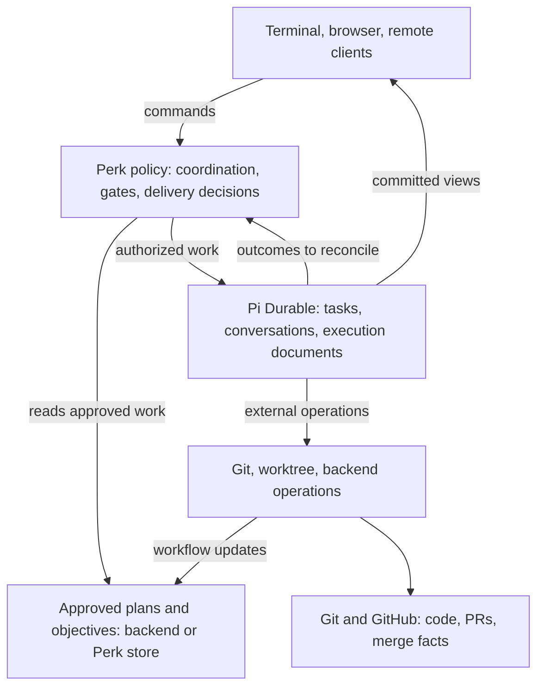

# Pi in the sky: perk as a durable engineering workspace

2026-10-05. A strategy proposal for perk's maintainers, grounded in the source snapshots
listed below. The proposed architecture and experiments are future work.

For the first-v2 experience and longer-term product horizon, start with
[Perk with Pi Durable: a working vision](vision.md).

For a concrete walkthrough of TypeScript/Durable coordination with Python doors and issue-backed
plans, see the companion [How a durable perk would work](pi-durable-workflows.md).

For developing that integration alongside the current runtime, see
[A parallel path to Pi Durable](pi-durable-v2.md).

For a bounded investment in delegated questions and human review that benefits both runtimes,
see [A shared decision foundation for v1 and v2](decision-foundation.md).

## Direction

**Extend perk's durable plans into durable execution and coordination.** Perk already keeps
reviewed work outside any one conversation. Its cross-machine guarantee is
[stage-boundary and pushed-branch durability][current-durability]. Pi Durable raises the
possibility of retaining finer-grained execution progress and coordination across interruptions.

An objective could own its execution, decisions, and evidence across many bounded
conversations. People would join, steer, and review that work through whichever interface
suits the moment.

Three ideas make this worth pursuing: objectives that execute across sessions, a shared
engineering workspace, and competing approaches that can be tested before committing to one.
Where orchestration runs and where approved plans live are separate architectural decisions.

Keep [#2656's Pi 1.0 compatibility program][pin-program] bounded. Completing it strengthens
the current system and gives us a better baseline for experiments. This memo neither adds
Durable to that program nor makes its completion depend on a new architecture.

## What has changed

The [October 1 announcement][announcement] presents Pi Durable as a separate experimental
framework alongside the Pi coding agent. Its combination of tasks, conversations, and
application documents makes a larger architectural question practical: could the same runtime
support the lifetime of the engineering workflow as well as its agent calls?

Earlier planning already explored durability, state ownership, shared services, and detached
interfaces. The released Durable package gives those questions a concrete implementation to
evaluate together:

| Earlier direction | Principle retained | Question to test now |
| --- | --- | --- |
| [Headless objective execution][headless] | Deterministic coordination, bounded workers, receipts, and human gates. | Which conductor responsibilities remain Perk policy, and which can Durable execute? |
| [Library decomposition][decomposition] | Perk owns semantic interfaces that hide runtime details. | Can those interfaces admit Durable while reducing caller obligations? |
| [Deep Pi integration][integration] and the [v3 memo][v3] | State, execution, and presentation need independent proofs; retaining Python is a migration default. | How much of that broader vision does this package support, and what must perk still build? |

Those documents describe older upstream snapshots. Their AgentHarness, lane, storage-format,
and application-host details require fresh verification against `packages/durable`. Their
central discipline survives: an architectural change earns its place by removing obligations
from callers while preserving perk's domain guarantees.

## 1. Objectives become durable programs

Imagine starting an approved objective node on Monday. Perk implements it, publishes a draft
PR, and starts its reviewer wave. The process dies. On Tuesday, a replacement process
recovers the completed reports, finishes the outstanding work, and waits for a maintainer's
decision. The maintainer responds that afternoon; execution continues within the approved
scope.

The objective would have an explicit execution state throughout. Perk's deterministic policy
would select eligible work and decide whether evidence satisfies a gate. Models would author,
implement, and review through bounded assignments with distinct contexts, capabilities,
budgets, and outcomes.

Durable provides custom checkpointed tasks, child ownership, and waits on other tasks.
Those are mechanisms on which perk could express the workflow. [Task documentation][tasks]
supports that possibility; it does not supply perk's objective dependency rules, review
completeness policy, or delivery semantics.

A useful Perk topology would give objective execution a durable owner separate from
interactive turns, with tasks owning fresh worker conversations. Clients attach to committed
views. Detachment changes observation; interrupting a turn and cancelling an objective have
different, explicitly defined scopes. The [background-subagent example][background-example]
demonstrates deliberate lifetime separation; perk would still have to define its own
ownership and pending-decision lifecycle.

Fresh implementation context remains valuable, as does an independent reviewer's view. A long
objective could use many short conversations while retaining one coherent execution record.

The largest potential simplification is shared execution machinery. Objective coordination,
stage driving, reviewer collection, deadlines, and waiting currently cross several lifetimes.
A durable task substrate could absorb common scheduling and recovery mechanics. Perk would
retain the meanings of “review complete,” “plan approved,” and “ready for delivery.” Its
roadmap dependencies would remain distinct from the runtime's ownership tree.

Human gates would record decisions against the work and revision they authorize. Closing a
view leaves the gate pending. Perk must also retain its governing policy identity, recheck
applicable authorization on resumption, and enforce budgets across recovered attempts.
Durable's [runtime settings][settings] are not persisted; reopening tasks alone would not
establish those guarantees.

**Proof:** interrupt a reviewer wave after one assignment finishes. Recovery should reuse that
report, continue unfinished work, and preserve the wave's restrictions, budgets, and acceptance
rules. External effects still require perk's reconciliation outside Durable's atomic commits.

## 2. Perk becomes a shared engineering workspace

Imagine drafting a plan in the terminal, leaving implementation running on a remote machine,
and opening a browser later to inspect its evidence. A teammate reviews a particular plan
revision while the agent continues an independent assignment. Both see the same engineering
state, including what is running and which decision is pending.

The workspace would hold explicit plans and revisions, objective progress, decisions,
artifact references, and review evidence. Conversations would read the portions relevant to
their assignments. Interfaces would present that state and submit semantic operations such
as proposing a revision, approving it, requesting the next action, or cancelling work.
These are proposed application responsibilities, not new command names or API contracts.

Durable's documents can change atomically with transcript entries and task creation; its
conversation watches support current views and subsequent changes. [Documents][documents],
[commit semantics][invariants], and [watching][watching] provide useful foundations. Perk
would still need to implement client transport, identity, authorization, and conflict handling.
Subscribing to state would confer no permission to change it.

The payoff would reach beyond multiplayer. A single maintainer could move between terminal,
browser, and unattended execution with the same operation semantics. Warm, cold, and
headless entry points could share more of their behavior. Interface lifecycle would govern
observation; explicit commands would govern execution.

Evidence could become easier to use as well. A review would identify the plan revision and
code head it assessed. A delivery decision would point to its supporting checks. `/learn`
could consume those relationships alongside conversation evidence, reducing dependence on
reconstructing every fact from session files. Curating durable learnings would remain an
explicit workflow decision.

All three configurations below could support this experience. Workspace documents could
hold execution facts and versioned observations of backend-owned plans, or the workspace
could also own approved workflow revisions. Each fact needs one owner; keeping independently
editable copies would undermine the simplification.

**Proof:** connect two clients, disconnect one, change the plan, and reconnect it. Both must
converge on current state. A stale approval must not authorize the changed revision, a
retried decision must not advance work twice, and disconnecting must not cancel execution.

## 3. Competing approaches become executable experiments

Imagine an objective whose central uncertainty is whether a refactor should preserve an
existing abstraction or replace it. Perk could investigate both from a common starting point,
produce a bounded implementation of each, run the same checks, and present the evidence
before the maintainer chooses.

This would make an important class of planning questions empirical. The comparison could
include correctness, migration difficulty, maintenance burden, runtime measurements, and
agent cost. A cheaper or faster candidate would still need to satisfy the agreed criteria.

Perk could assemble a basic comparison using existing agents and worktrees. Durable's
potential contribution is keeping the experiment's coordination, costs, evidence, and
unfinished work coherent across interruptions. The hypothesis is a more useful and recoverable
experiment, with conversation inheritance as one optional technique.

Durable supports conversation forks and document inheritance choices, including historical
values. Task documents are not copied by a conversation fork. [Fork documentation][forks]
and [document semantics][document-semantics] make the limits explicit. Perk would coordinate
those capabilities with a separate Git worktree or execution environment for each candidate.
Conversation history alone cannot reproduce a filesystem or reverse an external action.

A reviewed experiment plan would authorize the implementation work, define its starting
commit, comparison criteria, resource bounds, and publication limits. Ordinary planning
would retain its read-only posture. Each candidate would receive the relevant approved
material; implementation and independent review would keep fresh contexts where they improve
judgment. Forking would be a deliberate choice for exploration, rather than the default for
every worker.

Promotion would be an explicit domain operation: choose an approach, preserve the evidence,
and carry the selected work into the normal plan and delivery path. Any changed plan would
need the corresponding review. Authorization and assertions about published work would not
be copied into a candidate merely because its conversation inherited some history.

The selected and rejected candidates would leave evidence of what was tried, under which
conditions, and why one approach won. A maintainer revisiting an assumption could use that
record; `/learn` could curate it into durable recommendations.

**Proof:** run two candidates against one starting commit, stop one, and complete the other.
Their writes, budgets, and cancellation must remain isolated. The final report must identify
each tested revision, and selecting a candidate must not publish or merge it implicitly.

## Separate orchestration from state authority

Two independent choices deserve comparison: who coordinates work, and where approved workflow
records live. Shared interfaces are possible with all three illustrative configurations:

| Configuration | Orchestration | Approved plans and objectives | Benefit and cost to evaluate |
| --- | --- | --- | --- |
| Evolve the exterior | Python selects domain actions; Durable executes bounded assignments. | GitHub/Linear remain authoritative. | Reuses existing coordination; cross-runtime protocols remain. |
| Consolidate orchestration | TypeScript Perk policy coordinates through Durable tasks. | GitHub/Linear remain authoritative. | May unify execution lifetimes; requires policy migration and fresh backend reconciliation. |
| Consolidate workflow authority | TypeScript Perk policy coordinates through Durable tasks. | A Perk store owns revisions and decisions; issue backends publish projections. | Can commit workflow decisions and task admission together; adds authoritative-store operation and migration obligations. |

The middle configuration isolates the case for orchestration consolidation. Python could
continue supplying mature Git, worktree, and backend operations. Execution receipts would
reference approved artifacts and reconcile against current authority, following the
[existing execution-contract distinction][execution-authorities]. A task checkpoint could
record an attempt without becoming a second mutable copy of objective truth.

In all three, Git remains authoritative for code, and GitHub remains authoritative for
PR and merge state. A workflow document can record an observation or an intended operation;
the external system determines whether the effect happened.

If workflow authority moved, issue edits would enter as explicit proposed changes, with revision
checks and conflict handling. They could not silently compete with the Perk store. Existing
issue-backed work would require an explicit import and cutover before its authority changed.
Likewise, exporting a readable plan would not back up execution history. A fresh clone with
GitHub access would no longer reconstruct all workflow state. That loss must be weighed
against the benefit of atomic decisions and task admission.

The shared workspace has this common responsibility structure, independent of those choices:

The boxes describe proposed responsibilities, not deployment units or new APIs. Language
consolidation earns its place where it removes a costly boundary; changing the authority for
approved work needs its own case.

## Recommendation and proofs

**Pursue the shared workspace as the product vision; prove Durable's execution and observation
benefits first.** Durable objectives are the strongest architectural opportunity. Competing
implementations remain a further exploration once work isolation and recovery are credible.
Compare orchestration ownership and canonical-state migration separately.

Use three increasing levels of evidence:

1. **Capability fit.** Run one read-only report assignment through a minimal Durable binding
   with a controlled provider. Reuse actual Perk restriction and report-validation logic;
   establish allowed reads, rejected writes, fresh context, exact subject delivery, and a
   valid terminal result. This isolates integration from objective orchestration.
2. **Distinctive recovery.** Run two assignments, finish one, then interrupt and reopen
   execution. Reuse its completed report, recover unfinished work, preserve restrictions and
   budget semantics, and accept the aggregate once. Exercise scoped cancellation and observer
   reconnection. Compare the machinery and caller obligations with the current wave path.
3. **Workflow acceptance.** Drive an approved objective node through implementation,
   publication, review, and a persisted human decision. Reuse existing publication recovery
   as a regression requirement. Check stale and duplicate decisions against their intended
   revisions. This is the later end-to-end proof; it ends at the human handoff.

Start on a prepared worktree with a pinned runtime and controlled effects. Live publication
would use a designated test repository. The later two-candidate experiment must additionally
prove workspace isolation, comparable evidence, bounded resources, and explicit selection.

The Perk/Durable extension integration remains unproven. The appendix distinguishes execution
mechanics that might shrink from policy, resource loading, and evidence guarantees that need
an implementation under either runtime. Each proof must name one owner of next-action policy.

Assess the result by the responsibilities it removes: fewer recovery paths, fewer repeated
identity and state checks, clearer cancellation, and a smaller set of facts required to
drive work correctly. Reject expansion if Durable merely adds another runtime while leaving
all existing lifecycle machinery necessary.

Production adoption would also require storage and workspace recovery. Current backends
require one owning process without cross-process locking; SQLite's documented defaults
distinguish process-crash recovery from power or host failure. [Storage documentation][storage]
leaves backup, placement, and relocation as application responsibilities. Long-lived work also
needs task/document migrations and policy-version rules. Those decisions belong in subsequent
plans; this memo does not choose a host or amend the current two-plane contract.

## Appendix: evidence and boundaries

Snapshots: perk `9c4e52c0`; upstream Pi
`b7dfc049e917a265a5aefa9f3952a2dec9b81cfd`. The [package manifest][package] declares Durable
`1.0.3`; its [README][upstream] labels the API experimental. These source observations are
distinct from the October 1 announcement and #2656's exact Pi 1.0.0 compatibility work.

README/spec links identify **documented** contracts; source links identify **implementation
inspected**; test links identify **tests inspected**, meaning bodies were read, not executed.
The architectural implications below remain proposals. Citations support the observed
behavior, not an assertion that the Perk integration has already been demonstrated.

| Boundary | Inspected evidence | Proposed reduction, retained responsibilities, and uncertainty |
| --- | --- | --- |
| Stage execution | Perk's [stage drive][perk-stage] handles `implement` and `address`; the [SDK adapter][perk-sdk] constructs coding-agent services with project resources. Durable's [scheduler][scheduler] restores running tasks to pending checkpoints, and its [recovery test][task-recovery-test] exercises close/reopen with persisted state. | Durable might own interrupted execution and task scheduling. Resource isolation, Perk tool bindings, budgets, and terminal-success policy still require an owner. This is not evidence that the coding-agent extension loads in Durable. The capability-fit proof must establish an actual binding before estimating which driver code could disappear. |
| Reviewer waves | [ReportWave][perk-wave] holds pending references and promises in an instance-owned `WeakMap`, although supplier results have persistence. The [child policy][perk-child-policy] specifies fresh report delivery, a latched restriction floor, and subject restoration. The [background example][background-example] supplies durable child/report coordination with explicit ownership. | Durable identity could make wave collection reacquirable after restart and reduce custom wait/collection machinery. Keep report schemas, completeness rules, exact subject availability, restriction enforcement, and logical single acceptance. The example does not prove those Perk guarantees. Measure whether a replacement actually simplifies the complete path, including interruption after partial success. |
| Workflow state and artifacts | [WorkflowSession][perk-artifacts] validates current-run provenance and content digests. Durable's [commit implementation][commit-implementation] settles storage before publishing changes. Its [fork tests][fork-tests] distinguish historical, current, and initial document values; the [document contract][document-semantics] excludes task documents from conversation forks. | A document backing could replace persistence mechanics or support richer evidence relationships. Artifact integrity and the meaning of inherited state remain Perk policy. Evaluate fields by their lifetime and fork semantics; one successful backing experiment does not justify migrating every field or making approved plans authoritative in that store. |
| Shared observation | The [commit path][commit-implementation] publishes after storage settlement. The [document-watch tests][watch-tests] check delivery of committed revisions. Perk's [surfaces module][perk-surfaces] already centralizes UI emission; its current status subscription is tied to presentation state. The [watch documentation][watching] describes conversation views and attachment. | Shared committed views could remove some presentation-specific state reconstruction and make reconnection coherent. That still requires a Perk observation model, client transport, actor authorization, and stale-command handling. A document-watch test establishes neither a remote application nor authorized multiplayer steering; the reconnect and decision scenarios test those additional claims. |
| Delivery effects | Perk's [publication protocol][perk-publication] records intent before remote mutations. Its [PR-creation crash regression][perk-publication-test] rediscovers the existing PR. Durable's [tool recovery][tool-recovery] requires both recorded and current replay policies to be safe; its [task recovery test][task-recovery-test] calls an idempotent external service twice but applies one effect. | Durable could schedule and retain outcomes of delivery operations. Perk's journal, fresh remote reconciliation, and mutation preconditions still carry domain correctness. Reuse the existing crash scenario as an integration regression. New recovery value must also appear within execution or coordination, such as retaining completed reviewers while recovering the remaining assignments. |

No Durable runtime experiment, Perk extension-compatibility certification, multi-client
application, or failure-injection run was performed for this memo. The proposed experiments
must establish whether these mechanisms compose successfully. Current workflow contracts and
user-facing behavior remain unchanged.

[pin-program]: https://github.com/mattgiles/perk/issues/2656
[announcement]: https://earendil.com/posts/pi-durable/
[current-durability]: ../../user-docs/explanation/how-perk-thinks.md#stages-and-doors-how-you-move-through-the-workflow
[headless]: ../deepen-headless-execution/memo.md
[execution-authorities]: ../deepen-headless-execution/objective-execution-contract.md#authorities
[decomposition]: ../future-proofing-decomposition.md
[integration]: ../deep-opportunities-pi-integration.md
[v3]: ../upcoming-pi-changes-memo-v3.md
[upstream]: https://github.com/earendil-works/pi/blob/b7dfc049e917a265a5aefa9f3952a2dec9b81cfd/packages/durable/README.md
[package]: https://github.com/earendil-works/pi/blob/b7dfc049e917a265a5aefa9f3952a2dec9b81cfd/packages/durable/package.json
[tasks]: https://github.com/earendil-works/pi/blob/b7dfc049e917a265a5aefa9f3952a2dec9b81cfd/packages/durable/README.md#child-tasks
[documents]: https://github.com/earendil-works/pi/blob/b7dfc049e917a265a5aefa9f3952a2dec9b81cfd/packages/durable/README.md#your-own-state
[watching]: https://github.com/earendil-works/pi/blob/b7dfc049e917a265a5aefa9f3952a2dec9b81cfd/packages/durable/README.md#watching-a-conversation
[forks]: https://github.com/earendil-works/pi/blob/b7dfc049e917a265a5aefa9f3952a2dec9b81cfd/packages/durable/README.md#more-conversations-and-forks
[storage]: https://github.com/earendil-works/pi/blob/b7dfc049e917a265a5aefa9f3952a2dec9b81cfd/packages/durable/README.md#storage
[invariants]: https://github.com/earendil-works/pi/blob/b7dfc049e917a265a5aefa9f3952a2dec9b81cfd/packages/durable/docs/spec.md#1-terms-and-invariants
[document-semantics]: https://github.com/earendil-works/pi/blob/b7dfc049e917a265a5aefa9f3952a2dec9b81cfd/packages/durable/docs/spec.md?plain=1#L1084-L1096
[settings]: https://github.com/earendil-works/pi/blob/b7dfc049e917a265a5aefa9f3952a2dec9b81cfd/packages/durable/README.md#settings
[background-example]: https://github.com/earendil-works/pi/blob/b7dfc049e917a265a5aefa9f3952a2dec9b81cfd/packages/durable/test/examples/23-subagent-background.ts#L56-L115
[scheduler]: https://github.com/earendil-works/pi/blob/b7dfc049e917a265a5aefa9f3952a2dec9b81cfd/packages/durable/src/harness/scheduler.ts#L238-L255
[task-recovery-test]: https://github.com/earendil-works/pi/blob/b7dfc049e917a265a5aefa9f3952a2dec9b81cfd/packages/durable/test/harness-tasks-recovery.test.ts#L111-L144
[commit-implementation]: https://github.com/earendil-works/pi/blob/b7dfc049e917a265a5aefa9f3952a2dec9b81cfd/packages/durable/src/session/session.ts#L405-L443
[fork-tests]: https://github.com/earendil-works/pi/blob/b7dfc049e917a265a5aefa9f3952a2dec9b81cfd/packages/durable/test/session-forks.test.ts#L29-L108
[watch-tests]: https://github.com/earendil-works/pi/blob/b7dfc049e917a265a5aefa9f3952a2dec9b81cfd/packages/durable/test/session-watches.test.ts#L39-L82
[tool-recovery]: https://github.com/earendil-works/pi/blob/b7dfc049e917a265a5aefa9f3952a2dec9b81cfd/packages/durable/src/harness/tool.ts#L93-L110
[perk-stage]: ../../../extension/worker/stageExecution.ts#L60-L93
[perk-sdk]: ../../../extension/worker/sdkAdapter.ts#L458-L526
[perk-wave]: ../../../extension/waves/reportWave.ts#L638-L686
[perk-child-policy]: ../../design/pi-subagents-child-execution-policy.md
[perk-artifacts]: ../../../extension/session/workflowSession.ts#L531-L566
[perk-surfaces]: ../../../extension/surfaces/surfaces.ts#L120-L155
[perk-publication]: ../../../src/perk/delivery/publish.py#L879-L925
[perk-publication-test]: ../../../tests/test_delivery_publish.py#L1387-L1403
